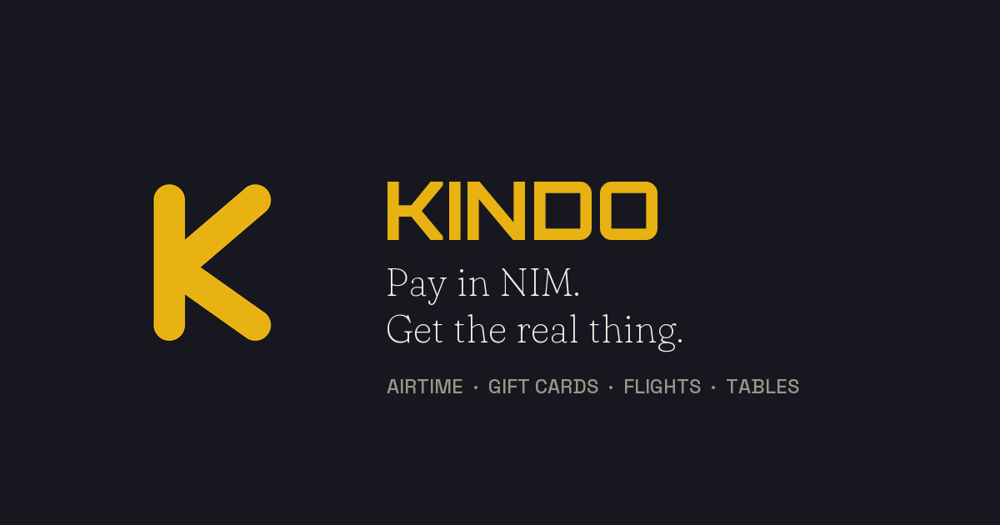
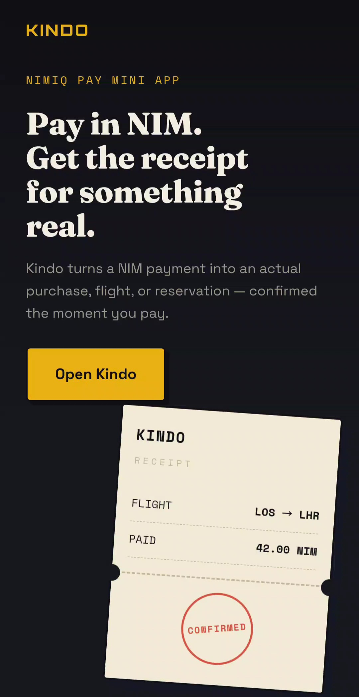
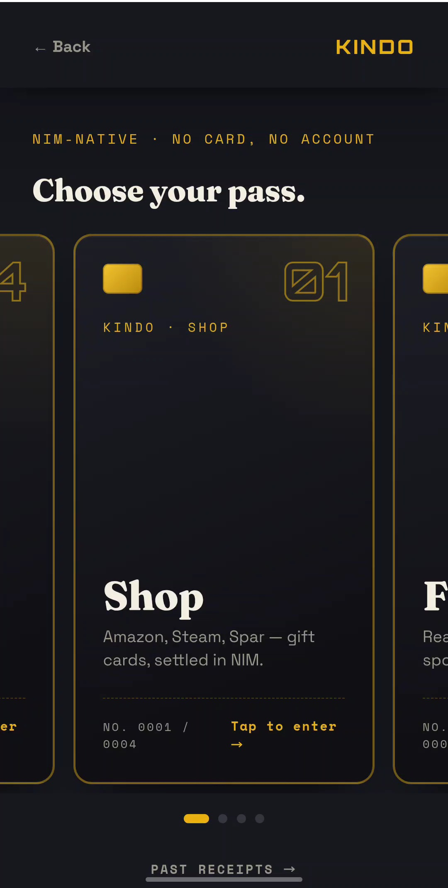
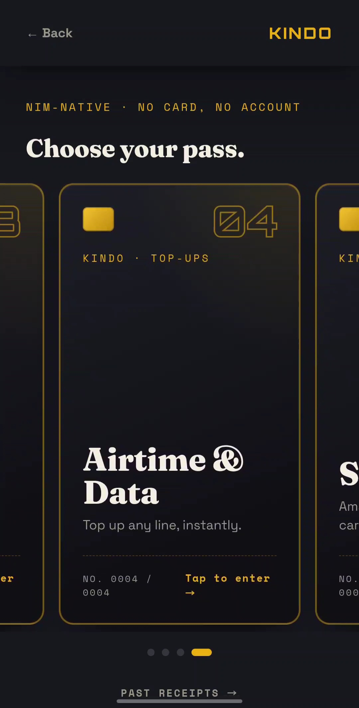

# kindo

> Pay in NIM. Get the real thing.

| Field | Value |
| --- | --- |
| Category | Marketplaces |
| Pricing | Free |
| Team name | _Not provided — optional_ |
| Team members | _Not provided — optional_ |
| X account | _Not provided — optional_ |
| Heard about it via | _Not provided — optional_ |
| Contact email | iamthefirstone715@gmail.com |
| GitHub login | @iamthefirstone715-ops |
| Submitted at | 2026-09-17T12:05:31.174Z |

## Links

| Link | URL |
| --- | --- |
| Repo | [https://github.com/iamthefirstone715-ops/kindo](<https://github.com/iamthefirstone715-ops/kindo>) |
| Demo | [https://kindo-production.up.railway.app](<https://kindo-production.up.railway.app>) |
| Video | [https://youtube.com/shorts/rqkYt89zAXk?si=2wGNW2viAO_4QqFB](<https://youtube.com/shorts/rqkYt89zAXk?si=2wGNW2viAO_4QqFB>) |
| Skool post | _Not provided — optional_ |
| Social post | _Not provided — optional_ |

## Description

Spend NIM on real things inside Nimiq Pay: airtime, gift cards, flights and tables. No card, no bank, no account.

## Builder story

I kept looking at NIM in my wallet and thinking: what can I actually do with this?

Not swap it. Not stake it. Spend it. Where I live, that's the only test a currency has to pass — can it buy airtime, can it buy groceries, can it help a friend who's run out of credit.

So I built Kindo. Open it inside Nimiq Pay and you're shopping with NIM: airtime and data on any number, gift cards from 10,000+ brands — Amazon, Steam, Roblox, Spar Nigeria for groceries — real flight fares from real airlines, and restaurant tables. No card, no bank, no account. You tap an amount, Nimiq Pay asks you to approve, and the thing shows up. The NIM payment is the checkout.

Under the hood: your payment is matched on-chain by the order in the transaction memo, then the provider gets paid in USDC over x402 — no API keys, no merchant accounts, on Base and Solana depending on the provider. Every cost is checked against what you actually paid before anything moves, and small orders draw from a standing float that gets swept back to USDC in batches.

## Thumbnail

## Screenshots

---

_Generated from the submission form. `submission.yaml` in this folder is the machine-readable source of truth._
