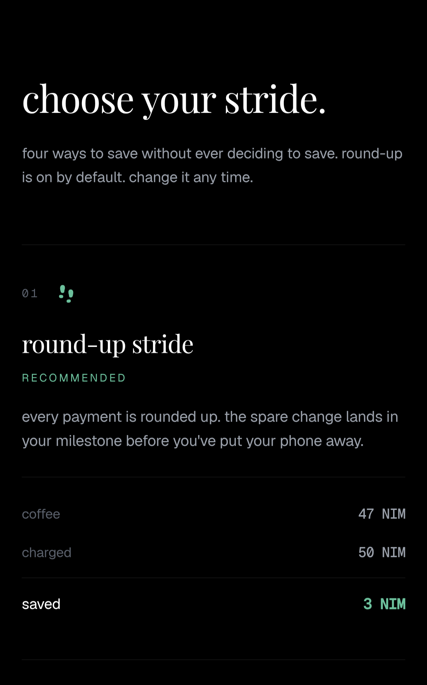
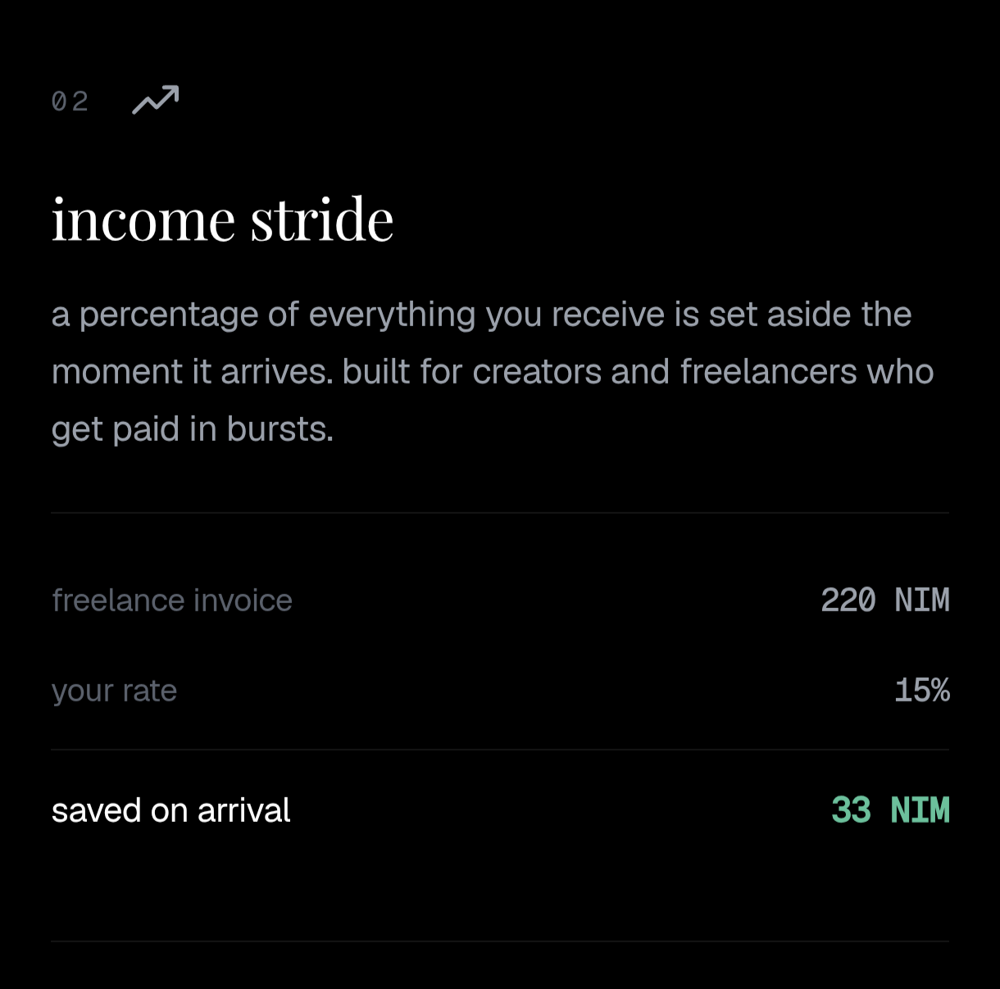
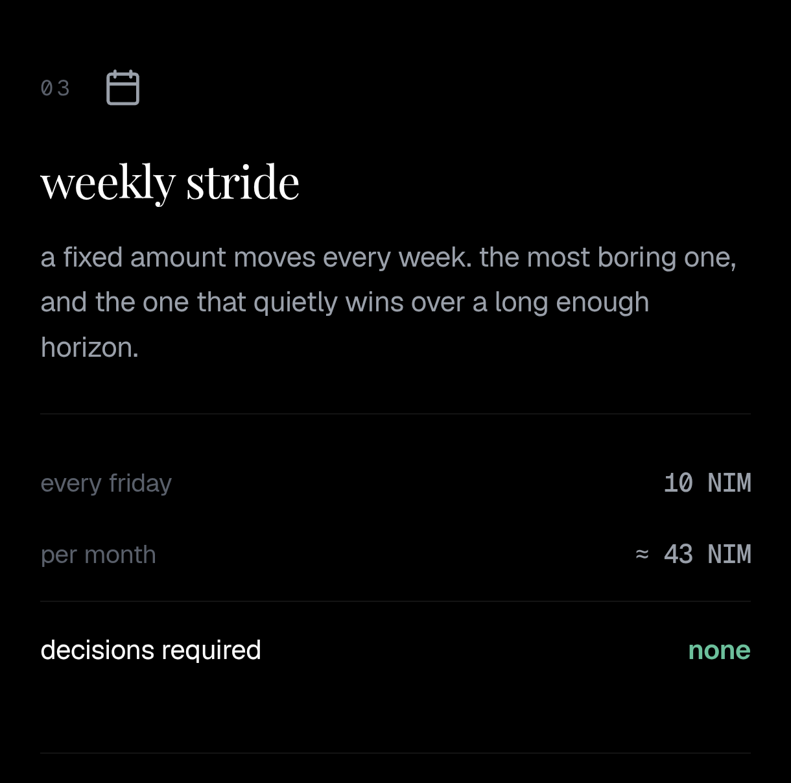
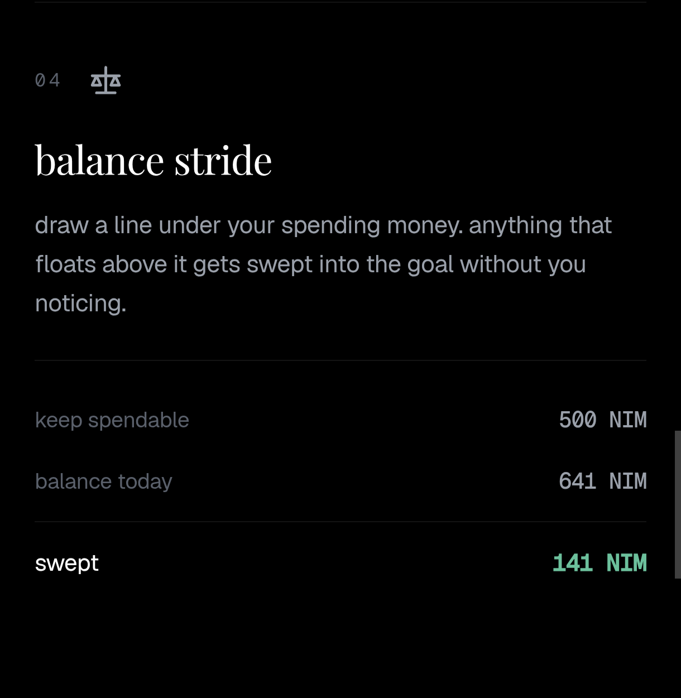

# Stride

> Turn everyday spending into progress toward your goals.

| Field | Value |
| --- | --- |
| Category | Earning |
| Pricing | Free |
| Team name | HACKDPLANET |
| Team members | Itachi, kookie, ODK |
| X account | https://x.com/ONLY_D_KING |
| Heard about it via | On x. |
| Contact email | ajkings711@gmail.com |
| GitHub login | @itachi-exe |
| Submitted at | 2026-09-18T18:48:44.676Z |

## Links

| Link | URL |
| --- | --- |
| Repo | [https://github.com/itachi-exe/stride](<https://github.com/itachi-exe/stride>) |
| Demo | [https://stride-nine-jet.vercel.app](<https://stride-nine-jet.vercel.app>) |
| Video | [https://youtu.be/91ySdlxeRKQ?si=mAySkMG4MPsAlfWe](<https://youtu.be/91ySdlxeRKQ?si=mAySkMG4MPsAlfWe>) |
| Skool post | _Not provided — optional_ |
| Social post | [https://x.com/ONLY_D_KING/status/2100963996249506051](<https://x.com/ONLY_D_KING/status/2100963996249506051>) |

## Description

Stride is a savings experience built on Nimiq that helps users automatically build toward personal and shared goals through round-ups, weekly contributions, and income-based saving. Create a milestone, choose your stride, and turn small, repeatable actions into visible progress.

## Builder story

Most people want to save, but wanting to save and actually saving are two different things. Money comes in, expenses happen, and the intention to move something aside often gets pushed to the next day or next month.

We wanted to explore what a wallet could do if it helped turn that intention into a habit.

That led to Stride.

Instead of treating Nimiq Pay as somewhere money simply sits and moves around, Stride turns everyday wallet activity into progress toward something meaningful. Users create a milestone, choose a saving rule that fits their life, and let small actions build toward the goal.

We also wanted saving to feel more human. Some goals are personal, while others are shared with friends, teammates, or family. Stride brings those contributions together and makes the progress visible.

The idea behind Stride is simple: you don't need to make a perfect saving decision every time. Small, repeatable actions can get you somewhere.

## Thumbnail

## Screenshots

---

_Generated from the submission form. `submission.yaml` in this folder is the machine-readable source of truth._
