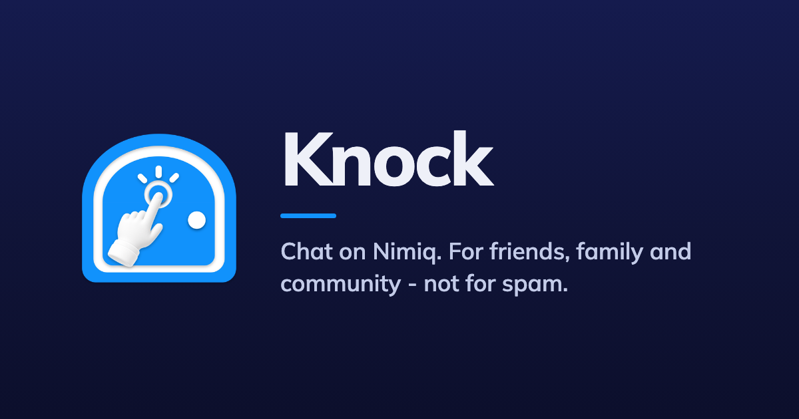
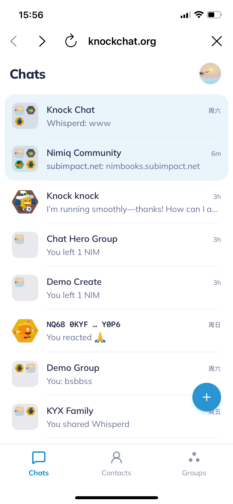
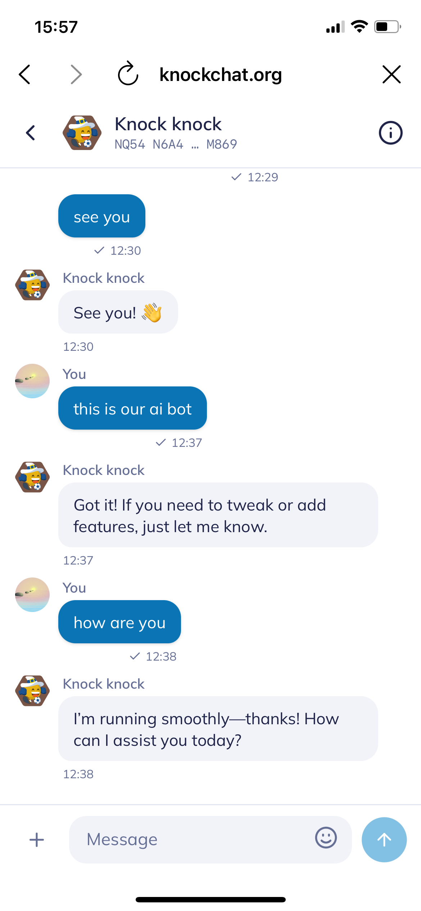
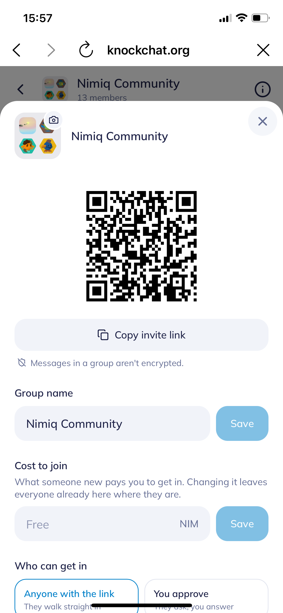

# Knock

> Chat on Nimiq. For friends, family and community - not for spam.

| Field | Value |
| --- | --- |
| Category | Social |
| Pricing | Free |
| Team name | Keyring |
| Team members | 2 |
| X account | kaichaosun |
| Heard about it via | Nimiq Community |
| Contact email | kaichaosuna@gmail.com |
| GitHub login | @kaichaosun |
| Submitted at | 2026-09-08T08:07:52.299Z |

## Links

| Link | URL |
| --- | --- |
| Repo | [https://github.com/kaichaosun/knock-chat](<https://github.com/kaichaosun/knock-chat>) |
| Demo | [https://knockchat.org/](<https://knockchat.org/>) |
| Video | [https://youtu.be/DSgO3qT8pIU](<https://youtu.be/DSgO3qT8pIU>) |
| Skool post | [https://www.skool.com/miniappscompetition/feedback-for-knock-chat-miniapp](<https://www.skool.com/miniappscompetition/feedback-for-knock-chat-miniapp>) |
| Social post | [https://x.com/keyringso/status/2094736637284548693](<https://x.com/keyringso/status/2094736637284548693>) |

## Description

Knock Chat lets you:
- 💰 Set a connection cost for strangers
- 💬 Send encrypted direct messages
- 👥 Create and join public group chats
- 💸 Send and receive NIM directly in chat
- 🎁 Gift NIM to other community members
- ❤️ Reply to messages and react with emojis

## Builder story

1. Spam Protection

We’ve all had enough of spam, random messages, and unwanted requests. Knock Chat gives you a simple way to take back control: set a small cost to connect, such as 1 NIM, or keep it free at 0 NIM. Communities can do the same by setting a cost to join and keeping bad actors out.

2. A Creator Economy Without Ads

Creators shouldn’t have to rely on ads to make money from their communities. With Knock Chat, value can flow directly between people through NIM. Users can pay to connect, join communities, send and receive NIM, or support others through gifts — creating a more direct and meaningful creator economy.

## Thumbnail

## Screenshots

---

_Generated from the submission form. `submission.yaml` in this folder is the machine-readable source of truth._
