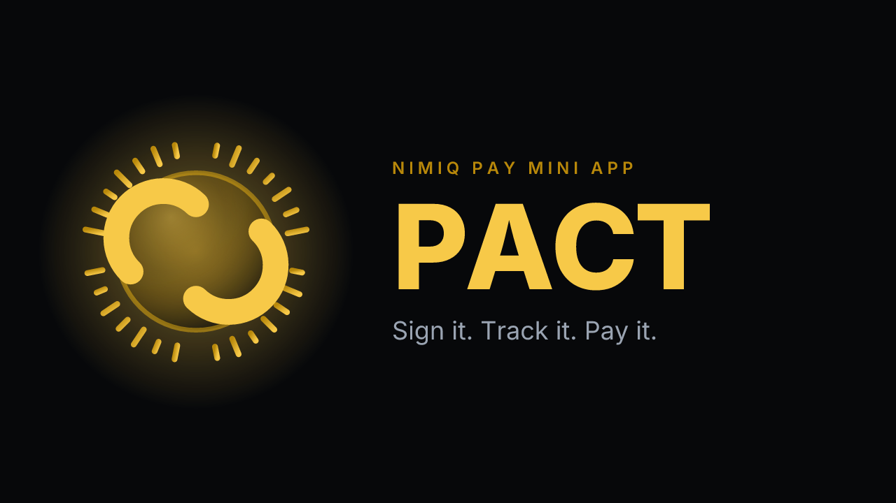
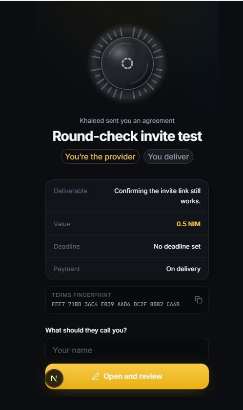
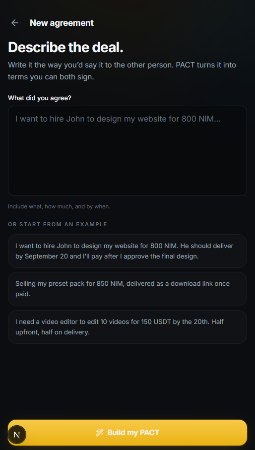
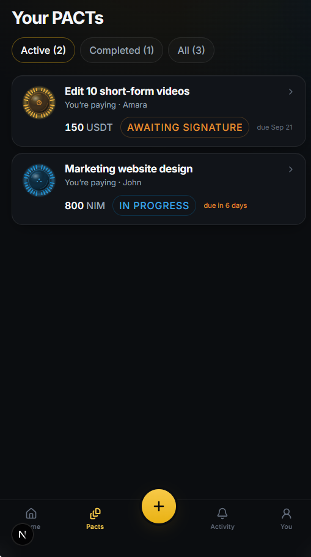
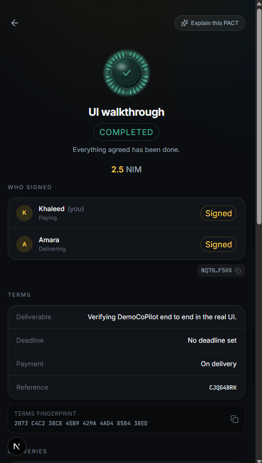
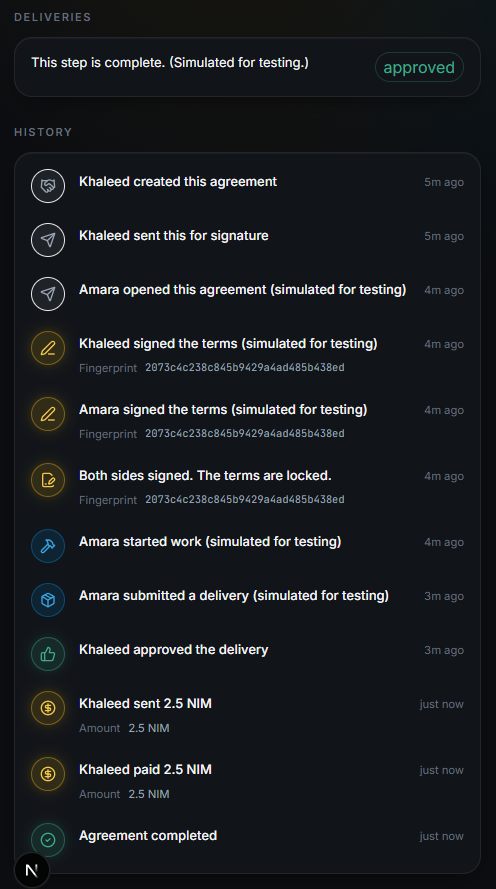

# Pact

> Don't just send money. Send certainty.

| Field | Value |
| --- | --- |
| Category | Productivity |
| Pricing | Free |
| Team name | _Not provided — optional_ |
| Team members | _Not provided — optional_ |
| X account | makeclipbag |
| Heard about it via | X |
| Contact email | adelekekhaleed105@gmail.com |
| GitHub login | @khaleed0019 |
| Submitted at | 2026-09-09T20:28:39.837Z |

## Links

| Link | URL |
| --- | --- |
| Repo | [https://github.com/khaleed0019/pact](<https://github.com/khaleed0019/pact>) |
| Demo | [https://pact-nimiq.vercel.app](<https://pact-nimiq.vercel.app>) |
| Video | [https://www.youtube.com/watch?v=PtVJbNk9AOo](<https://www.youtube.com/watch?v=PtVJbNk9AOo>) |
| Skool post | _Not provided — optional_ |
| Social post | [https://x.com/makeclipbag/status/2097783680533971414](<https://x.com/makeclipbag/status/2097783680533971414>) |

## Description

PACT turns an informal deal, "I'll pay when you finish," "half upfront", into terms both sides sign with their Nimiq wallet. Every agreement gets a Seal, a visual fingerprint of its exact terms that changes the instant anything is edited. Payments go straight from wallet to wal

## Builder story

I built PACT because informal deals fall apart in a specific, avoidable way:
nobody wrote down what was actually agreed. The Nimiq wallet already sits
between two people who trust each other enough to work together, PACT just
makes that trust legible. Every agreement gets a Seal: a visual fingerprint
of its exact terms, derived from the same digest both sides sign. Change one
word and it visibly changes shape, so nobody can quietly redraft what was
promised. No escrow, because the framework gives no way to hold funds
honestly, so PACT says exactly that instead of pretending otherwise.

## Thumbnail

## Screenshots

---

_Generated from the submission form. `submission.yaml` in this folder is the machine-readable source of truth._
