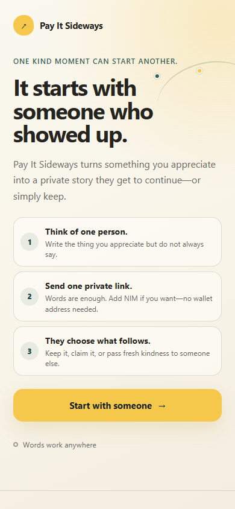
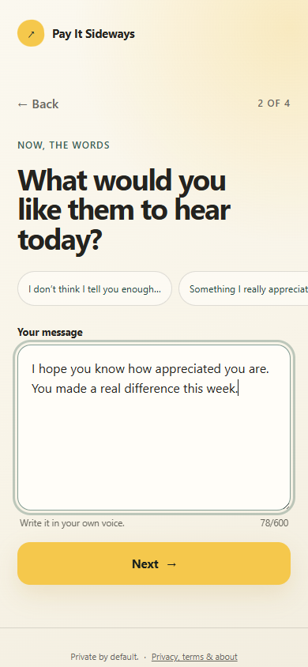
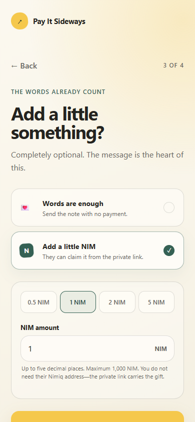
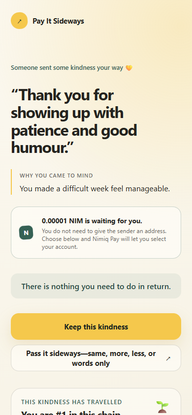

# Pay It Sideways

> Someone showed up for you. Show up for someone else.

| Field | Value |
| --- | --- |
| Category | Social |
| Pricing | Free |
| Team name | _Not provided — optional_ |
| Team members | _Not provided — optional_ |
| X account | [@KHDigitalStudio](https://x.com/KHDigitalStudio) |
| Contact email | kirstyjhawker@gmail.com |
| GitHub login | @kirstyjhawker-hms |
| Submitted at | 2026-09-01T17:18:25.954Z |

## Links

| Link | URL |
| --- | --- |
| Repo | [https://github.com/kirstyjhawker-hms/pay-it-sideways](<https://github.com/kirstyjhawker-hms/pay-it-sideways>) |
| Demo | [https://pay-it-sideways.grand-sugar.workers.dev](<https://pay-it-sideways.grand-sugar.workers.dev>) |
| Video | [https://youtu.be/qk53Jla9X5g](<https://youtu.be/qk53Jla9X5g>) |
| Skool post | [Competition community post](<https://www.skool.com/miniappscompetition/we-talk-about-paying-it-forward-but-what-about-paying-it-sideways?p=0efb3e0f>) |
| Social post | [Public X launch post](<https://x.com/KHDigitalStudio/status/2095202596390678874/photo/1>) |

## Description

Pay It Sideways sends a private note with optional NIM—no wallet address needed. The recipient can keep it or relay the exact gift into a fresh one-use link. Private acknowledgements, anonymous trails, sender recovery and on-chain checks make each chain safe and meaningful.

## Builder story

Crypto gifting normally begins with plumbing: “What is your wallet address?” Pay It Sideways begins with the person. I wanted a product where a sincere sentence still feels whole at 0 NIM, while a tiny payment can add something tangible without becoming a score, status symbol, or social debt. The difficult part was making one link preserve the recipient’s choice. The resulting addressless bearer gift keeps wallet mechanics quiet, uses real NIM, and lets a message reach someone who has never exchanged an address with the sender.

## Thumbnail

## Screenshots

---

_Generated from the submission form. `submission.yaml` in this folder is the machine-readable source of truth._
