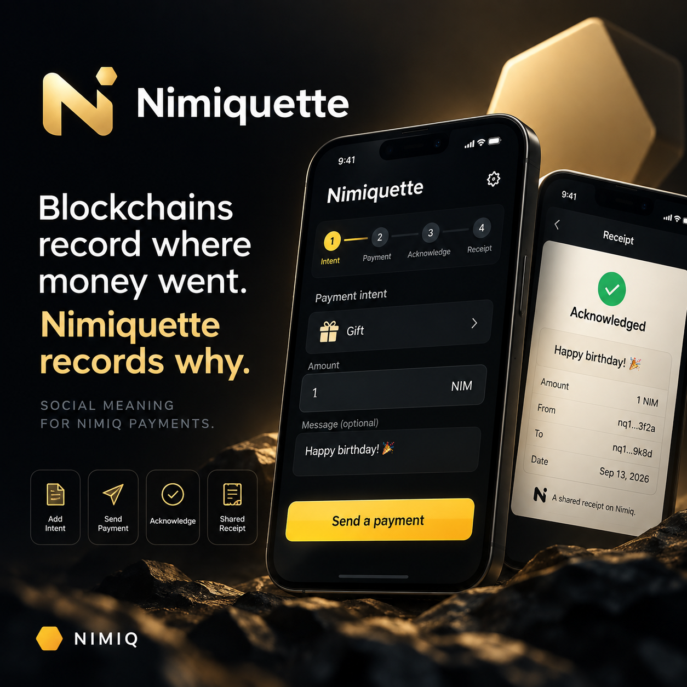
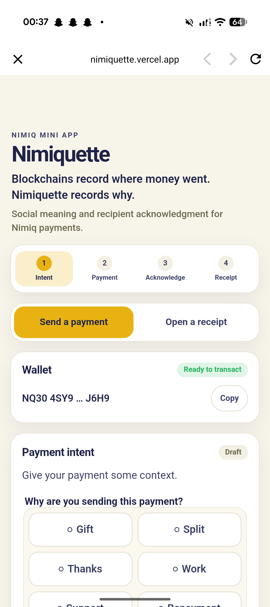
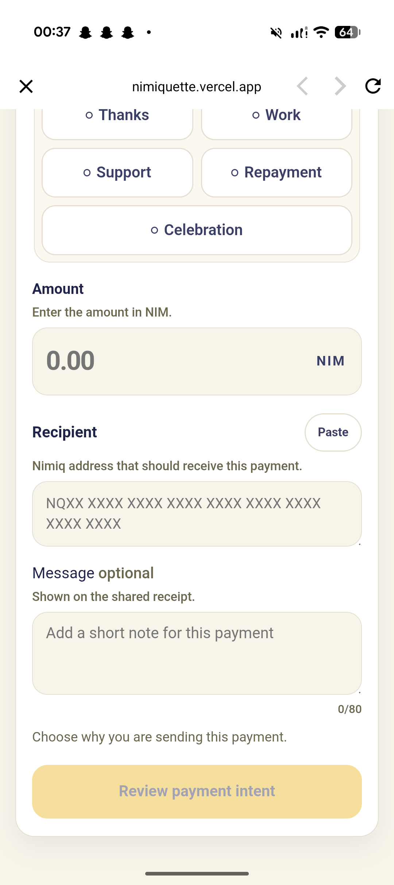
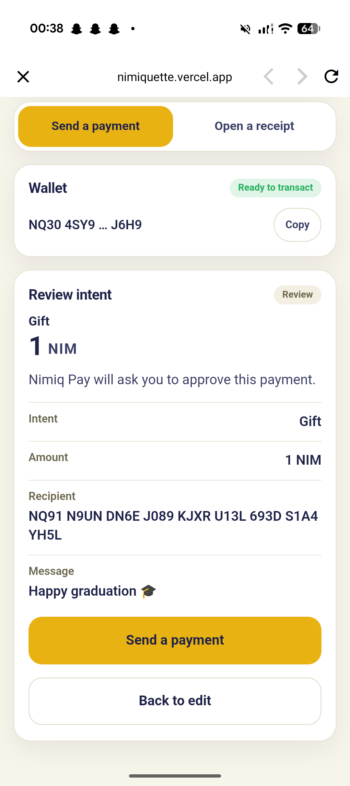
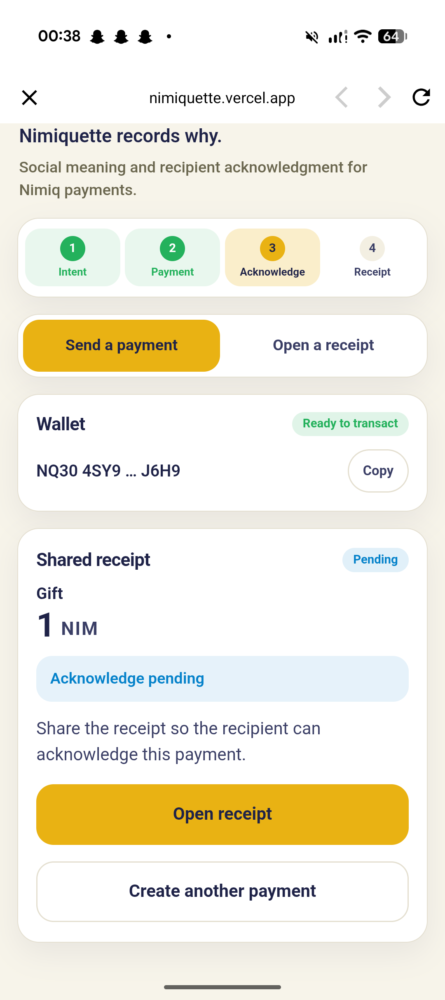
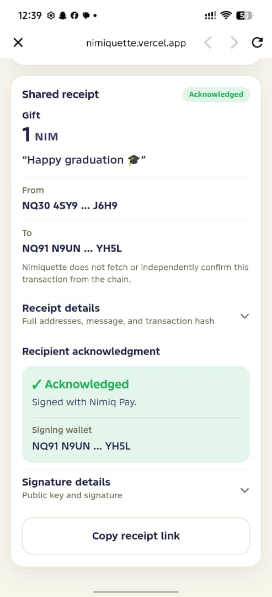

# Nimiquette

> Payments with meaning.

| Field | Value |
| --- | --- |
| Category | Social |
| Pricing | Free |
| Team name | _Not provided — optional_ |
| Team members | _Not provided — optional_ |
| X account | larimcloud |
| Heard about it via | X |
| Contact email | eyoobot@gmail.com |
| GitHub login | @levilabs-hash |
| Submitted at | 2026-09-16T23:54:21.775Z |

## Links

| Link | URL |
| --- | --- |
| Repo | [https://github.com/levilabs-hash/nimiquette](<https://github.com/levilabs-hash/nimiquette>) |
| Demo | [https://nimiquette.vercel.app](<https://nimiquette.vercel.app>) |
| Video | [https://vimeo.com/1227544757?share=copy&fl=sv&fe=ci](<https://vimeo.com/1227544757?share=copy&fl=sv&fe=ci>) |
| Skool post | _Not provided — optional_ |
| Social post | [https://x.com/larimcloud/status/2099290548733358144](<https://x.com/larimcloud/status/2099290548733358144>) |

## Description

Nimiquette adds social meaning to Nimiq payments. Users choose why they're sending a payment, attach context, and create a shared receipt that the recipient can acknowledge through Nimiq Pay.

## Builder story

I built Nimiquette around a simple idea: crypto payments record transactions, but often lose the human reason behind them. I wanted to create a lightweight social layer for Nimiq that lets people attach intent and context to payments, then gives recipients a way to acknowledge that meaning.

## Thumbnail

## Screenshots

---

_Generated from the submission form. `submission.yaml` in this folder is the machine-readable source of truth._
