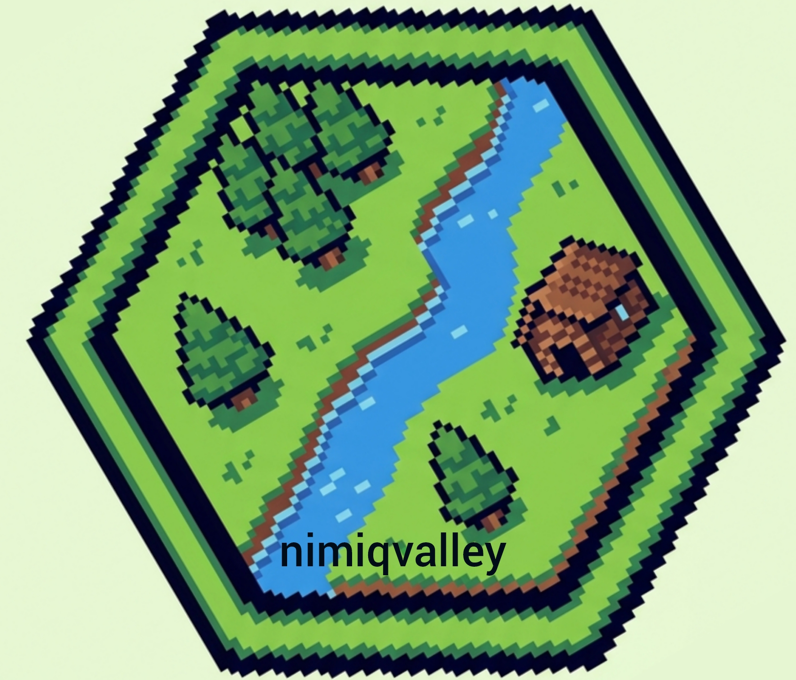
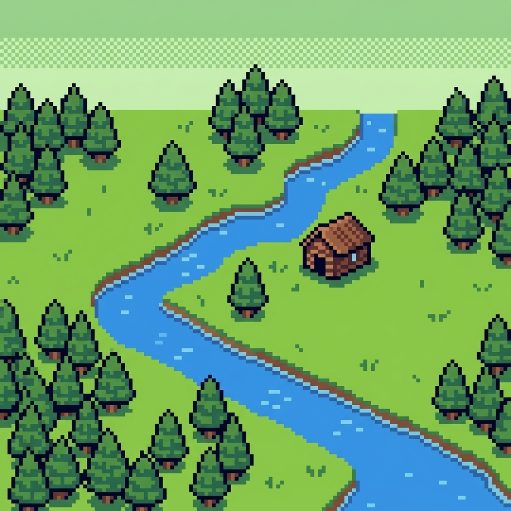
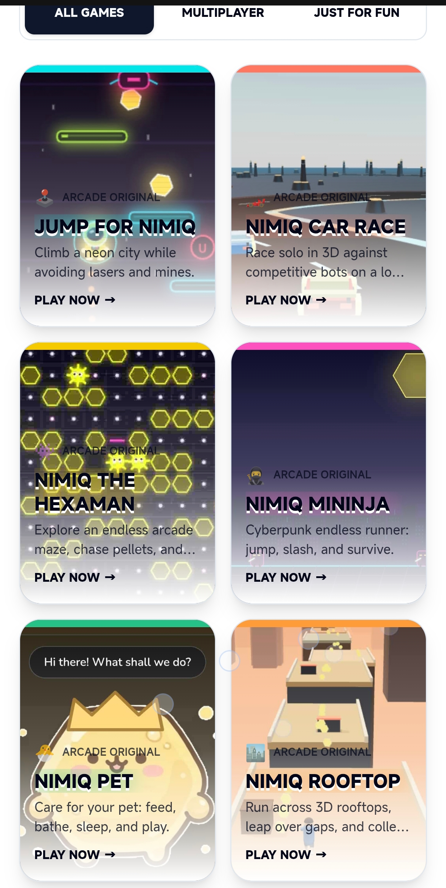
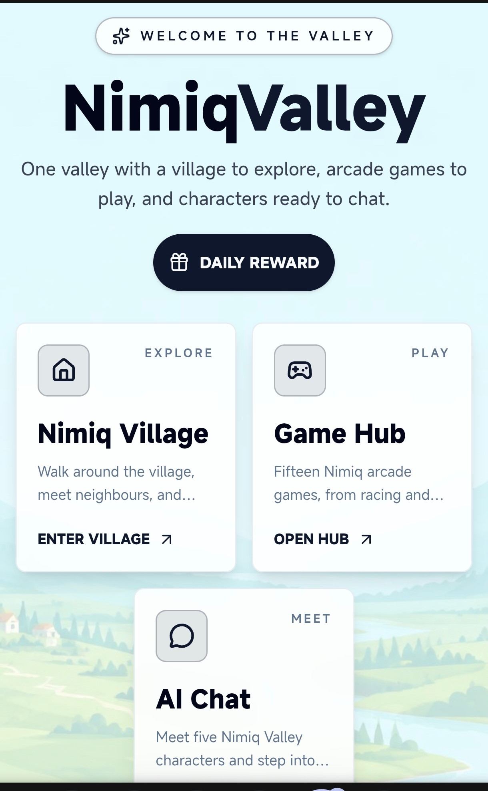
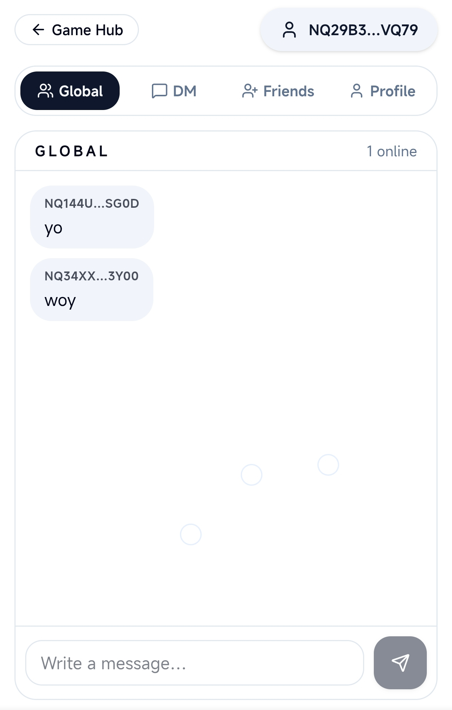
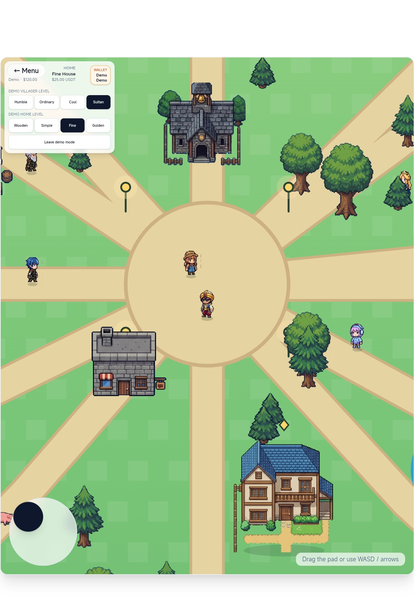

# nimiqvalley

> A whole village of games inside your Nimiq wallet

| Field | Value |
| --- | --- |
| Category | Games |
| Pricing | Freemium |
| Team name | _Not provided — optional_ |
| Team members | _Not provided — optional_ |
| X account | sarusand0x |
| Heard about it via | from x |
| Contact email | sayfulam25@gmail.com |
| GitHub login | @masrumin-blip |
| Submitted at | 2026-09-18T23:36:28.627Z |

## Links

| Link | URL |
| --- | --- |
| Repo | [https://github.com/masrumin-blip/nimiqvalley](<https://github.com/masrumin-blip/nimiqvalley>) |
| Demo | [https://nimiqvalley.lovable.app](<https://nimiqvalley.lovable.app>) |
| Video | [https://youtube.com/shorts/7c8DDpzMQcw?si=FDkzdOA8kverlzeU](<https://youtube.com/shorts/7c8DDpzMQcw?si=FDkzdOA8kverlzeU>) |
| Skool post | [https://www.skool.com/miniappscompetition/nimiqvalley?p=7eb88a0e](<https://www.skool.com/miniappscompetition/nimiqvalley?p=7eb88a0e>) |
| Social post | [https://x.com/nimiqvalley/status/2101092779317465145?s=20](<https://x.com/nimiqvalley/status/2101092779317465145?s=20>) |

## Description

NimiqValley is a mini-app village with 15 arcade games, online multiplayer, an AI-powered story room, a live arena chat, and leaderboards — all tied to your Nimiq wallet login. Match keys, room passes, and chat packs are paid in real NIM, so every session runs on the Nimiq

## Builder story

just vibecoding escaterict

## Thumbnail

## Screenshots

---

_Generated from the submission form. `submission.yaml` in this folder is the machine-readable source of truth._
