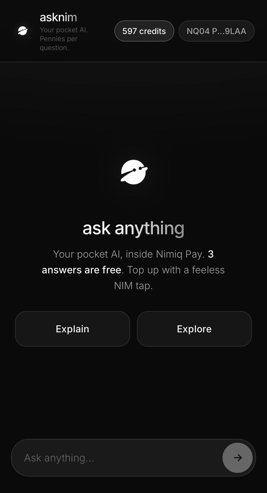
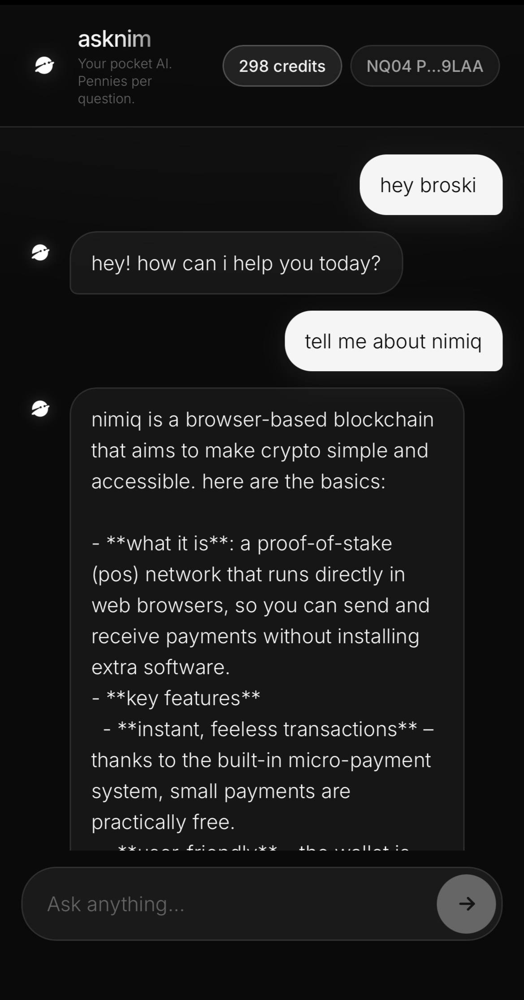
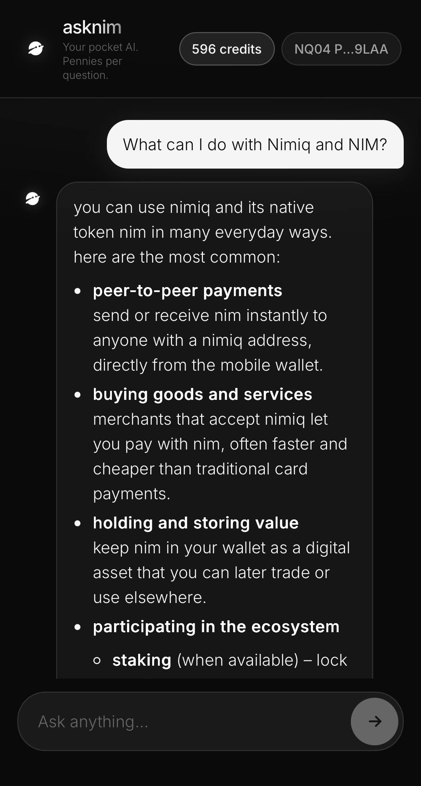

# asknim

> Your pocket AI, inside Nimiq Pay

| Field | Value |
| --- | --- |
| Category | Productivity |
| Pricing | Freemium |
| Team name | _Not provided — optional_ |
| Team members | _Not provided — optional_ |
| X account | mateojk_ |
| Heard about it via | X/twitter |
| Contact email | thesaintszn@gmail.com |
| GitHub login | @mateojkk |
| Submitted at | 2026-09-04T18:23:43.918Z |

## Links

| Link | URL |
| --- | --- |
| Repo | [https://github.com/mateojkk/AskNimi](<https://github.com/mateojkk/AskNimi>) |
| Demo | [https://ask-nim.vercel.app/](<https://ask-nim.vercel.app/>) |
| Video | [https://youtube.com/shorts/Ug9BeKl26zY?si=EZaCv2LmqlWIBLY1](<https://youtube.com/shorts/Ug9BeKl26zY?si=EZaCv2LmqlWIBLY1>) |
| Skool post | _Not provided — optional_ |
| Social post | [https://x.com/mateojk_/status/2095939845117902999?s=46](<https://x.com/mateojk_/status/2095939845117902999?s=46>) |

## Description

AskNim is a pocket AI assistant built natively inside Nimiq Pay that delivers fast, private streaming answers with zero signup. It's designed for anyone who wants quick AI on the go, powered by feeless pay-per-question NIM micropayments instead of expensive monthly subscriptions.

## Builder story

Every AI tool today demands a $20/month subscription or credit card signup, even if you just need a few quick answers a week. Charging fractions of a cent per query has always been impossible on other chains due to gas fees.

I built AskNim to leverage Nimiq's feeless, 1-second block rails to make real AI micropayments viable. With zero signup and native Nimiq Pay integration, users get instant, privacy-first answers on their phone, paying only for what they actually use. It’s an everyday utility built to showcase the true superpower of Nimiq.

## Thumbnail

## Screenshots

---

_Generated from the submission form. `submission.yaml` in this folder is the machine-readable source of truth._
