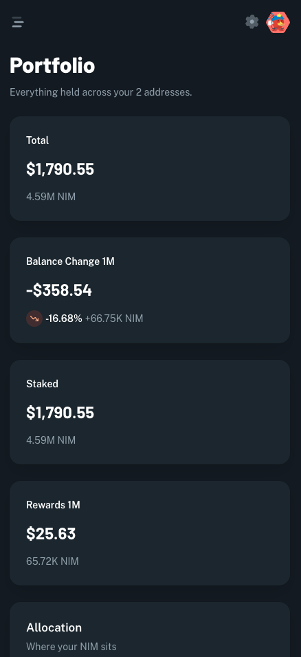
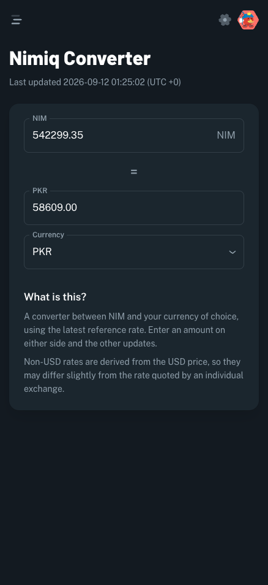
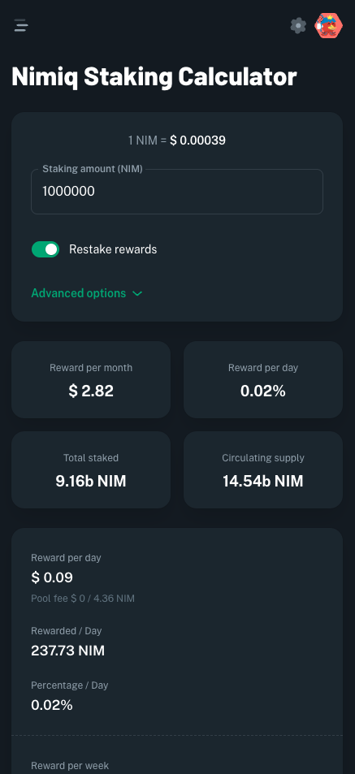
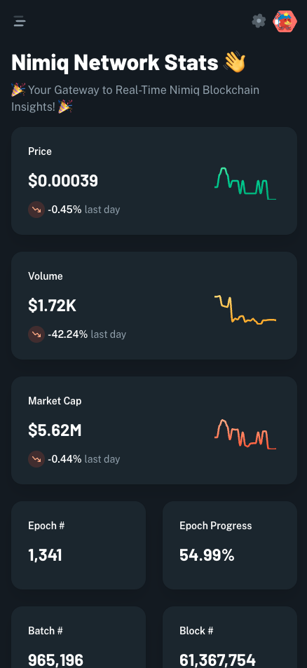

# Reef

> An aquarium that fills from your Nimiq staking.

| Field | Value |
| --- | --- |
| Category | Games |
| Pricing | Free |
| Team name | _Not provided — optional_ |
| Team members | _Not provided — optional_ |
| X account | Nimiq_Cafe |
| Contact email | miaoyu319@gmail.com |
| GitHub login | @miao-yu |
| Submitted at | 2026-08-31T14:31:58.370Z |

## Links

| Link | URL |
| --- | --- |
| Repo | [https://github.com/miao-yu/nimiq-reef](<https://github.com/miao-yu/nimiq-reef>) |
| Demo | [https://reef.nimiq.cafe/](<https://reef.nimiq.cafe/>) |
| Video | [https://x.com/Nimiq_Cafe/status/2095657569368879279](<https://x.com/Nimiq_Cafe/status/2095657569368879279>) |

## Description

Reef turns Nimiq staking into a living aquarium: cast a line each epoch and pull out one of seventeen species, whose rarity you earn by staking steadily rather than heavily. For anyone holding NIM who'd rather watch something grow
than watch a number.

## Builder story

I run a Nimiq staking pool, so I've watched what happens after somebody
delegates: nothing. The transaction confirms and the experience ends.

Reef makes the waiting visible - an aquarium that fills from your real staking,
one cast per epoch, seventeen species with over a thousand looks each. The rule
I care about is that rarity comes from how long you've staked, never how much.
Stake size buys room; the rare creatures only come to people who stayed.

Reef is totally free.

## Thumbnail

## Screenshots

---

_Generated from the submission form. `submission.yaml` in this folder is the machine-readable source of truth._
