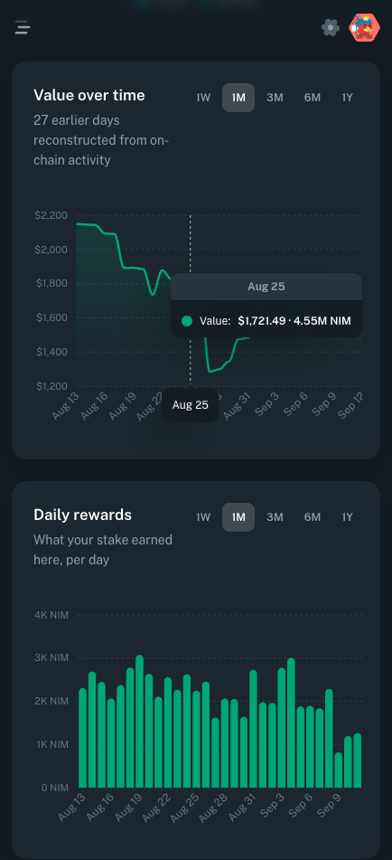

# NimiqCafe

> Everything your NIM is doing, in one place.

| Field | Value |
| --- | --- |
| Category | Earning |
| Pricing | Free |
| Team name | _Not provided — optional_ |
| Team members | _Not provided — optional_ |
| X account | Nimiq_Cafe |
| Heard about it via | X |
| Contact email | miaoyu319@gmail.com |
| GitHub login | @miao-yu |
| Submitted at | 2026-09-12T01:33:58.776Z |

## Links

| Link | URL |
| --- | --- |
| Repo | [https://github.com/miao-yu/nimiq-cafe](<https://github.com/miao-yu/nimiq-cafe>) |
| Demo | [https://nimiq.cafe](<https://nimiq.cafe>) |
| Video | [https://x.com/Nimiq_Cafe/status/2098566542493720979](<https://x.com/Nimiq_Cafe/status/2098566542493720979>) |
| Skool post | [https://www.skool.com/miniappscompetition/nimiqcafe-now-has-a-portfolio?p=fe9523a4](<https://www.skool.com/miniappscompetition/nimiqcafe-now-has-a-portfolio?p=fe9523a4>) |
| Social post | [https://x.com/Nimiq_Cafe/status/2098566542493720979](<https://x.com/Nimiq_Cafe/status/2098566542493720979>) |

## Description

NimiqCafe shows your full NIM position - liquid and staked balances, value over time, and daily rewards - whichever validator you stake with. It also bundles live network stats, a staking calculator, a NIM converter and a block explorer.

## Builder story

I run a staking pool and explorer at nimiq.cafe and kept failing to answer the
simplest question people asked: what is my NIM actually doing? Balances are easy
to look up; what it has been worth, and what it has earned, is not - and if you
staked elsewhere, my records knew nothing about you.

So the Portfolio works whoever you stake with, reading rewards from the chain
rather than from my own pool's books. And because the chain cannot tell you what
you held last month, it reconstructs your past balances from on-chain activity,
so the history is there the moment you sign in instead of a year later.

## Thumbnail

## Screenshots

---

_Generated from the submission form. `submission.yaml` in this folder is the machine-readable source of truth._
