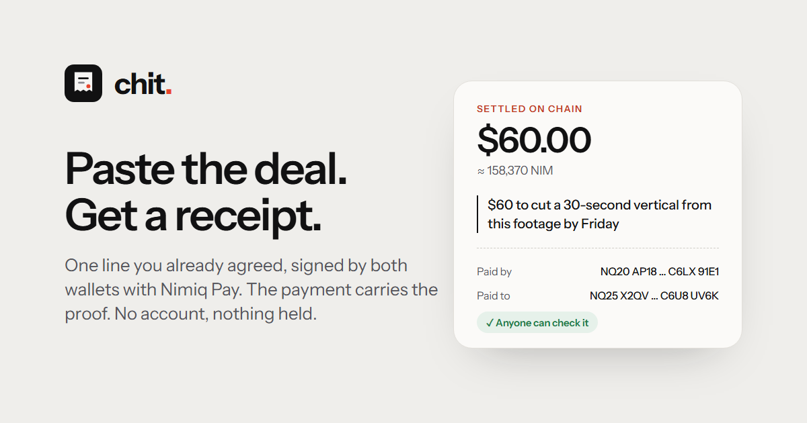
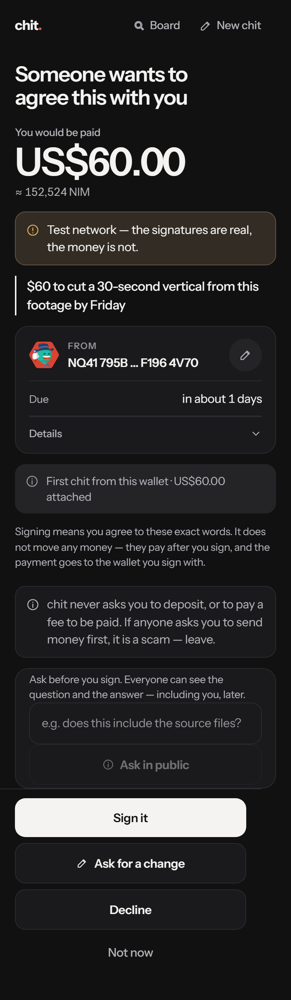
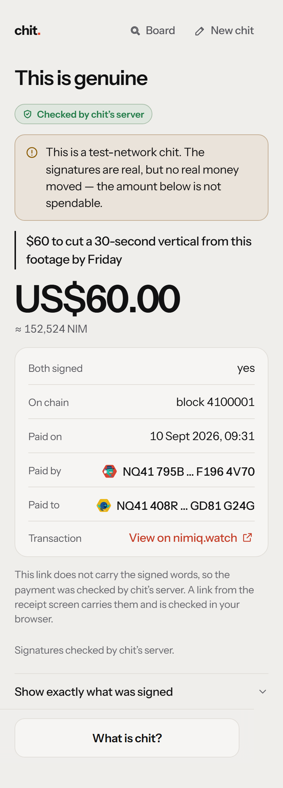
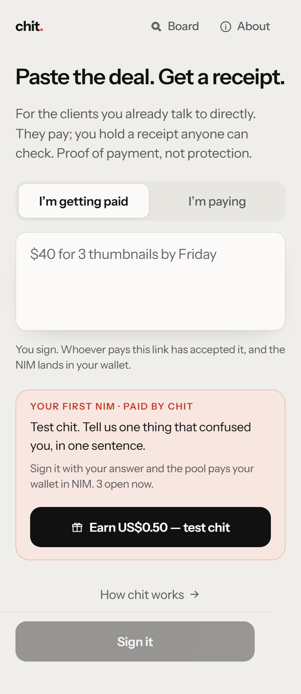
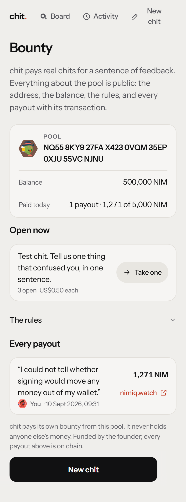

# Chit

> Paste the deal you already agreed. Both sign it. The payment carries the proof.

| Field | Value |
| --- | --- |
| Category | Productivity |
| Pricing | Free |
| Team name | Neon |
| Team members | Neon, Prateek |
| X account | neon_isme |
| Heard about it via | Nimiq Community |
| Contact email | neon10816@gmail.com |
| GitHub login | @minshuga108 |
| Submitted at | 2026-09-18T13:10:08.944Z |

## Links

| Link | URL |
| --- | --- |
| Repo | [https://github.com/minshuga108/chit](<https://github.com/minshuga108/chit>) |
| Demo | [https://chit-ecru.vercel.app](<https://chit-ecru.vercel.app>) |
| Video | [https://youtu.be/9DUBPD1TRTA](<https://youtu.be/9DUBPD1TRTA>) |
| Skool post | [https://www.skool.com/miniappscompetition/introducing-chit-a-simple-digital-receipt-for-online-work?p=bbb1bd09](<https://www.skool.com/miniappscompetition/introducing-chit-a-simple-digital-receipt-for-online-work?p=bbb1bd09>) |
| Social post | [https://x.com/neon_isme/status/2100934704610603029](<https://x.com/neon_isme/status/2100934704610603029>) |

## Description

Turn any agreement from Discord, WhatsApp, or DMs into a signed, on-chain receipt in one second using Nimiq Pay. No accounts, no fees, and no middleman holding your funds—just direct wallet-to-wallet payments with permanent proof anyone can verify.

## Builder story

Every freelance platform's worst reviews are the same complaint in different words: locked
out of an account holding money you earned, a 20% cut, a two-week wait to withdraw, support
that never answers. None of that is a policy problem — it's what happens when a platform
holds your money and your identity at the same time. chit doesn't hold either. There's no
account to be locked out of and no balance to freeze, so the failure modes the whole industry
apologizes for don't exist here to apologize for. What's left is the smallest possible
object: one line of text, signed by both sides, paid in NIM the moment it's signed. Building
it against Nimiq Pay specifically meant the "instant, feeless, works for an empty wallet"
claim had to be literally true before it could be a selling point — a $3 tip and a $200
invoice go through the exact same five taps.

## Thumbnail

## Screenshots

---

_Generated from the submission form. `submission.yaml` in this folder is the machine-readable source of truth._
