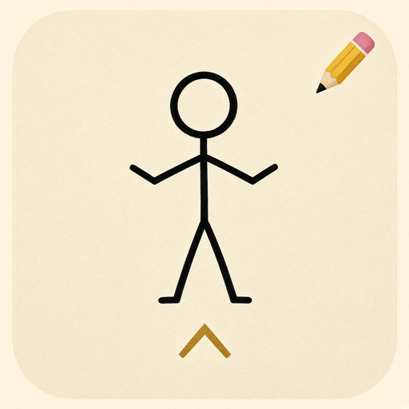
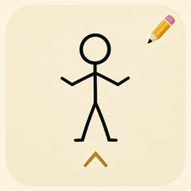
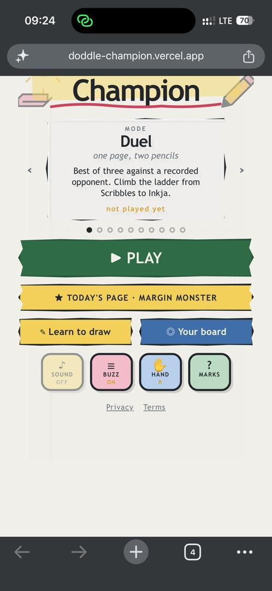
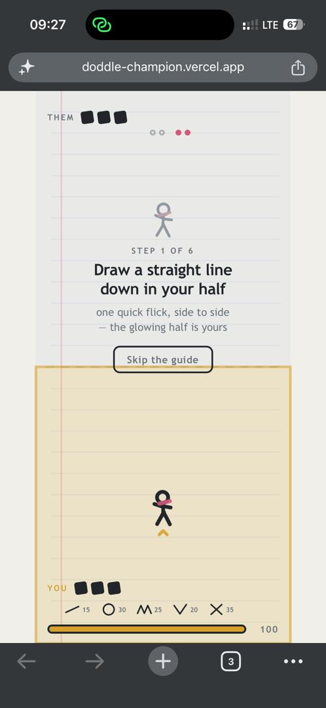
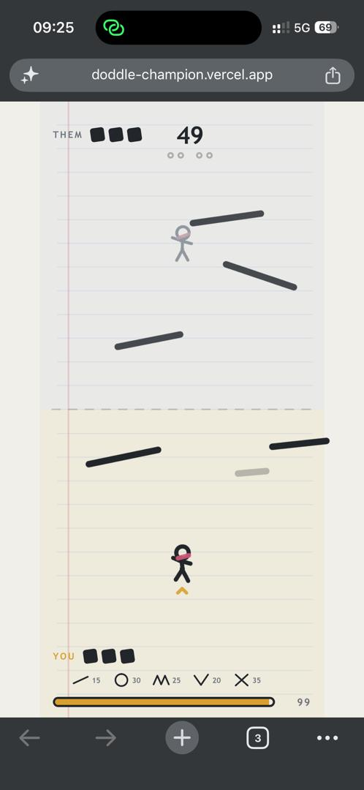
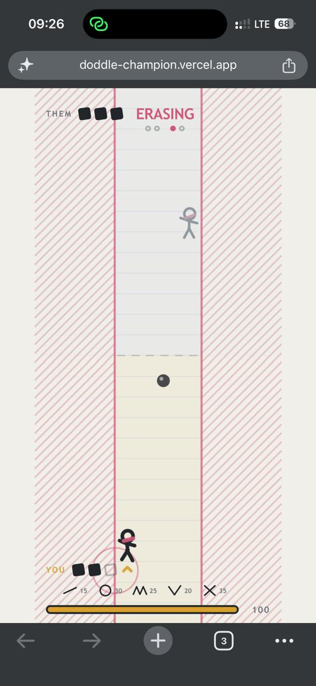
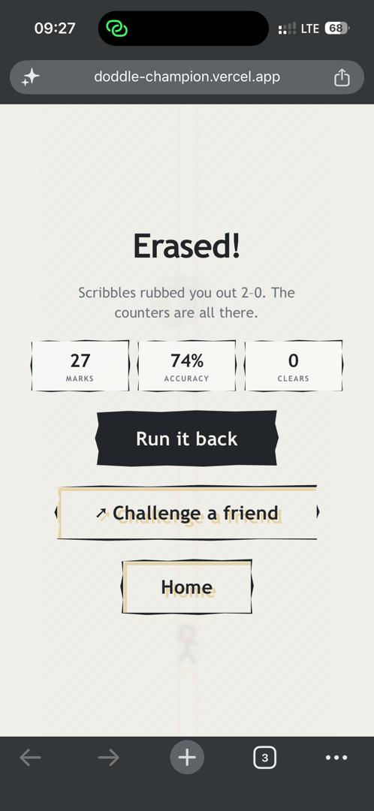

# Doodle Champion

> Draw to fight. One thumb. One page.

| Field | Value |
| --- | --- |
| Category | Games |
| Pricing | Free |
| Team name | _Not provided — optional_ |
| Team members | _Not provided — optional_ |
| X account | https://x.com/mohammednusee |
| Heard about it via | Nimiq Community |
| Contact email | mohammedyusi6@gmail.com |
| GitHub login | @miss-yusrah |
| Submitted at | 2026-09-18T09:31:18.330Z |

## Links

| Link | URL |
| --- | --- |
| Repo | [https://github.com/miss-yusrah/Doddle-Champion](<https://github.com/miss-yusrah/Doddle-Champion>) |
| Demo | [https://doddle-champion.vercel.app/](<https://doddle-champion.vercel.app/>) |
| Video | [https://vimeo.com/1228003311?share=copy&fl=sv&fe=ci](<https://vimeo.com/1228003311?share=copy&fl=sv&fe=ci>) |
| Skool post | _Not provided — optional_ |
| Social post | _Not provided — optional_ |

## Description

Doodle Champion is a mobile ink-dueling game for players who want a quick, tactile fight in the browser. You draw simple marks to attack and defend where you draw changes what they do then challenge friends with a shareable bout link and optionally save runs on Celo.

## Builder story

I wanted a game that feels like a real pencil not tap icons and pretend you’re drawing. Most mobile “action” games bury you under buttons; I built Doodle Champion so one thumb on a phone is enough: five simple marks, and where you draw changes what they do. Defend on your half of the page, attack across the fold. That rule is the whole game.

It’s for people who want a quick, tactile duel in the browser challenge a friend with a shareable bout link, no live server required. On Celo, runs can optionally be saved on-chain without gating play behind a wallet connect. The problem it solves is simple: skill games in wallet browsers usually feel bolted on; this one is built thumb-first and stays playable even if crypto is off.

## Thumbnail

## Screenshots

---

_Generated from the submission form. `submission.yaml` in this folder is the machine-readable source of truth._
