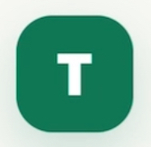
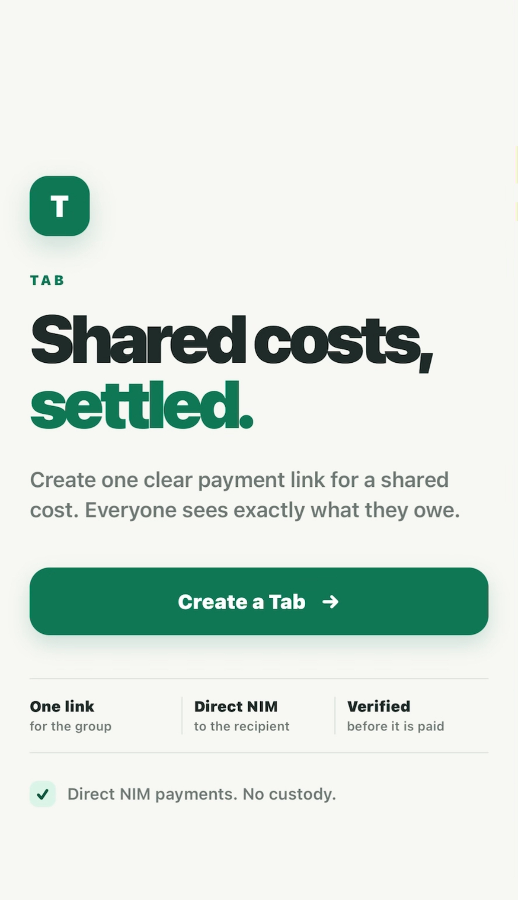
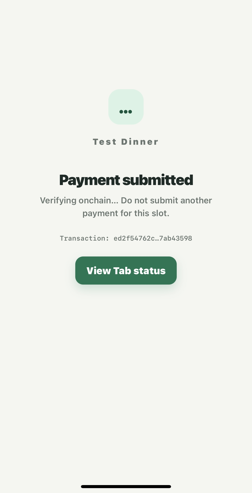
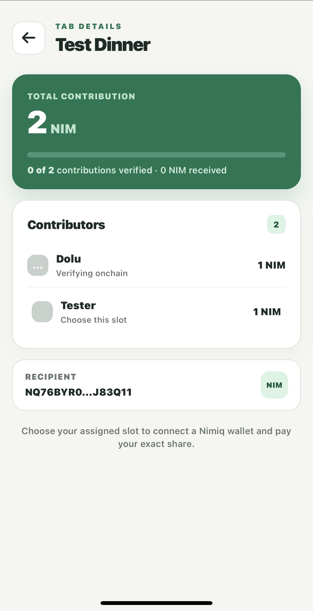
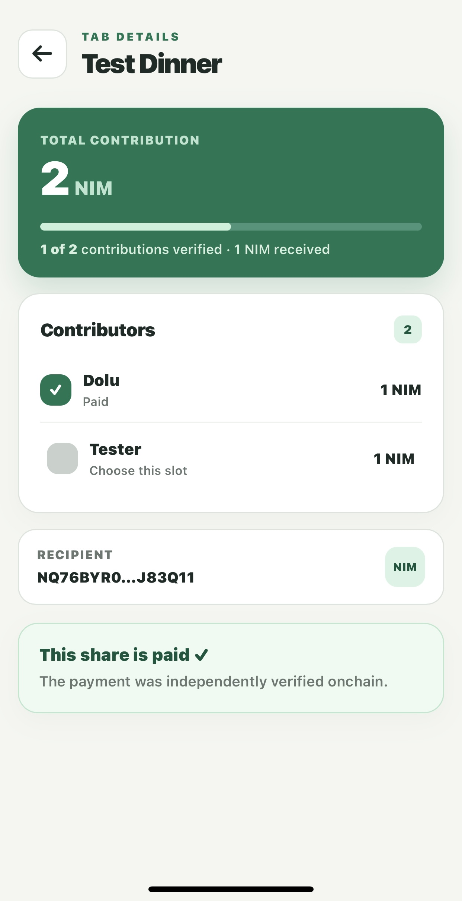

# Tab

> Shared costs, settled

| Field | Value |
| --- | --- |
| Category | Productivity |
| Pricing | Free |
| Team name | _Not provided — optional_ |
| Team members | _Not provided — optional_ |
| X account | _Not provided — optional_ |
| Heard about it via | X |
| Contact email | heritage143@gmail.com |
| GitHub login | @modolu |
| Submitted at | 2026-09-18T21:41:20.340Z |

## Links

| Link | URL |
| --- | --- |
| Repo | [https://github.com/modolu/Tab](<https://github.com/modolu/Tab>) |
| Demo | [https://tab-two-lime.vercel.app](<https://tab-two-lime.vercel.app>) |
| Video | [https://youtube.com/shorts/vVfQo8-sngo?feature=share](<https://youtube.com/shorts/vVfQo8-sngo?feature=share>) |
| Skool post | _Not provided — optional_ |
| Social post | [https://x.com/77pf_/status/2101063769728094473?s=20](<https://x.com/77pf_/status/2101063769728094473?s=20>) |

## Description

Tab is a shared-expense Mini App for Nimiq Pay. Organizers create one bill, assign exact NIM contributions, and share a link. Contributors pay the recipient directly from Nimiq Pay, while Tab verifies each transaction onchain and updates progress in real time.

## Builder story

Shared expenses are simple until it is time to collect the money. Someone pays first, everyone owes a different amount, links get lost, and the organizer ends up chasing people while manually checking who has paid.

I built Tab to make that process explicit. An organizer creates one shared obligation, adds the contributors, assigns each person's exact share, and shares a single link. Each contributor opens the Tab in Nimiq Pay, selects their slot, connects their wallet, reviews the exact sender, recipient and amount, then pays the recipient directly.

Tab is deliberately non-custodial: it never holds the funds. After a transaction is submitted, the app does not immediately mark it as paid. It independently checks the Nimiq transaction onchain against the expected recipient, amount and payment reference, waits for finality, and only then updates that contributor to Paid. Organizer and participant views update in real time until the Tab is settled.

The production deployment is configured for Nimiq mainnet. The complete payment-to-verification flow was also physically tested on Nimiq Testnet, including submission, onchain verification, Paid status and settlement behavior.

The goal was to make shared payment collection feel less like bookkeeping and more like one clear, trustworthy flow inside Nimiq Pay.

## Thumbnail

## Screenshots

---

_Generated from the submission form. `submission.yaml` in this folder is the machine-readable source of truth._
