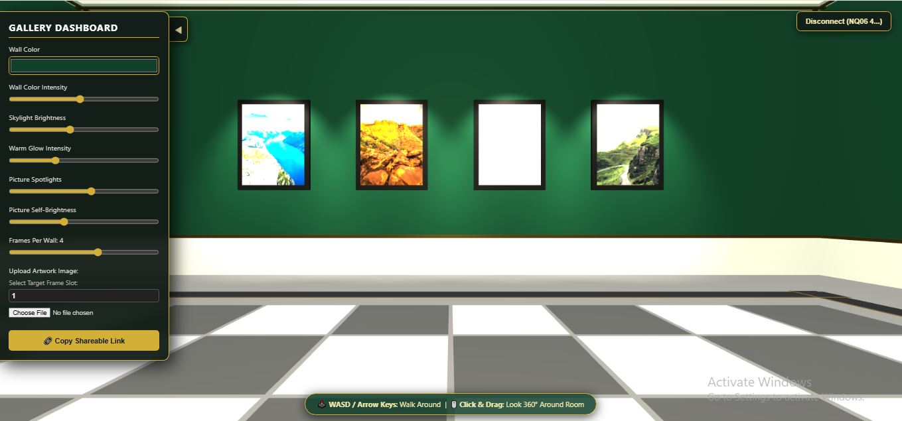
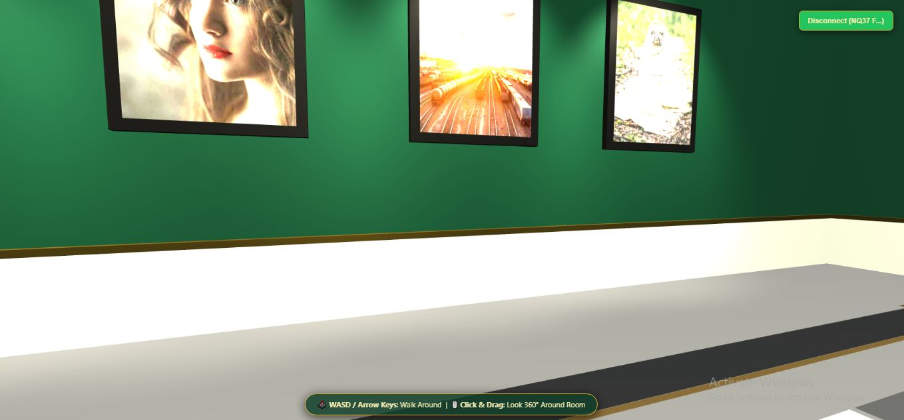
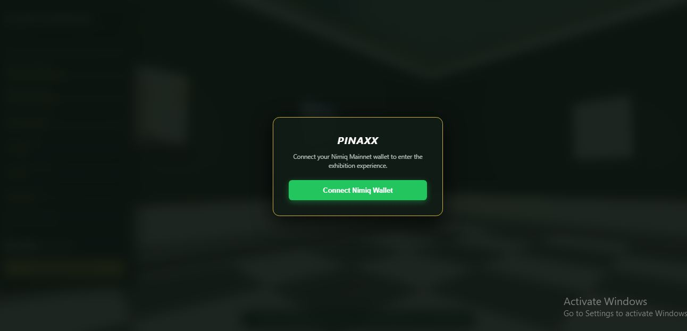
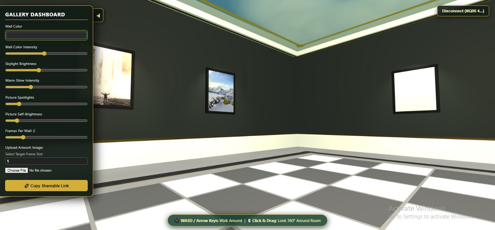

# PINAXX

> A responsive 3D virtual art gallery experience.

| Field | Value |
| --- | --- |
| Category | Creator tools |
| Pricing | Free |
| Team name | _Not provided — optional_ |
| Team members | _Not provided — optional_ |
| X account | thedeafEYE |
| Heard about it via | x, nimiq community |
| Contact email | chukwukafranciis@gmail.com |
| GitHub login | @montana419 |
| Submitted at | 2026-09-18T01:31:36.466Z |

## Links

| Link | URL |
| --- | --- |
| Repo | [https://github.com/montana419/Shared-Gallery-Exhibition](<https://github.com/montana419/Shared-Gallery-Exhibition>) |
| Demo | [https://pinaxx.vercel.app/](<https://pinaxx.vercel.app/>) |
| Video | [https://www.youtube.com/watch?v=_FhKeQ-P4gY](<https://www.youtube.com/watch?v=_FhKeQ-P4gY>) |
| Skool post | [https://www.skool.com/miniappscompetition/live?p=20eb5bef.](<https://www.skool.com/miniappscompetition/live?p=20eb5bef.>) |
| Social post | [https://x.com/ThedeafEYE/status/2100758649631092936](<https://x.com/ThedeafEYE/status/2100758649631092936>) |

## Description

The application is an interactive 3D virtual gallery ,that allows users and Creators looking for a lightweight, web accessible 3D showroom ; to exhibit their artwork without requiring complex 3D modeling tools or external software.

## Builder story

As an ideator and builder, i like to reimagine evey day concepts , to see how they can be improved upon . my App submission sit in an important path for both fashion and art enthusiast.

## Thumbnail

## Screenshots

---

_Generated from the submission form. `submission.yaml` in this folder is the machine-readable source of truth._
