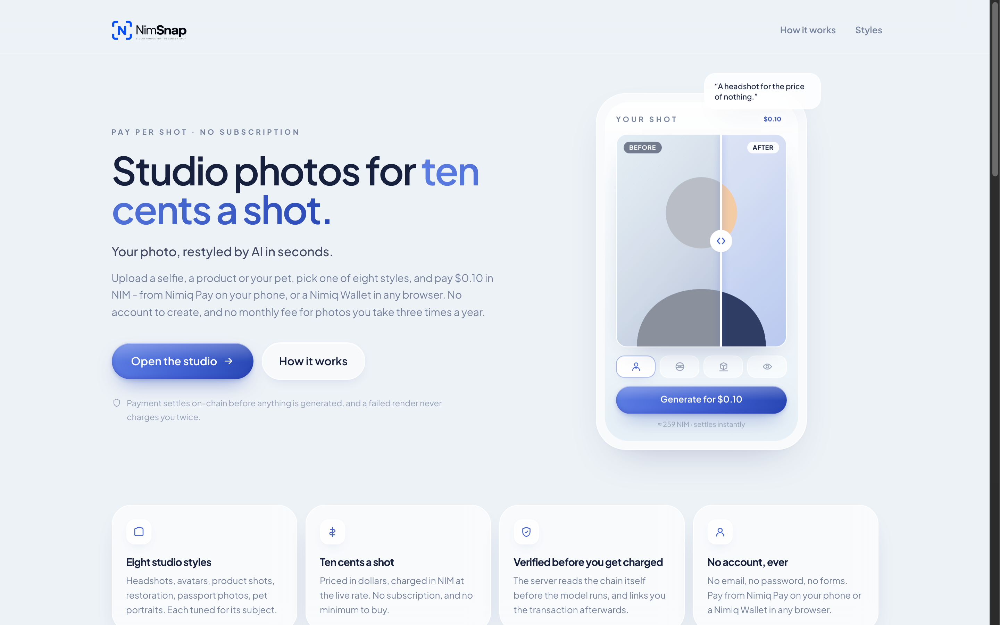
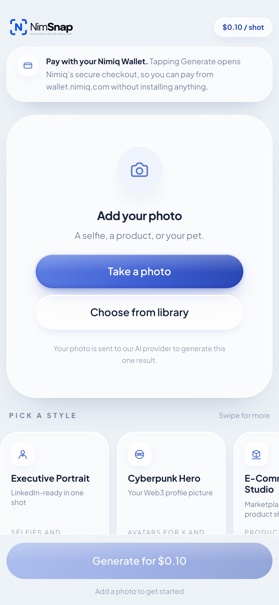
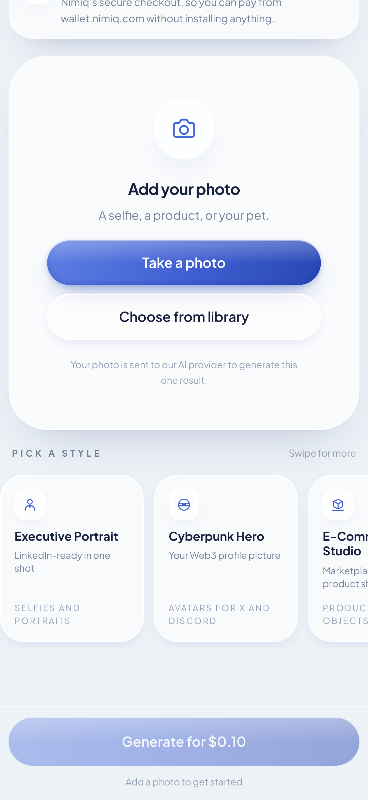
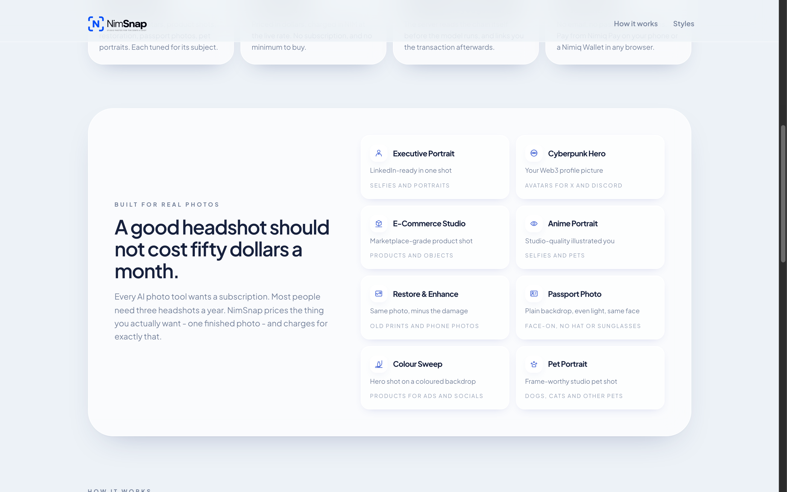
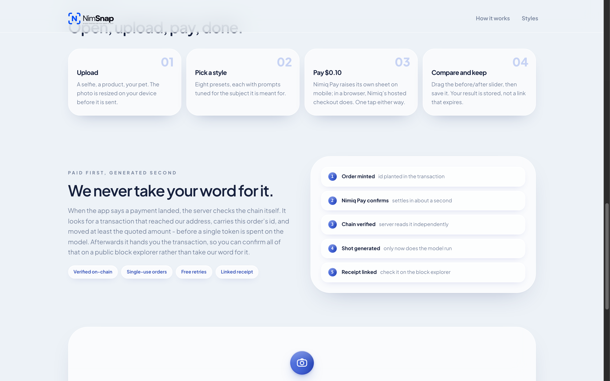

# NimSnap

> Studio photos for ten cents a shot.

| Field | Value |
| --- | --- |
| Category | Creator tools |
| Pricing | Paid |
| Team name | NetLayer Labs |
| Team members | N/A |
| X account | encrypt_wizard |
| Heard about it via | X |
| Contact email | mrnetwork0001@gmail.com |
| GitHub login | @mrnetwork0001 |
| Submitted at | 2026-09-17T05:10:36.402Z |

## Links

| Link | URL |
| --- | --- |
| Repo | [https://github.com/mrnetwork0001/NimSnap](<https://github.com/mrnetwork0001/NimSnap>) |
| Demo | [https://nimsnap.xyz](<https://nimsnap.xyz>) |
| Video | [https://youtu.be/l5hAyWUBn1Y](<https://youtu.be/l5hAyWUBn1Y>) |
| Skool post | [https://www.skool.com/miniappscompetition/built-nimsnap-pay-per-shot-ai-photos-010-in-nim-no-account-plus-2-gotchas-that-cost-me-a-day?p=94c8a649](<https://www.skool.com/miniappscompetition/built-nimsnap-pay-per-shot-ai-photos-010-in-nim-no-account-plus-2-gotchas-that-cost-me-a-day?p=94c8a649>) |
| Social post | [https://x.com/encrypt_wizard/status/2100313360571183196](<https://x.com/encrypt_wizard/status/2100313360571183196>) |

## Description

Upload a photo, pick one of eight styles, and pay $0.10 in NIM to get a studio-grade portrait, avatar, product shot or restored print back in seconds. For anyone who needs a good photo a few times a year and shouldn't have to buy a $30/month subscription to get one.

## Builder story

Every AI photo tool is a subscription. I needed about three headshots a year, and the maths never worked: pay for eleven months you don't use, or go without.

So I priced the actual unit of value; one finished photo, at ten cents. That only works on a rail where ten cents survives the fee, which is the whole reason NimSnap is a Nimiq Mini App rather than a website with a card form. 

The business model and the technology are the same decision.

The part I cared most about was not taking anyone's word for a payment. The order id rides inside the transaction, so the server reads the chain itself and confirms the money landed before spending anything on the model and the finished shot links back to that transaction so the user can check it too. 

Sixteen payments have settled on mainnet so far.

## Thumbnail

## Screenshots

---

_Generated from the submission form. `submission.yaml` in this folder is the machine-readable source of truth._
