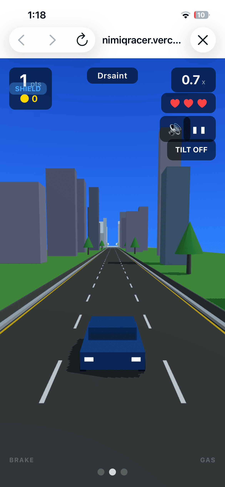
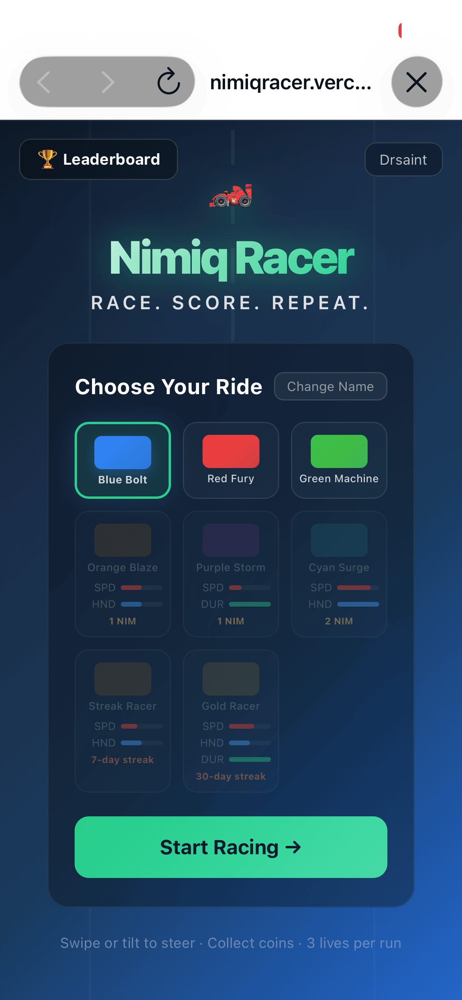
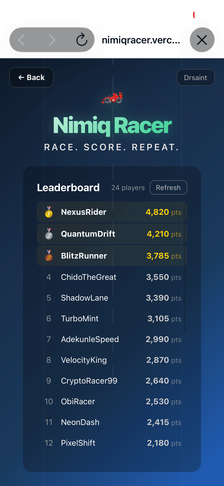

# Nimiq Racer

> Race, dodge, and earn,  a 3D racing Mini App powered by NIM

| Field | Value |
| --- | --- |
| Category | Games |
| Pricing | Freemium |
| Team name | Team Deaneries |
| Team members | _Not provided — optional_ |
| X account | deaneries_ |
| Heard about it via | Nimiq Community |
| Contact email | jamesfemiadedayo@gmail.com |
| GitHub login | @mrsaints004 |
| Submitted at | 2026-09-18T01:33:27.666Z |

## Links

| Link | URL |
| --- | --- |
| Repo | [https://github.com/mrsaints004/NimiqRacer](<https://github.com/mrsaints004/NimiqRacer>) |
| Demo | [https://nimiqracer.vercel.app/](<https://nimiqracer.vercel.app/>) |
| Video | [https://youtu.be/QJTeszse05I?si=BoBEG8IKl7XPjxRt](<https://youtu.be/QJTeszse05I?si=BoBEG8IKl7XPjxRt>) |
| Skool post | _Not provided — optional_ |
| Social post | [https://x.com/deaneries_/status/2100741663467479442](<https://x.com/deaneries_/status/2100741663467479442>) |

## Description

Nimiq Racer is a fast-paced 3D endless racing game where players dodge obstacles, collect coins, buy premium cars with NIM, compete on a global leaderboard, challenge friends, and earn achievements. Built for everyone who wants a fun, instant-play game right inside Nimiq Pay.

## Builder story

I wanted to build something that shows what Nimiq Mini Apps can actually do beyond payments and utilities. A game felt like the perfect way to push the SDK - it uses device identity for verified leaderboard entries, NIM payments for a cosmetic car shop, and message signing for daily streak check-ins. The whole thing runs at 60fps in the browser using Three.js, works on both desktop and mobile, and degrades gracefully outside Nimiq Pay so anyone can play. The leaderboard, anti-cheat system, achievements, and friend challenges all run on a backend API. I built it because crypto needs more fun stuff, and because proving real usage through an actual game people want to play felt more interesting than another dashboard.

## Thumbnail

## Screenshots

---

_Generated from the submission form. `submission.yaml` in this folder is the machine-readable source of truth._
