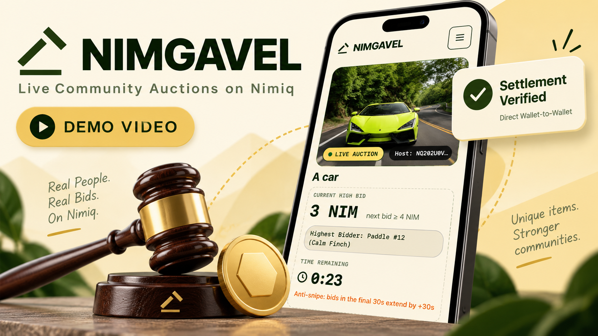
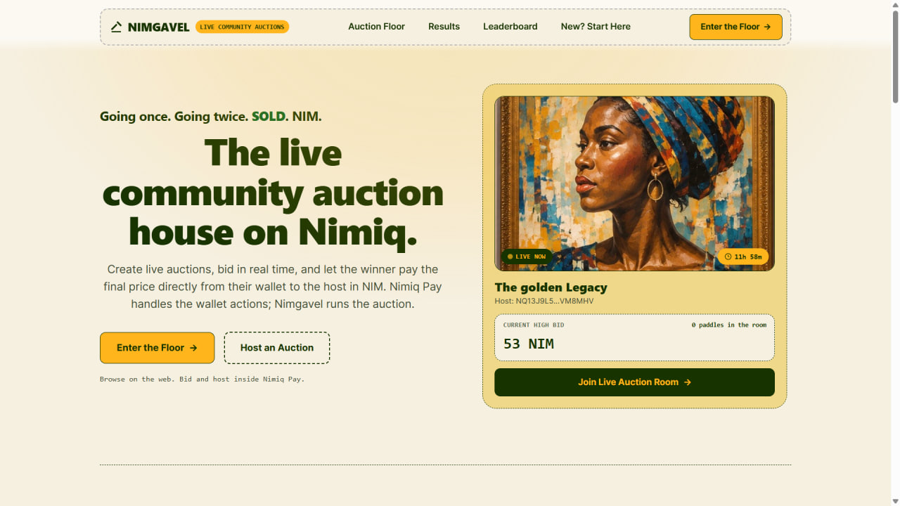
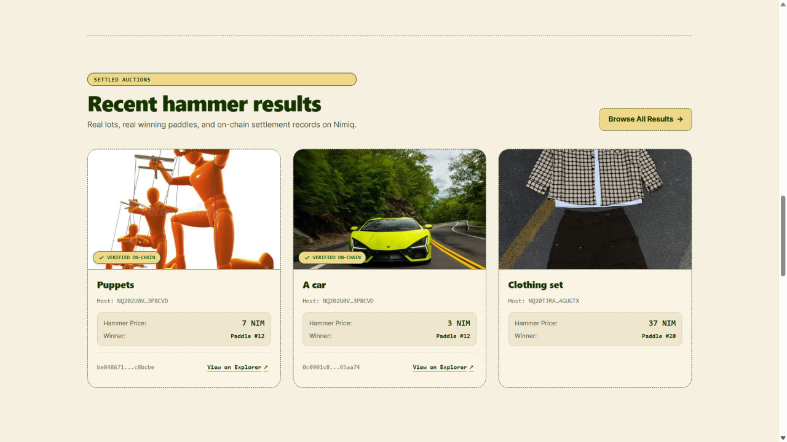
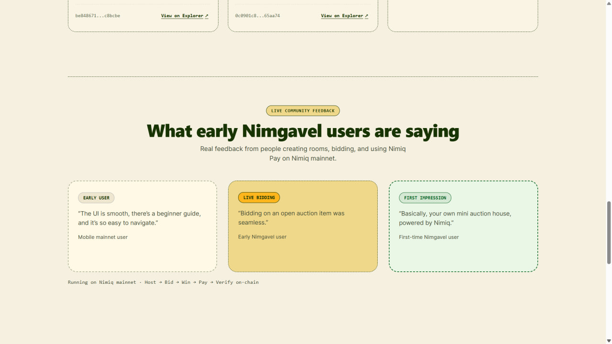
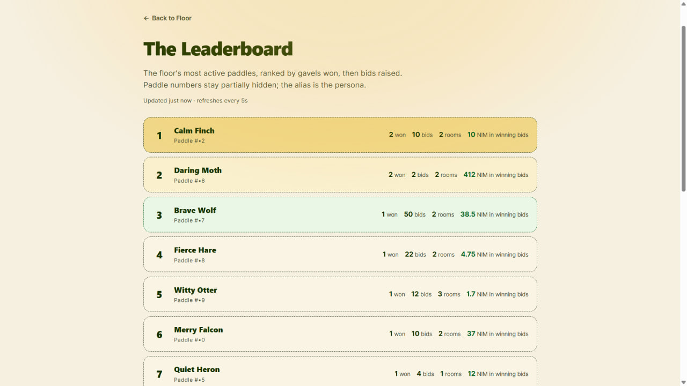
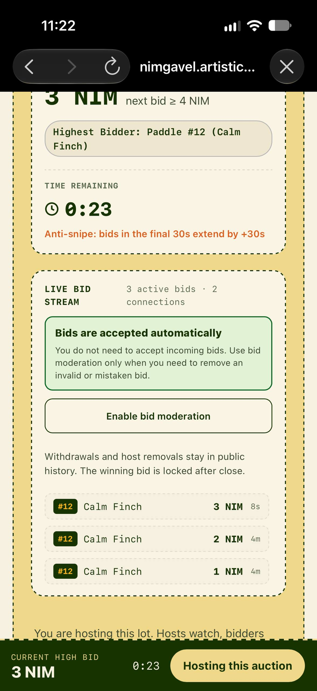

# Nimgavel

> The live community auction house on Nimiq.

| Field | Value |
| --- | --- |
| Category | Marketplaces |
| Pricing | Free |
| Team name | MideLabs |
| Team members | _Not provided — optional_ |
| X account | MystiqueMide |
| Heard about it via | Nimiq Community , X , Email |
| Contact email | mide27145@gmail.com |
| GitHub login | @mystiquemide |
| Submitted at | 2026-09-18T15:13:33.177Z |

## Links

| Link | URL |
| --- | --- |
| Repo | [https://github.com/mystiquemide/nimgavel](<https://github.com/mystiquemide/nimgavel>) |
| Demo | [https://nimgavel.midelabs.xyz](<https://nimgavel.midelabs.xyz>) |
| Video | [https://youtu.be/TYdVrHq_l20](<https://youtu.be/TYdVrHq_l20>) |
| Skool post | [https://www.skool.com/miniappscompetition/nimgavel-live-community-auction-house?p=15fdd733](<https://www.skool.com/miniappscompetition/nimgavel-live-community-auction-house?p=15fdd733>) |
| Social post | [https://x.com/MystiqueMide/status/2100965084843356296?s=20](<https://x.com/MystiqueMide/status/2100965084843356296?s=20>) |

## Description

Nimgavel is a live community auction house built for Nimiq Pay. Hosts create a lot, set the starting bid, minimum increment, duration and fulfilment terms, then sign with Nimiq Pay to launch a real-time auction. Bidders receive pseudonymous paddles, acknowledge the published term

## Builder story

Community auctions are incredibly easy to start in a group chat,but once real people begin bidding, everything becomes harder: who bid first, whether the deadline was fair, what happens when someone withdraws, who actually won, and whether the winner really paid.

I built Nimgavel to turn that messy process into one live, authoritative auction room powered by Nimiq Pay. I wanted the wallet to be part of the product from beginning to end, not something added only at checkout. Hosts sign to create and control auctions, bidders receive pseudonymous paddles and authorise their wallets, bids are checked against live NIM balances, and winners settle directly with hosts through Nimiq Pay.

During Cycle II I kept putting Nimgavel in front of real mobile users and rebuilding the weak parts they found, including wallet detection, balance checks, mobile navigation, auction previews, loading states and fulfilment terms. 

By submission, we had completed real two-device mainnet auctions and verified multiple NIM settlements on-chain.

## Thumbnail

## Screenshots

---

_Generated from the submission form. `submission.yaml` in this folder is the machine-readable source of truth._
