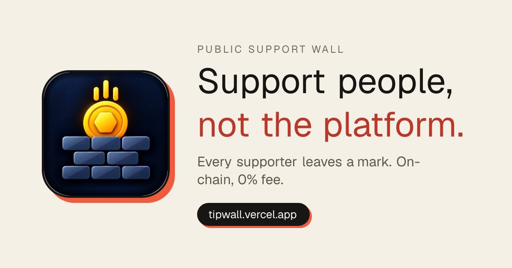
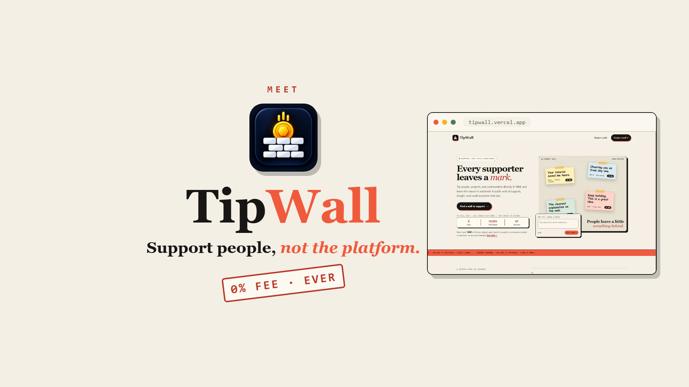
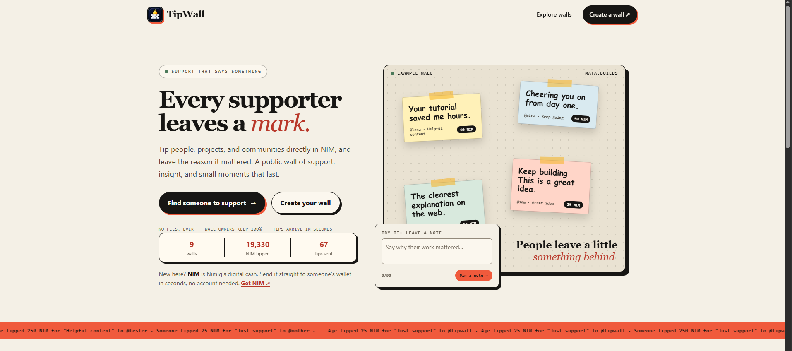
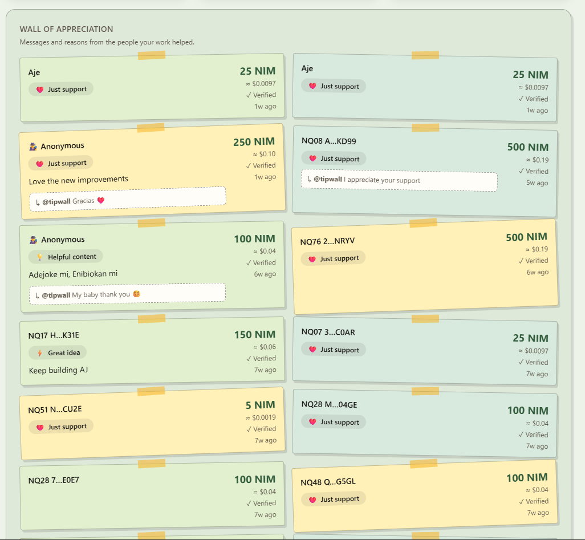
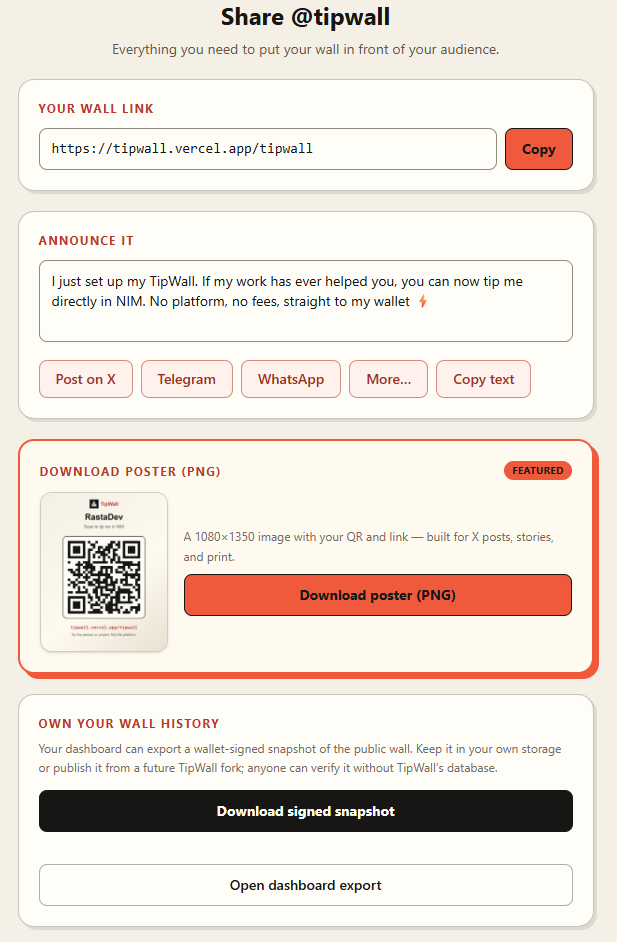

# TipWall

> Tip the creator, Not the platform.

| Field | Value |
| --- | --- |
| Category | Social |
| Pricing | Free |
| Team name | TipWall |
| Team members | Adejoke |
| X account | RastaDev_ |
| Heard about it via | X |
| Contact email | akinolaa769@gmail.com |
| GitHub login | @natureloved |
| Submitted at | 2026-09-17T11:05:41.534Z |

## Links

| Link | URL |
| --- | --- |
| Repo | [https://github.com/natureloved/TipWall](<https://github.com/natureloved/TipWall>) |
| Demo | [https://tipwall.vercel.app/](<https://tipwall.vercel.app/>) |
| Video | [https://youtube.com/shorts/zsep3PpS-cI?si=xCuXV7Hk4Bw4IXbR](<https://youtube.com/shorts/zsep3PpS-cI?si=xCuXV7Hk4Bw4IXbR>) |
| Skool post | [https://www.skool.com/miniappscompetition/i-changed-tipwall-ux?p=2c8b62d7](<https://www.skool.com/miniappscompetition/i-changed-tipwall-ux?p=2c8b62d7>) |
| Social post | [https://x.com/tipwallonNIM/status/2099772603804041471?s=20](<https://x.com/tipwallonNIM/status/2099772603804041471?s=20>) |

## Description

TipWall is a public support platform where you can tip creators, projects, and communities in NIM and leave messages explaining why their work mattered.

## Builder story

The friction was doing the talking
Every time I wanted to send someone money for something they made, something got in the way. A fee that made a small amount pointless. An account I had to create first. A minimum. A wait. A form.

I would read a post that saved me an afternoon, or use a tool someone clearly poured weekends into, and there was no way to say thank you that felt worth the effort. So I did not say it. That is the part that stuck with me: not that I could not pay, but that the friction quietly talked me out of it, and nobody ever noticed.

The moment I decided to build it
I was looking at a payout statement from a platform I used to tip a developer whose library I had relied on for months. The number that reached them was not the number I sent. The gap was not hidden, it was the business model. I sent what felt like a meaningful amount; they received what felt like a rounding error.

That was the moment. Not anger, just clarity. If the act of saying thank you is taxed, fewer people say it. And the people who do say it are sending a smaller signal than they think. Every percent is a person.

## Thumbnail

## Screenshots

---

_Generated from the submission form. `submission.yaml` in this folder is the machine-readable source of truth._
