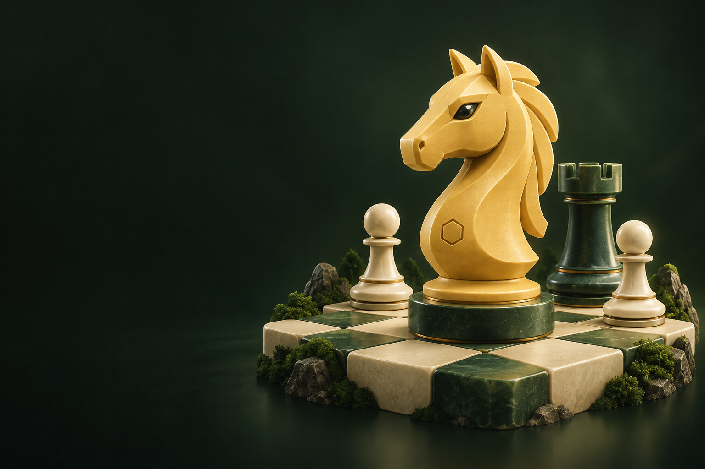
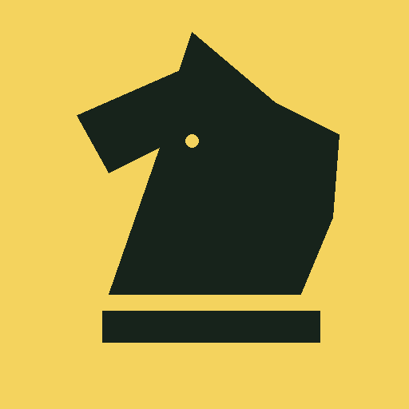
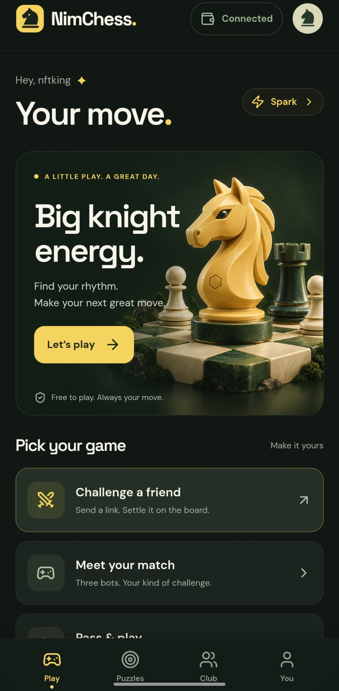
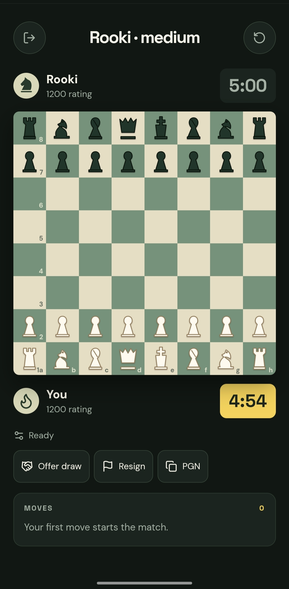
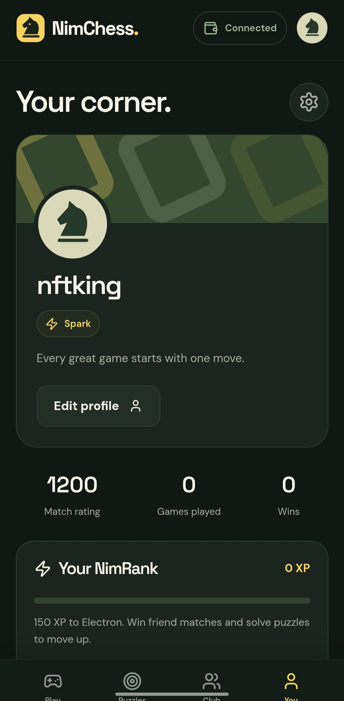

# NimChess

> Play sharp. Earn your NimRank. Celebrate with NIM.

| Field | Value |
| --- | --- |
| Category | Games |
| Pricing | Free |
| Team name | _Not provided — optional_ |
| Team members | _Not provided — optional_ |
| X account | NFTKINGIII |
| Heard about it via | X |
| Contact email | onlyonenftking@gmail.com |
| GitHub login | @nftkingiii |
| Submitted at | 2026-09-11T20:44:06.782Z |

## Links

| Link | URL |
| --- | --- |
| Repo | [https://github.com/nftkingiii/nimchess](<https://github.com/nftkingiii/nimchess>) |
| Demo | [https://nimchess-game.up.railway.app](<https://nimchess-game.up.railway.app>) |
| Video | [https://youtube.com/shorts/ZrOGbZGlCUY?feature=share](<https://youtube.com/shorts/ZrOGbZGlCUY?feature=share>) |
| Skool post | [https://www.skool.com/miniappscompetition/nimchess-is-live?p=41e3de1a](<https://www.skool.com/miniappscompetition/nimchess-is-live?p=41e3de1a>) |
| Social post | [https://x.com/NFTKINGIII/status/2098500588527141291?s=20](<https://x.com/NFTKINGIII/status/2098500588527141291?s=20>) |

## Description

NimChess is a mobile-first chess club inside Nimiq Pay for players to challenge friends, practice with bots, solve puzzles, build NimRank, and connect their Nimiq wallet.

## Builder story

Had a lot of ideas on what to build for a miniapp, some were built and abandoned, I realized that the whole purpose was just to build something that users can have fun using.
I like Chess and i know that there are people who love chess too, so i built NimChess for you.

## Thumbnail

## Screenshots

---

_Generated from the submission form. `submission.yaml` in this folder is the machine-readable source of truth._
