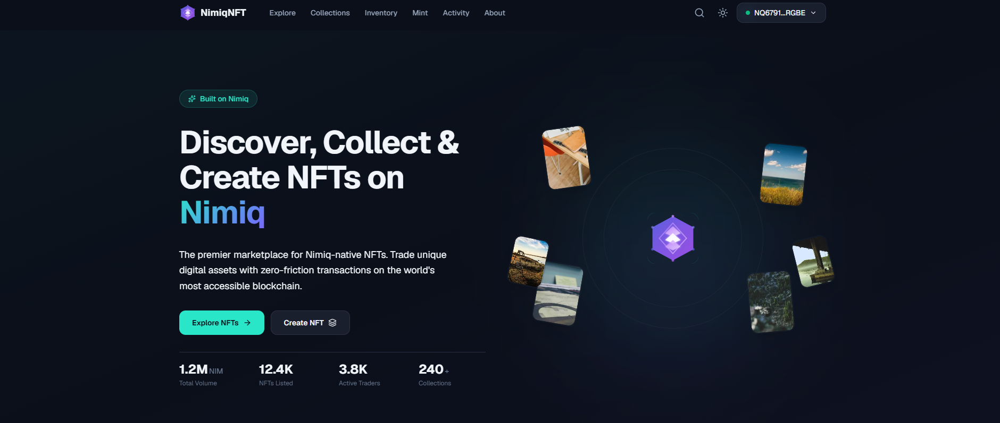
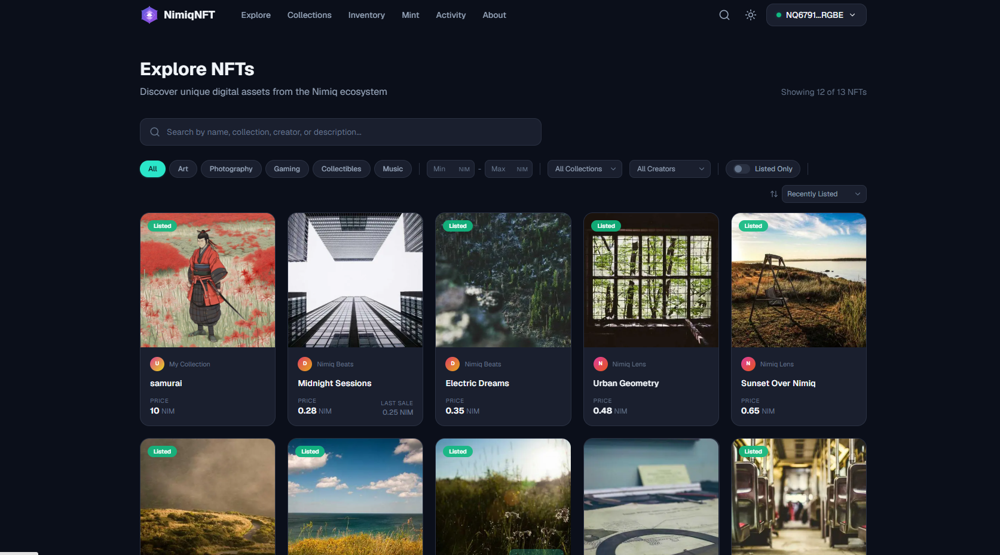
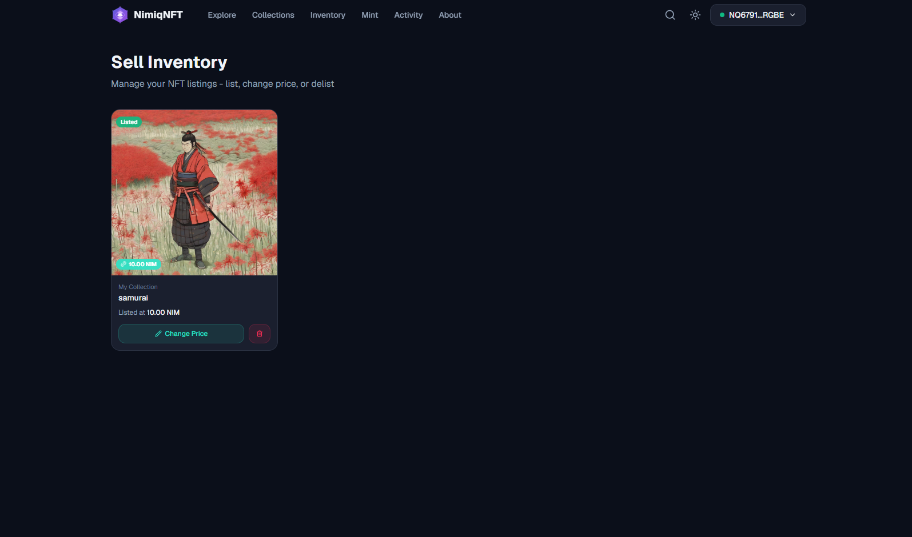
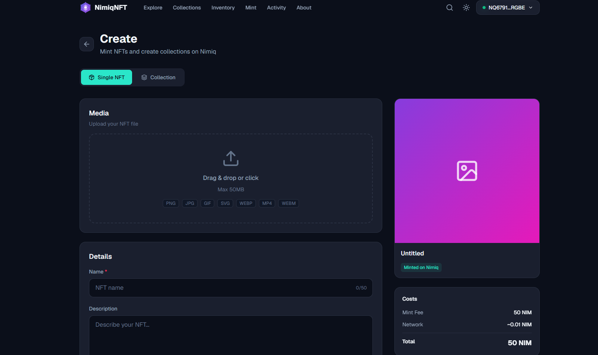

# Nimiq NFT Marketplace

> Discover, buy, and sell NFTs powered by Nimiq.

| Field | Value |
| --- | --- |
| Category | Marketplaces |
| Pricing | Free |
| Team name | _Not provided — optional_ |
| Team members | _Not provided — optional_ |
| X account | nimiq_nft |
| Heard about it via | X |
| Contact email | esinoob1@gmail.com |
| GitHub login | @nimnft |
| Submitted at | 2026-09-12T17:17:43.466Z |

## Links

| Link | URL |
| --- | --- |
| Repo | [https://github.com/nimnft/nimiq-nft-marketplace/tree/master](<https://github.com/nimnft/nimiq-nft-marketplace/tree/master>) |
| Demo | [https://nimnft.netlify.app/](<https://nimnft.netlify.app/>) |
| Video | [https://youtu.be/IvkthztqUCc](<https://youtu.be/IvkthztqUCc>) |
| Skool post | [https://www.skool.com/miniappscompetition/nimiq-nft-marketplace?p=f0fea4c8](<https://www.skool.com/miniappscompetition/nimiq-nft-marketplace?p=f0fea4c8>) |
| Social post | [https://x.com/nimiq_nft/status/2098793914631168013](<https://x.com/nimiq_nft/status/2098793914631168013>) |

## Description

A decentralized NFT marketplace built on Nimiq where users can discover, buy, and sell digital collectibles. Designed to make NFT trading simple and accessible for the Nimiq community.

## Builder story

I built this project to explore the possibilities of NFTs and decentralized marketplaces on Nimiq. My goal was to create a simple and accessible place where the Nimiq community can discover, buy, and sell digital collectibles while experiencing how Nimiq can power Web3 applications.

## Thumbnail

## Screenshots

---

_Generated from the submission form. `submission.yaml` in this folder is the machine-readable source of truth._
