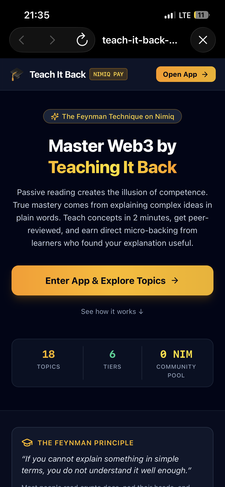
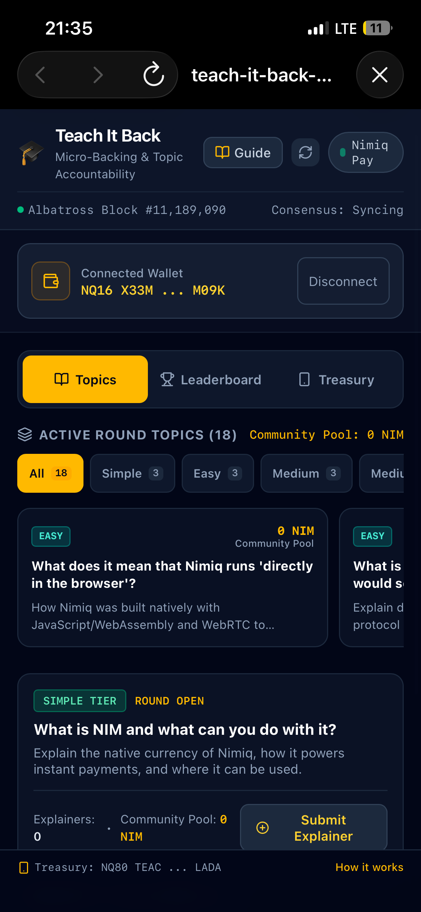
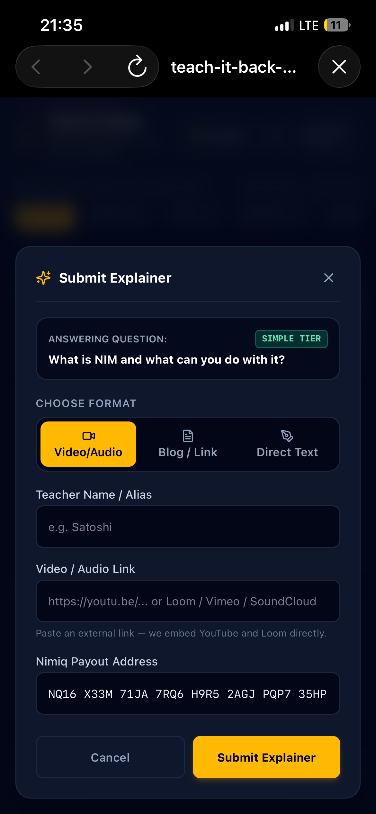
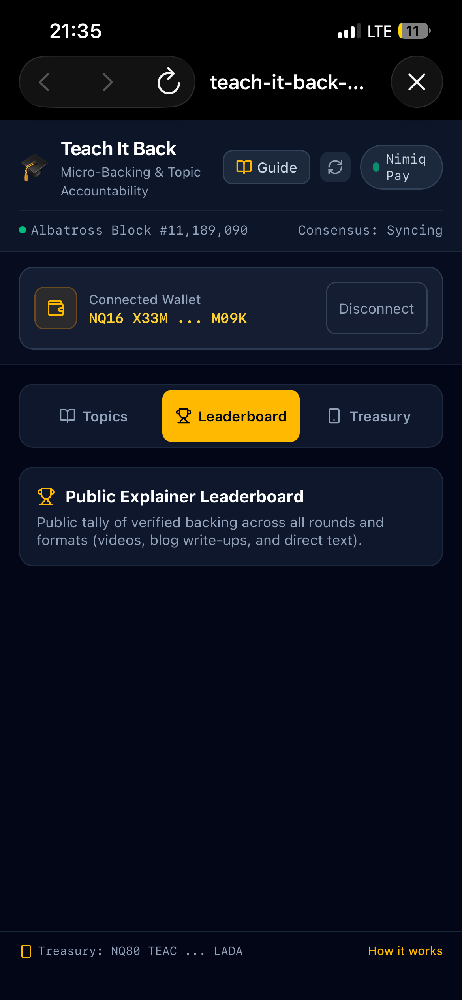

# Teach it back

> Master what you know by teaching it back

| Field | Value |
| --- | --- |
| Category | Education |
| Pricing | Free |
| Team name | _Not provided — optional_ |
| Team members | _Not provided — optional_ |
| X account | _Not provided — optional_ |
| Heard about it via | _Not provided — optional_ |
| Contact email | 1captaineddy@gmail.com |
| GitHub login | @nimrid |
| Submitted at | 2026-09-12T02:19:25.003Z |

## Links

| Link | URL |
| --- | --- |
| Repo | [https://github.com/nimrid/Teach-It-Back](<https://github.com/nimrid/Teach-It-Back>) |
| Demo | [https://teach-it-back-89eq.onrender.com](<https://teach-it-back-89eq.onrender.com>) |
| Video | [https://youtube.com/shorts/3UZ2h-Nu0hs?si=ZmKU9jr3WyqIvhBU](<https://youtube.com/shorts/3UZ2h-Nu0hs?si=ZmKU9jr3WyqIvhBU>) |
| Skool post | _Not provided — optional_ |
| Social post | _Not provided — optional_ |

## Description

Teach It Back is a Nimiq Pay Mini App that turns the Feynman Technique into an earn-as-you-learn flywheel. It’s for crypto learners who prove their understanding by teaching topics simply, and community backers who micro-fund the clearest explanations with instant NIM tips.

## Builder story

_Not provided — optional_

## Thumbnail

## Screenshots

---

_Generated from the submission form. `submission.yaml` in this folder is the machine-readable source of truth._
