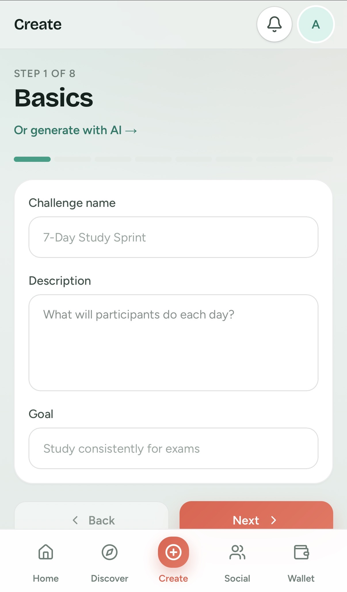
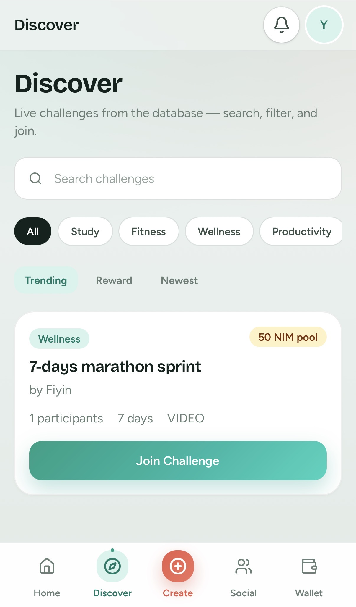
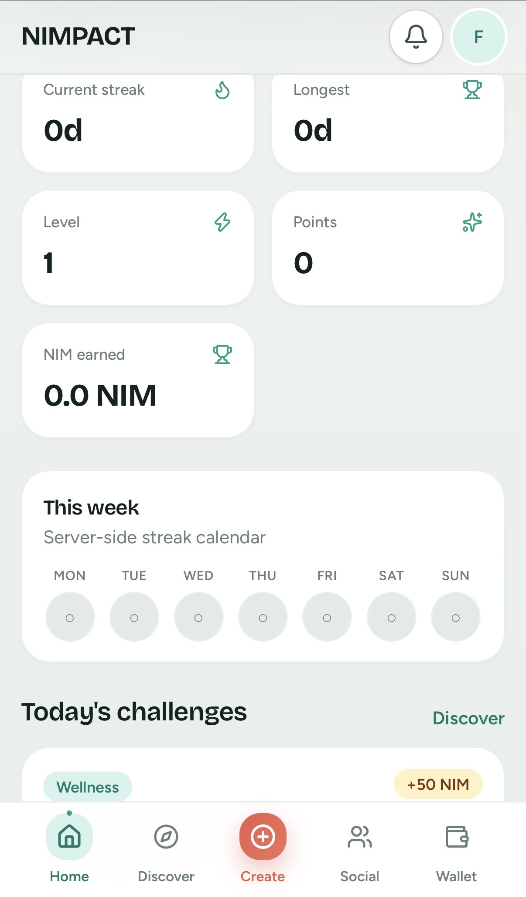

# Nimpact

> Do good. Challenge friends. Get rewarded.

| Field | Value |
| --- | --- |
| Category | Social |
| Pricing | Freemium |
| Team name | Myself ‘Nimpact |
| Team members | Fiyin |
| X account | uchemarvellous6 |
| Heard about it via | X |
| Contact email | sottingrace@gmail.com |
| GitHub login | @okanrende |
| Submitted at | 2026-09-18T19:10:56.667Z |

## Links

| Link | URL |
| --- | --- |
| Repo | [https://github.com/okanrende/-nimpact⁠](<https://github.com/okanrende/-nimpact⁠>) |
| Demo | [https://nimpact-production.up.railway.app/?utm_source=chatgpt.com](<https://nimpact-production.up.railway.app/?utm_source=chatgpt.com>) |
| Video | [https://vimeo.com/1228154449](<https://vimeo.com/1228154449>) |
| Skool post | [https://www.skool.com/miniappscompetition/introducing-nimpact?p=9acf30d3](<https://www.skool.com/miniappscompetition/introducing-nimpact?p=9acf30d3>) |
| Social post | [https://x.com/uchemarvellous6/status/2101017619381809498?s=46](<https://x.com/uchemarvellous6/status/2101017619381809498?s=46>) |

## Description

NIMPACT is a social challenge + accountability app where users create real-world challenges and put NIM/USDT behind them.

## Builder story

🛠️ Builder Story: Why I Built NIMPACT

I didn’t want to build another Mini App that simply puts a crypto wallet behind a normal Web2 experience.

I wanted to build something where NIM actually has a purpose.

That’s where NIMPACT came from.

I’ve always found that starting a goal is easy. Staying consistent is the hard part. Whether it’s studying, working out, building a project, reading, or simply sticking to a personal commitment, accountability can make a huge difference.

So I asked:

What if your commitment could be social, measurable, and economically meaningful?

That became NIMPACT.

With NIMPACT, people can create and join challenges, build streaks, track progress, and hold each other accountable. For challenges that require commitment, participants can use NIM through Nimiq Pay as an entry fee.

The goal isn’t to make people spend money just for the sake of it. The goal is to connect commitment → action → accountability → rewards in one experience.

Building it has been a journey of breaking down a big idea into something that actually works: authentication, challenges, participation, payment verification, wallet integration, transaction history, and the Mini App experience.

There’s still a lot I want to build.

AI-powered challenge creation. Better social features. More reward mechanics. More ways for communities to create challenges together.

But for now, I’m proud to say:

NIMPACT is live. 🟡

## Thumbnail

## Screenshots

---

_Generated from the submission form. `submission.yaml` in this folder is the machine-readable source of truth._
