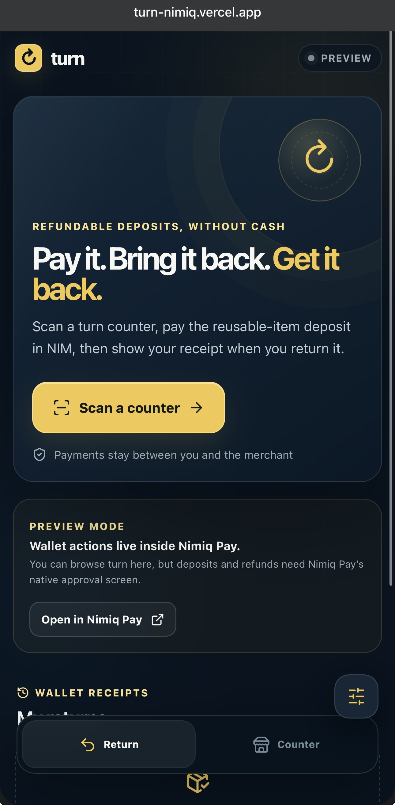
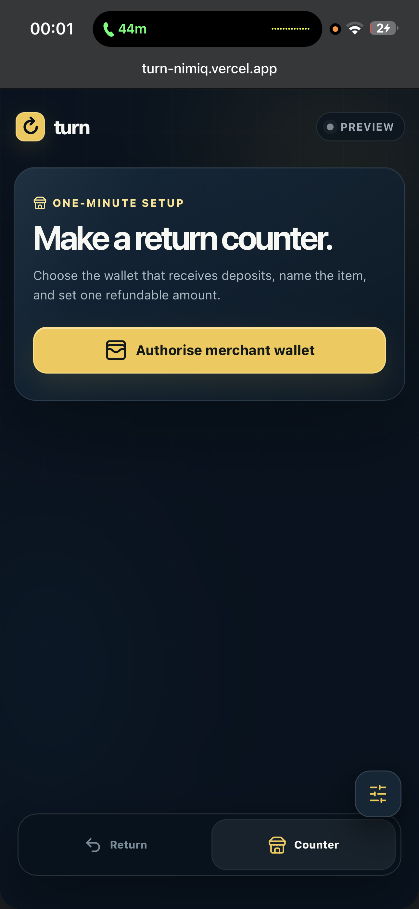
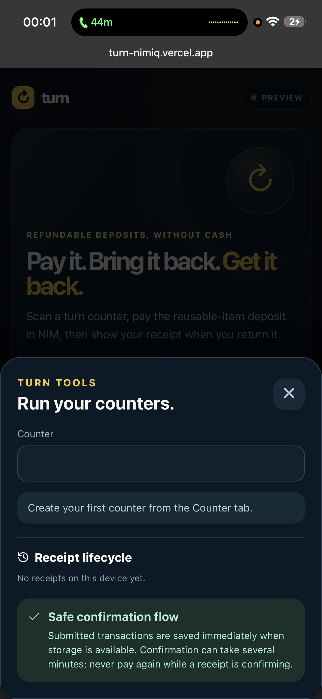

# Turn

> Refundable NIM deposits for reusable items.

| Field | Value |
| --- | --- |
| Category | On-chain services |
| Pricing | Free |
| Team name | _Not provided — optional_ |
| Team members | _Not provided — optional_ |
| X account | papito_dele |
| Heard about it via | X |
| Contact email | lordejhay@gmail.com |
| GitHub login | @ometere123 |
| Submitted at | 2026-09-18T23:03:15.522Z |

## Links

| Link | URL |
| --- | --- |
| Repo | [https://github.com/ometere123/turn](<https://github.com/ometere123/turn>) |
| Demo | [https://turn-nimiq.vercel.app/](<https://turn-nimiq.vercel.app/>) |
| Video | [https://youtu.be/MOaCnN6htME?si=9vzceM1EqqZXv683](<https://youtu.be/MOaCnN6htME?si=9vzceM1EqqZXv683>) |
| Skool post | _Not provided — optional_ |
| Social post | [https://medium.com/@lordejhay/turn-refundable-nim-deposits-for-reusable-items-95a6d5a0354e](<https://medium.com/@lordejhay/turn-refundable-nim-deposits-for-reusable-items-95a6d5a0354e>) |

## Description

Turn lets merchants take refundable NIM deposits for reusable items without cash or accounts. Customers pay the merchant directly, keep an on-chain return receipt, and get the same NIM back when the item is returned.

## Builder story

I built Turn because refundable deposits for reusable items are still often handled with cash, paper tickets or trust.

Turn keeps it simple. A merchant creates a counter and sets a refundable amount in NIM. The customer pays the merchant directly, and that payment becomes the return receipt. When the item is returned, Turn verifies the original transaction, amount and refund address before the merchant sends the refund.

Turn is not escrow and cannot force a refund. It simply makes the payment and refund trail clear and verifiable on Nimiq without accounts, custody or a backend holding users’ money.

## Thumbnail

## Screenshots

---

_Generated from the submission form. `submission.yaml` in this folder is the machine-readable source of truth._
