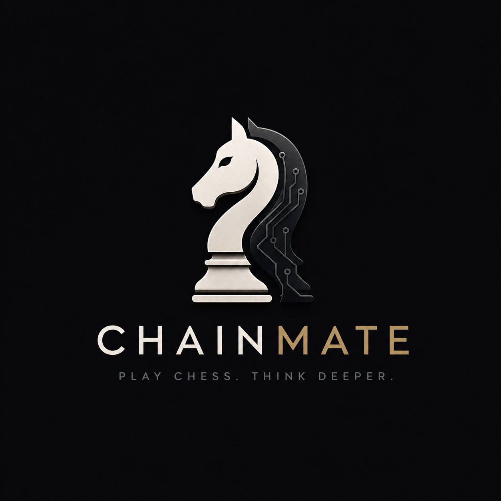
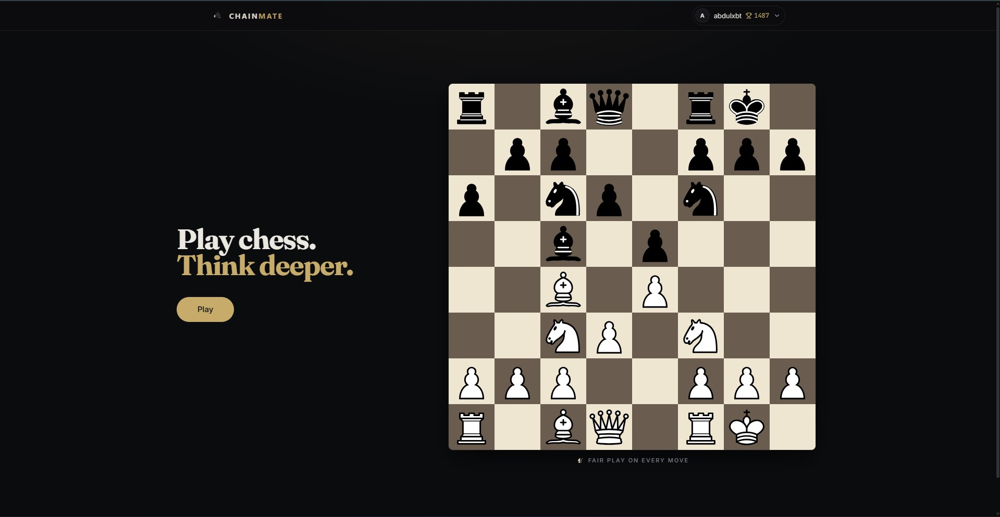
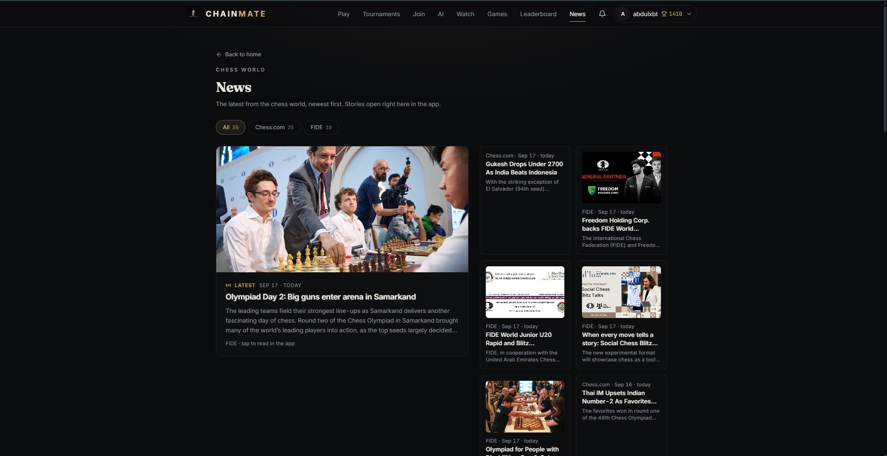
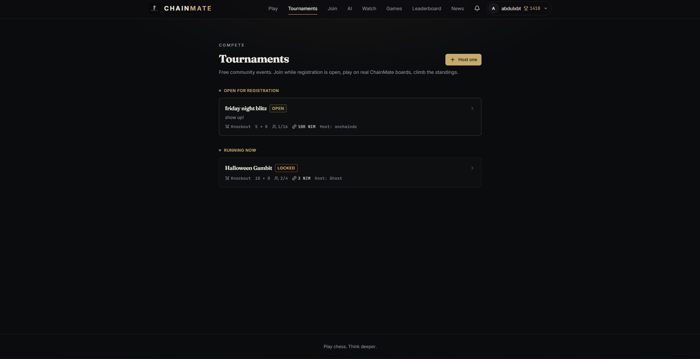
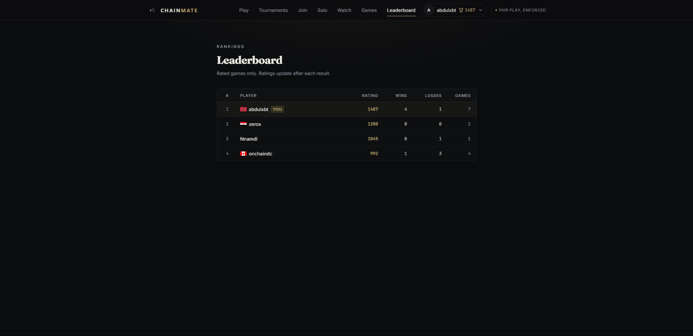
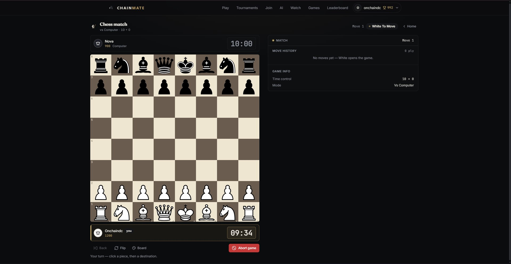

# ChainMate

> Play. Compete. Earn

| Field | Value |
| --- | --- |
| Category | Games |
| Pricing | Freemium |
| Team name | _Not provided — optional_ |
| Team members | _Not provided — optional_ |
| X account | onchaindc |
| Heard about it via | I heard about Nimiq mini apps competition on X |
| Contact email | onchaindc@gmail.com |
| GitHub login | @onchaindc |
| Submitted at | 2026-09-17T19:10:26.570Z |

## Links

| Link | URL |
| --- | --- |
| Repo | [https://github.com/onchaindc/CHAINMATE](<https://github.com/onchaindc/CHAINMATE>) |
| Demo | [https://chainmate-gg.vercel.app/](<https://chainmate-gg.vercel.app/>) |
| Video | [https://youtu.be/srAmGWAyDoM?si=fXm-kraWm5Wj04zJ](<https://youtu.be/srAmGWAyDoM?si=fXm-kraWm5Wj04zJ>) |
| Skool post | _Not provided — optional_ |
| Social post | [https://x.com/onchaindc/status/2100300586843320359/video/1?s=46](<https://x.com/onchaindc/status/2100300586843320359/video/1?s=46>) |

## Description

ChainMate is a competitive online chess platform for players who want more than casual matches. challenge friends, watch live games, and compete in skill based tournaments. With Nimiq Pay, players can connect their Nimiq wallet and use NIM for tournament entry fees and earnprize

## Builder story

Chess is already competitive, but most online chess experiences stop at the match itself. I wanted to build something that makes chess feel more like a competitive community: play  opponents, build a rating, challenge friends, follow live games, enter tournaments, and have something meaningful on the line.

That became ChainMate , a chess platform built around the idea that every game should contribute to a player's competitive journey.

The Nimiq Mini Apps Competition gave that idea another layer. Instead of adding a wallet as a separate crypto feature, I wanted NIM to become part of the competition itself: players can connect their Nimiq wallet, enter skill-based tournaments with NIM, compete for prize pools, and build a reputation through their results.

The goal is simple: make competitive chess feel deeper, more social, and more rewarding without getting in the way of the game.

ChainMate is for players who want more than a one-off chess match, a place to play, compete, improve, and come back for the next game.

## Thumbnail

## Screenshots

---

_Generated from the submission form. `submission.yaml` in this folder is the machine-readable source of truth._
