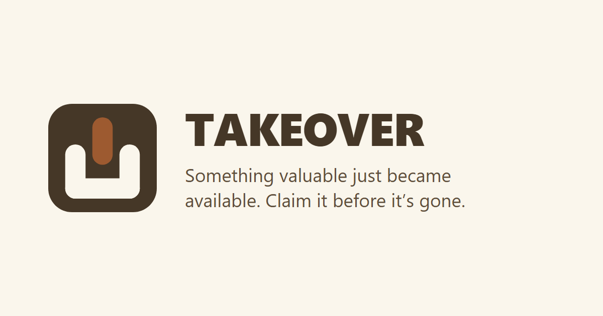
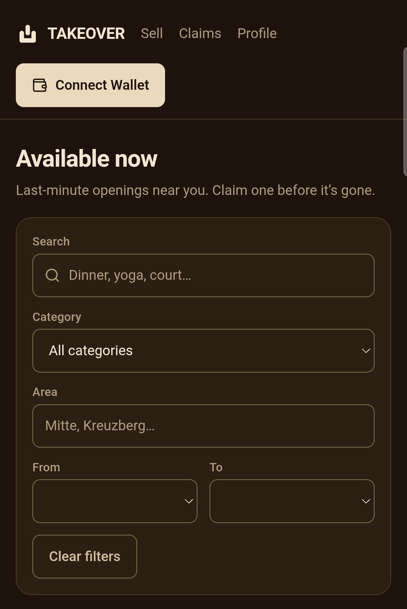
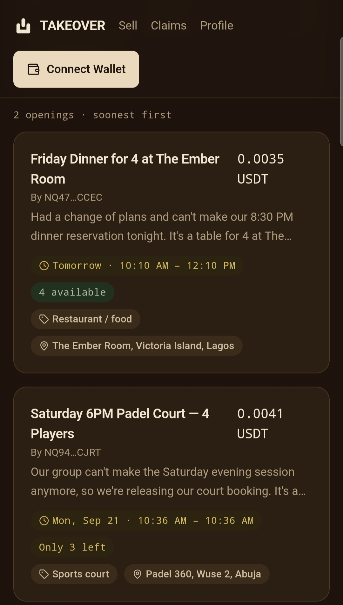
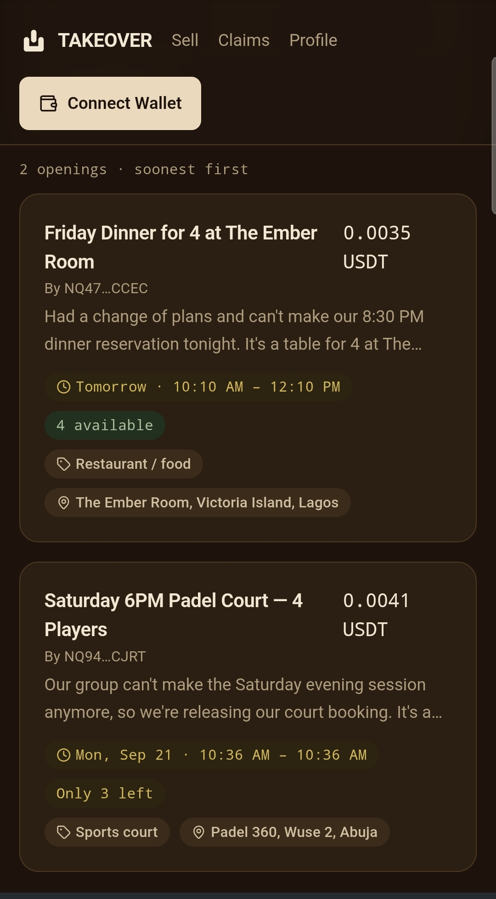
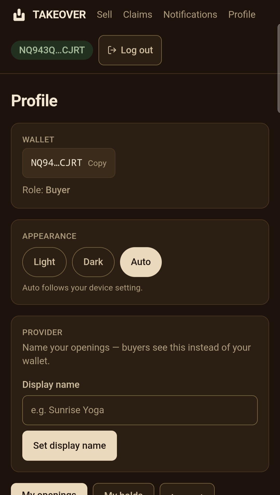
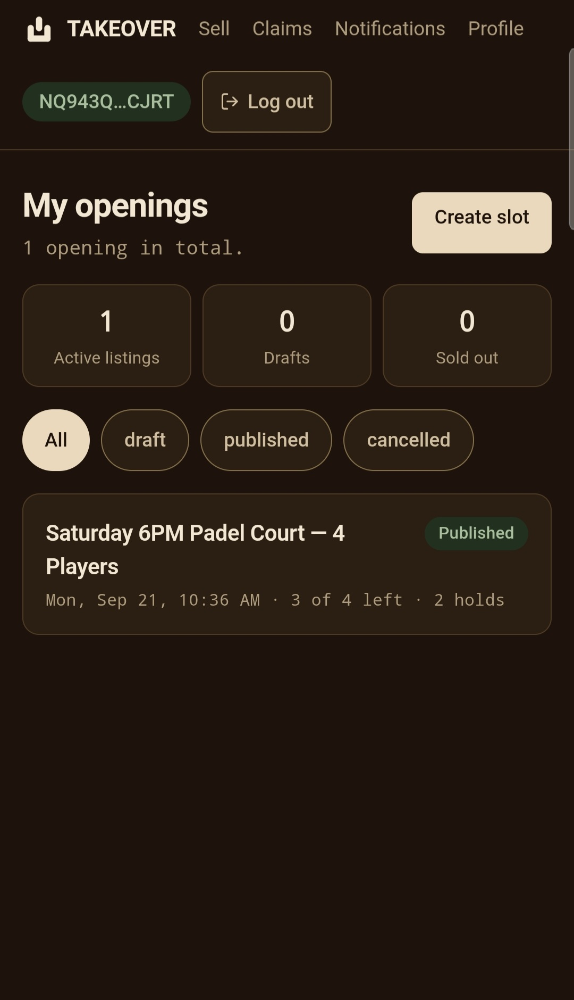

# TAKEOVER

> the last minute marketplace for released capacity

| Field | Value |
| --- | --- |
| Category | Marketplaces |
| Pricing | Paid |
| Team name | none |
| Team members | none |
| X account | turnttfup99 |
| Heard about it via | X |
| Contact email | onyebuchidaniel60@gmail.com |
| GitHub login | @onyebuchidaniel60 |
| Submitted at | 2026-09-18T21:02:35.102Z |

## Links

| Link | URL |
| --- | --- |
| Repo | [https://github.com/onyebuchidaniel60/TAKEOVER](<https://github.com/onyebuchidaniel60/TAKEOVER>) |
| Demo | [https://takeover-web-gamma.vercel.app](<https://takeover-web-gamma.vercel.app>) |
| Video | [https://youtu.be/pUFijMaj2pM?si=cYcIBuBBZ2xoWWOA](<https://youtu.be/pUFijMaj2pM?si=cYcIBuBBZ2xoWWOA>) |
| Skool post | [https://www.skool.com/miniappscompetition/takeover?p=7fbb4e84](<https://www.skool.com/miniappscompetition/takeover?p=7fbb4e84>) |
| Social post | [https://x.com/Turnttfup99/status/2101048339131502754](<https://x.com/Turnttfup99/status/2101048339131502754>) |

## Description

TAKEOVER is a last-minute marketplace for released capacity, helping people sell or claim valuable reservations, bookings, appointments, tickets, other transferable slots that would otherwise go unused. Built for people who seek to recover value from cancelled/released capacity.

## Builder story

The idea came from a simple observation: valuable capacity can disappear just because the person who originally booked it can no longer use it.

A restaurant table can sit empty after a last-minute cancellation. A sports court can have an unused hour. A class can have an empty seat. An appointment can go unfilled. In each case, the capacity still has value, but once the original user gives it up, there often isn't a simple way to get that value to someone else who wants it.

I wanted to build a marketplace around that moment.

TAKEOVER is designed to give released capacity a second chance. Someone who can no longer use a reservation, booking, appointment, ticket, or other transferable slot can publish it as an opening. Someone else looking for a last-minute opportunity can discover it, claim it, and complete the transfer.

The problem isn't simply that people cancel things. The bigger problem is the disconnect between released capacity and people who could immediately use it.

TAKEOVER tries to close that gap.

I also wanted the transaction itself to feel trustworthy. Instead of making a buyer send money directly to someone they don't know and hoping the handoff happens, TAKEOVER uses escrow for the purchase. The payment is secured while the transfer takes place and released when the required conditions are met.

NIM has a specific role in the marketplace as well. Providers pay a 400 NIM listing fee when publishing an opening. This acts as a platform service charge while also adding an economic barrier against spam and mass automated listings.

The result is a marketplace where the underlying payment infrastructure is important, but the product isn't about crypto for its own sake.

Basically turns “I can't use this anymore” into “someone else can.”

TAKEOVER is my attempt to make that last-minute exchange simple, useful, and trustworthy.

## Thumbnail

## Screenshots

---

_Generated from the submission form. `submission.yaml` in this folder is the machine-readable source of truth._
