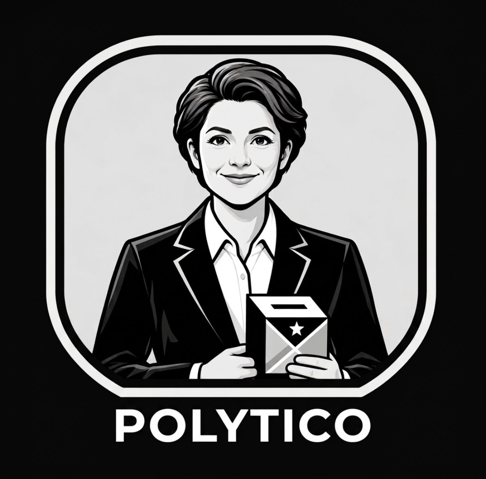
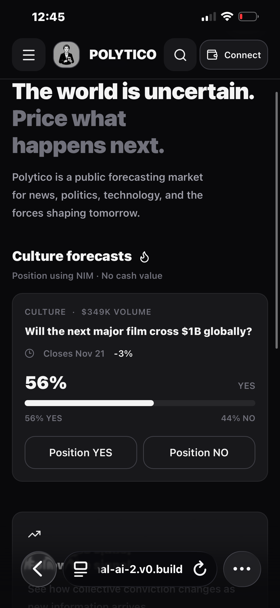
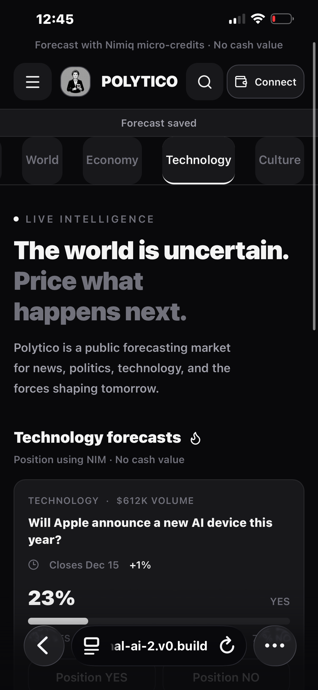
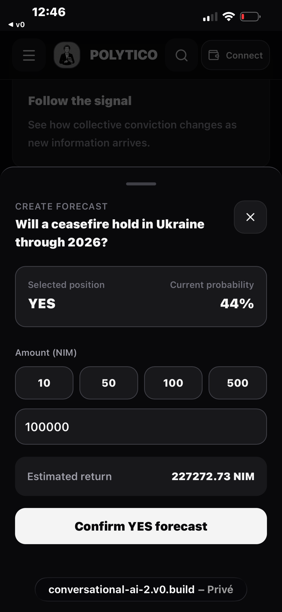
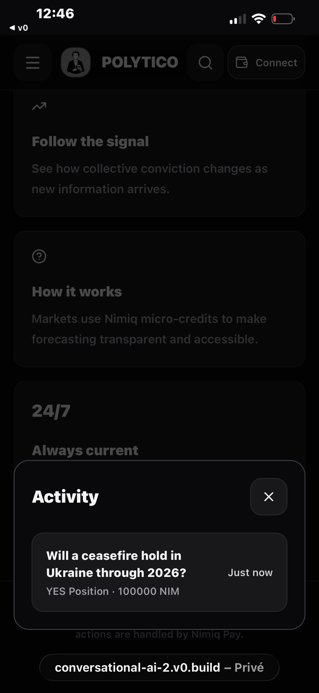
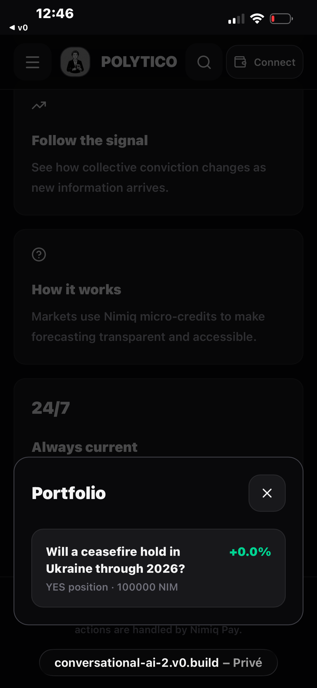

# Polytico

> Trade the future with Nimiq micro-credits.

| Field | Value |
| --- | --- |
| Category | Marketplaces |
| Pricing | Free |
| Team name | _Not provided — optional_ |
| Team members | _Not provided — optional_ |
| X account | _Not provided — optional_ |
| Heard about it via | Instagram ads |
| Contact email | polyticomarket@gmail.com |
| GitHub login | @patriceTalon1 |
| Submitted at | 2026-09-12T16:58:24.111Z |

## Links

| Link | URL |
| --- | --- |
| Repo | [https://github.com/patriceTalon1/polytico⁠](<https://github.com/patriceTalon1/polytico⁠>) |
| Demo | [https://conversational-ai-ten.vercel.app⁠](<https://conversational-ai-ten.vercel.app⁠>) |
| Video | [https://youtube.com/shorts/DxK1_joEBjY?si=AvzgOvkxafh4uZVQ](<https://youtube.com/shorts/DxK1_joEBjY?si=AvzgOvkxafh4uZVQ>) |
| Skool post | _Not provided — optional_ |
| Social post | _Not provided — optional_ |

## Description

Polytico is a public forecasting market for global news, politics, and technology. Users can place trades on real-world outcomes using Nimiq micro-credits, tracking live consensus and portfolio performance in real time.

## Builder story

Driven by a deep fascination with geopolitics, I built Polytico to serve as a digital recorder of humanity's collective sentiment. It acts as a live, decentralized archive where real-world events and global outcomes are continuously forecasted and recorded through Nimiq micro-transactions, capturing how society evaluates history as it happens.

## Thumbnail

## Screenshots

---

_Generated from the submission form. `submission.yaml` in this folder is the machine-readable source of truth._
