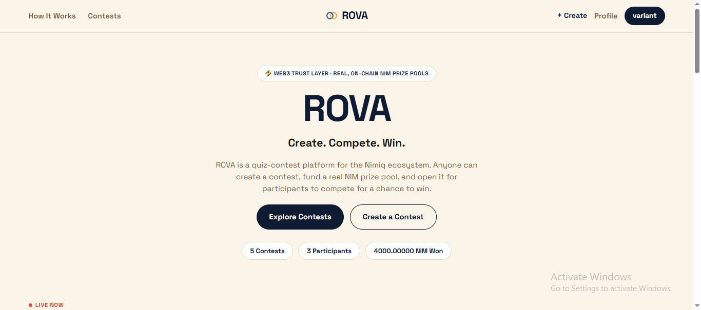
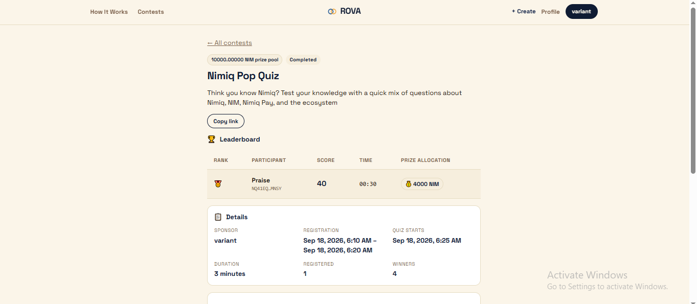
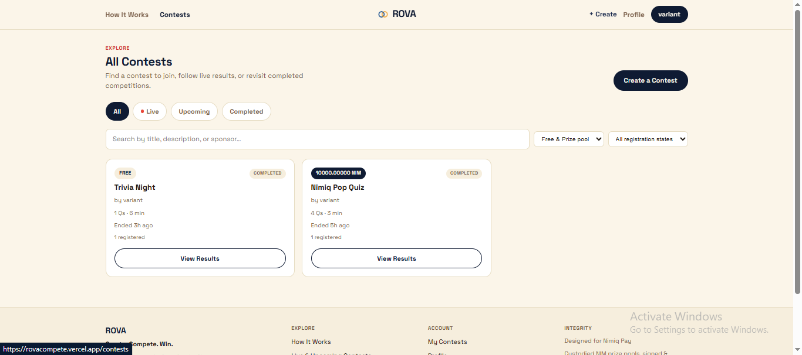
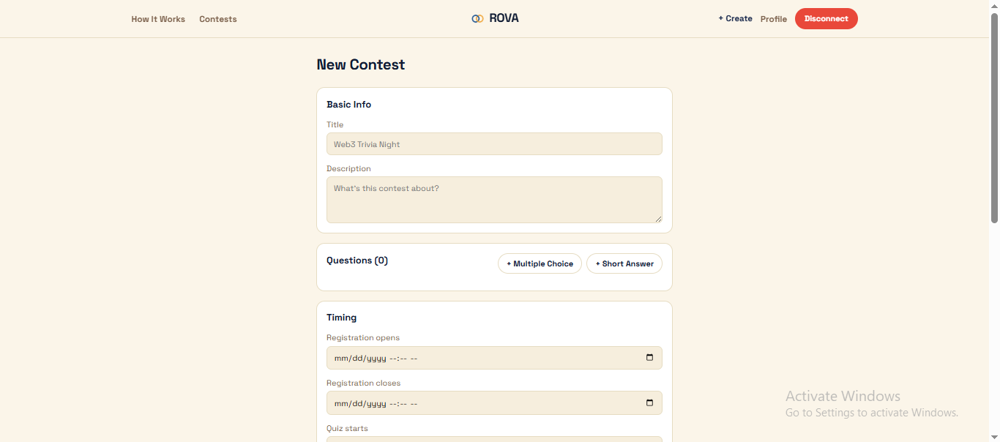
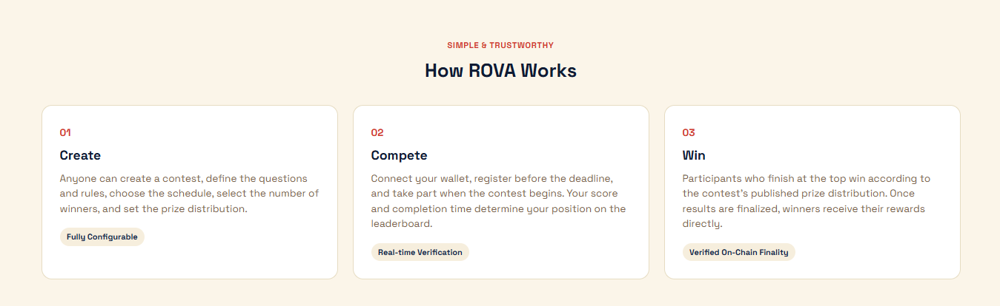

# Rova

> Create. Compete. Win.

| Field | Value |
| --- | --- |
| Category | Games |
| Pricing | Freemium |
| Team name | _Not provided — optional_ |
| Team members | _Not provided — optional_ |
| X account | TheVarian_t |
| Heard about it via | A friend |
| Contact email | kangvariant001@gmail.com |
| GitHub login | @praiz-y |
| Submitted at | 2026-09-18T11:00:18.606Z |

## Links

| Link | URL |
| --- | --- |
| Repo | [https://github.com/praiz-y/Rova](<https://github.com/praiz-y/Rova>) |
| Demo | [https://rovacompete.vercel.app/](<https://rovacompete.vercel.app/>) |
| Video | [https://youtu.be/R8do7h-8DjY?si=Ec7PGVwkMiVPDSnv](<https://youtu.be/R8do7h-8DjY?si=Ec7PGVwkMiVPDSnv>) |
| Skool post | [https://www.skool.com/miniappscompetition/rova-create-compete-win?p=682646a7](<https://www.skool.com/miniappscompetition/rova-create-compete-win?p=682646a7>) |
| Social post | [https://x.com/TheVarian_t/status/2100898301658681491](<https://x.com/TheVarian_t/status/2100898301658681491>) |

## Description

ROVA is a community contest platform where creators can launch contests and participants can compete, earn rewards, and climb the leaderboard. Quizzes are the first contest format, with more community competitions to come.

## Builder story

I built ROVA because I wanted to explore what a contest platform could look like when wallets and payments are part of the experience from the beginning. I started with quizzes as a simple way to build and test the core flow: a creator sets up a contest, participants join with their Nimiq wallet, compete, and see their results. The bigger idea is to make the platform flexible enough for different types of community competitions beyond quizzes.

## Thumbnail

## Screenshots

---

_Generated from the submission form. `submission.yaml` in this folder is the machine-readable source of truth._
