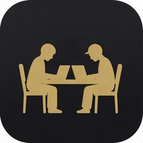
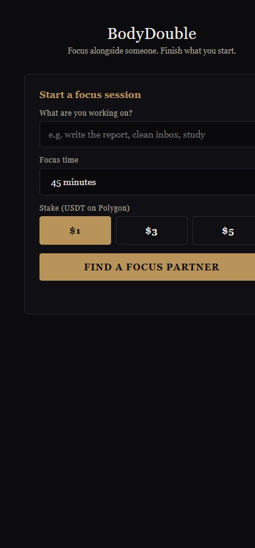
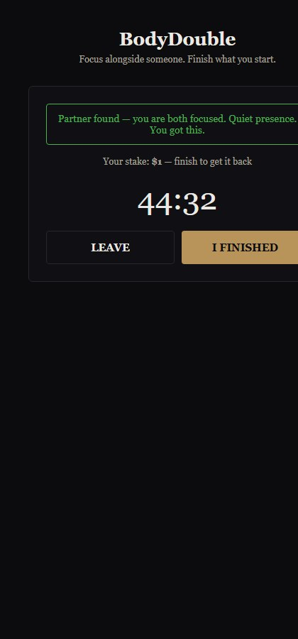
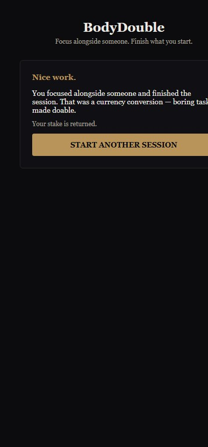

# BodyDouble

> "Focus alongside someone, finish what you start."

| Field | Value |
| --- | --- |
| Category | Productivity |
| Pricing | Free |
| Team name | TWYN |
| Team members | Fabe |
| X account | 1fabe1 |
| Contact email | fmbrown12@gmail.com |
| GitHub login | @profitandloss |
| Submitted at | 2026-08-26T01:37:37.139Z |

## Links

| Link | URL |
| --- | --- |
| Repo | [https://github.com/profitandloss/bodydouble](<https://github.com/profitandloss/bodydouble>) |
| Demo | [https://profitandloss.github.io/bodydouble/](<https://profitandloss.github.io/bodydouble/>) |
| Video | [https://www.loom.com/share/c959b9261e4240a1ad4e9512b85a2f0f](<https://www.loom.com/share/c959b9261e4240a1ad4e9512b85a2f0f>) |

## Description

Join a virtual room and work quietly alongside another person on your own task. Body doubling converts boring tasks into doable ones — built for ADHD minds and anyone who struggles to start. Stake a small amount to stay focused; finish the session and you get it back.

## Builder story

I built BodyDouble because of my own thesis. I wrote The Attention Economy
Thesis: ADHD is not a deficit of attention but a different economy of attention
— one that pays in interest, novelty, challenge, urgency and meaning instead of
importance, priority and consequence. Hyperfocus is the proof: nine hours on the
right task, nine minutes of struggle on the wrong one.

Body doubling is currency conversion in action. Working quietly beside someone
converts an importance-denominated task into one with social presence and
urgency — currencies the ADHD mind actually accepts. The stake adds real skin in
the game: finish the session, get it back; leave early, it's gone.

So BodyDouble is my thesis made touchable — a tool that doesn't ask anyone to
"try harder", it changes the price. Built with AI assistance as a web app on the
Nimiq Mini Apps SDK, with USDT-on-Polygon stakes. For the ADHD community, for
anyone who struggles to start, and for everyone who works better when they're
not alone.

## Thumbnail

## Screenshots

---

_Generated from the submission form. `submission.yaml` in this folder is the machine-readable source of truth._
