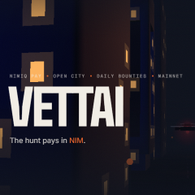
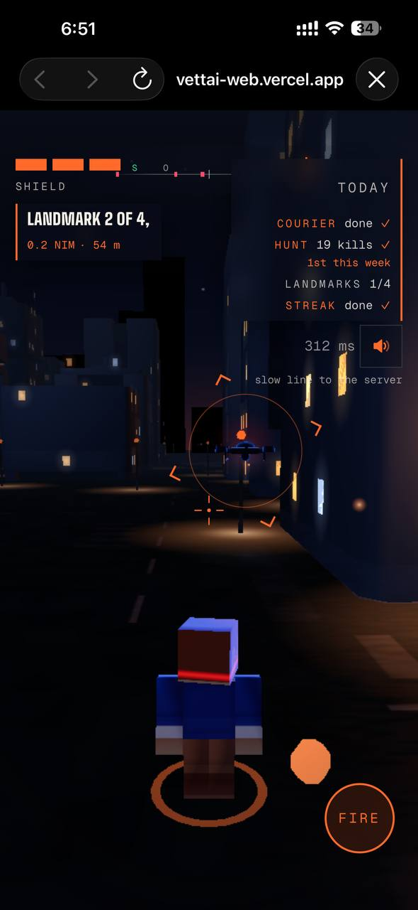
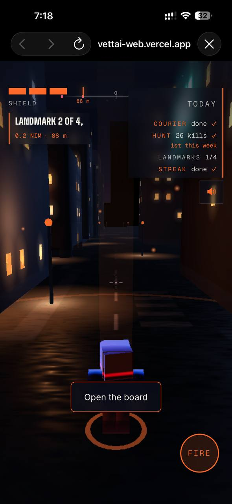
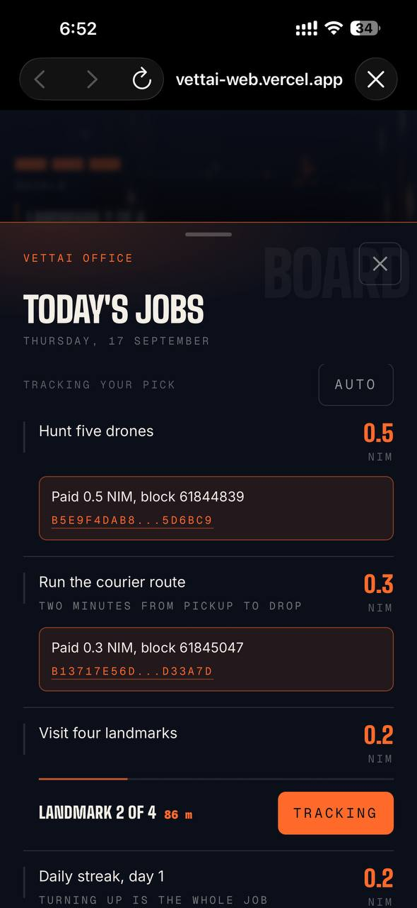
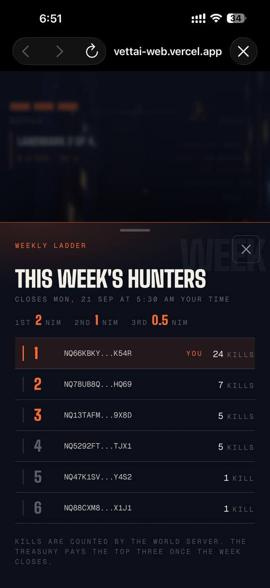
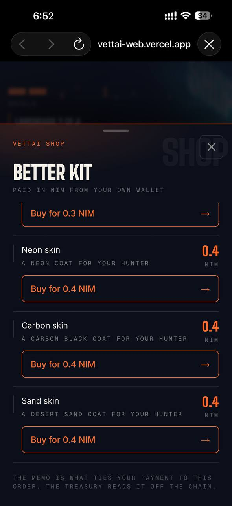

# Vettai

> The hunt pays in NIM.

| Field | Value |
| --- | --- |
| Category | Games |
| Pricing | Free |
| Team name | _Not provided — optional_ |
| Team members | _Not provided — optional_ |
| X account | ram_krish2000 |
| Heard about it via | Nimiq Community |
| Contact email | ramakrishnanhulk20@gmail.com |
| GitHub login | @ramakrishnanhulk20 |
| Submitted at | 2026-09-17T13:53:33.697Z |

## Links

| Link | URL |
| --- | --- |
| Repo | [https://github.com/ramakrishnanhulk20/vettai](<https://github.com/ramakrishnanhulk20/vettai>) |
| Demo | [https://vettai-web.vercel.app](<https://vettai-web.vercel.app>) |
| Video | [https://youtube.com/shorts/ONsEKMDy9I8?si=Oy9HwsLUJRKFHJIM](<https://youtube.com/shorts/ONsEKMDy9I8?si=Oy9HwsLUJRKFHJIM>) |
| Skool post | _Not provided — optional_ |
| Social post | [https://x.com/ram_krish2000/status/2100580710587457801?s=20](<https://x.com/ram_krish2000/status/2100580710587457801?s=20>) |

## Description

Hunt bounty drones, finish today's quests, sign once, and real NIM lands in your wallet with the block number on screen. It is for anyone with the Pay app who wants to earn their first NIM by playing rather than paying.

## Builder story

Every mini app I saw paid the wallet. I wanted one where the wallet gets paid. The server runs the world and decides every hit, so nobody can send it a score. Nimiq made the rest easy: no accounts, no gas, a memo on every payout, and a two hour transaction window that shaped how the treasury pays.

## Thumbnail

## Screenshots

---

_Generated from the submission form. `submission.yaml` in this folder is the machine-readable source of truth._
