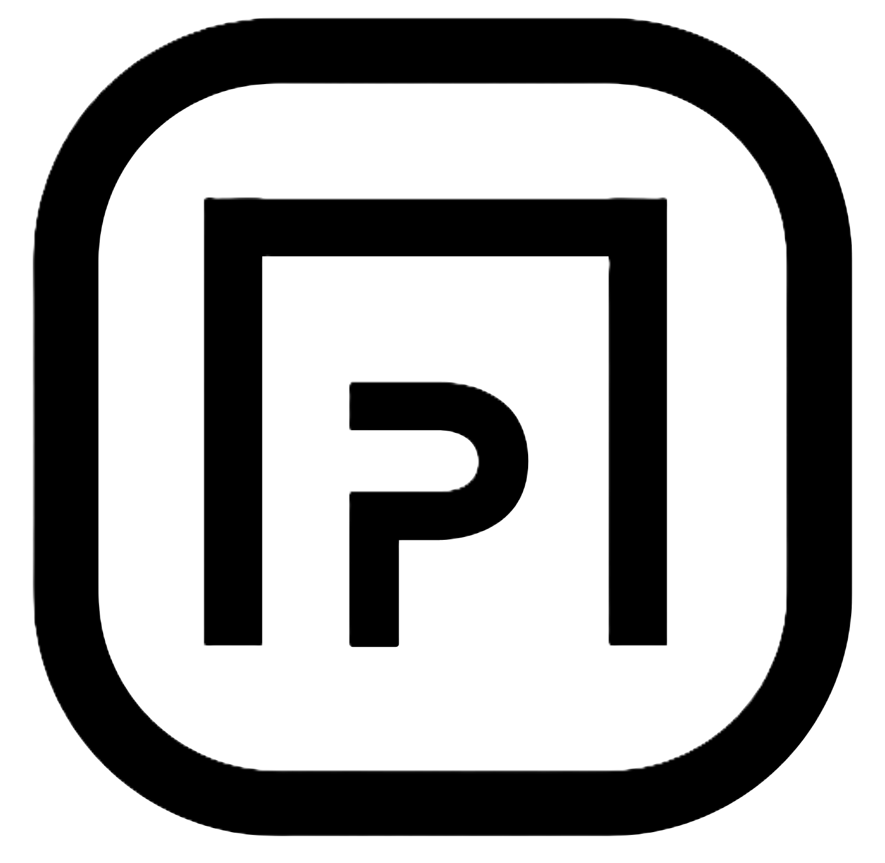
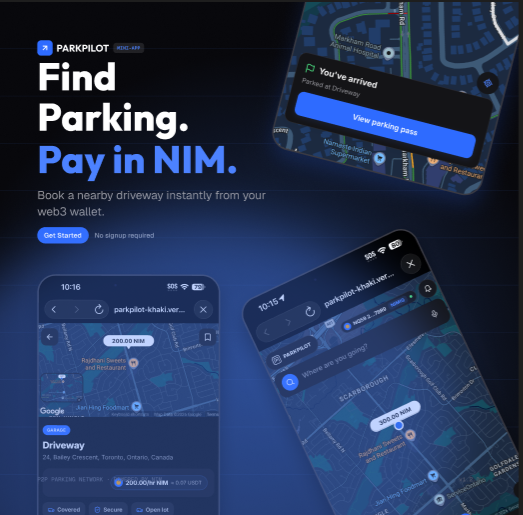
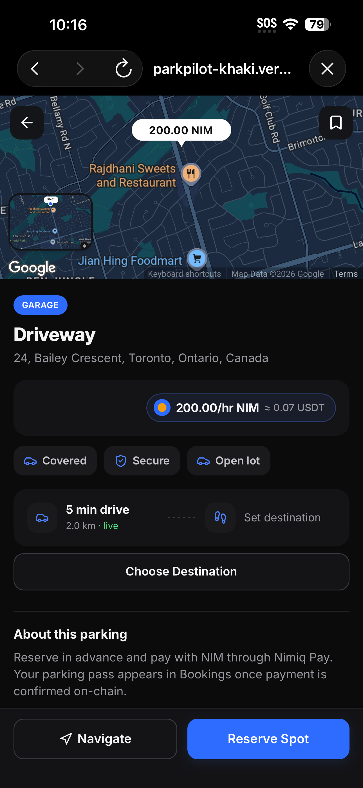
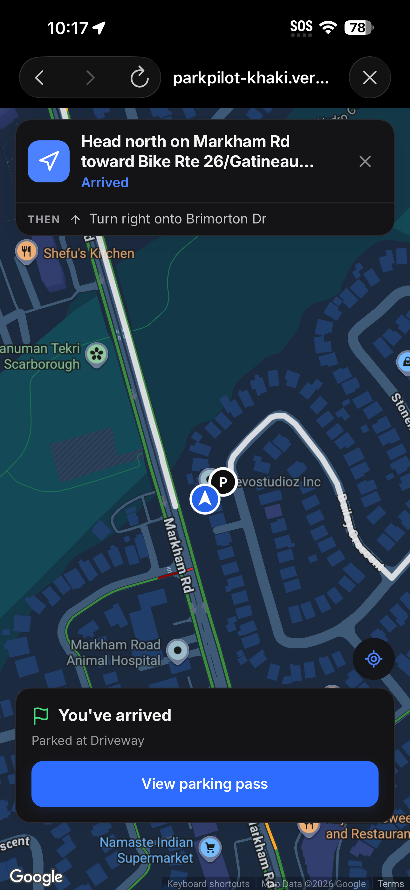
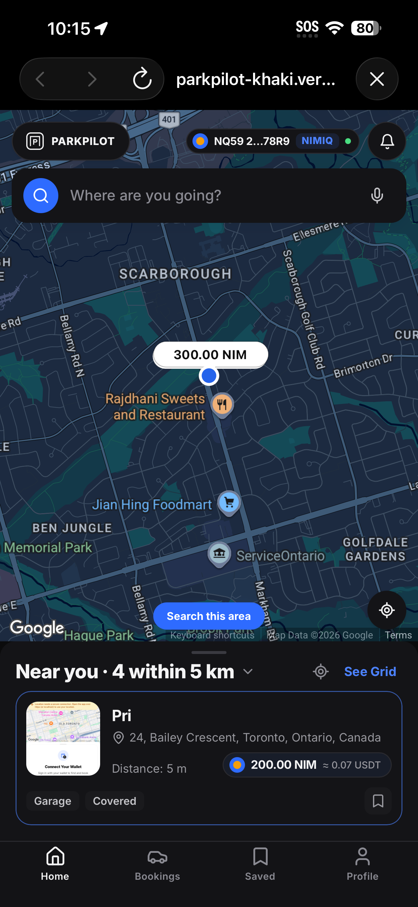
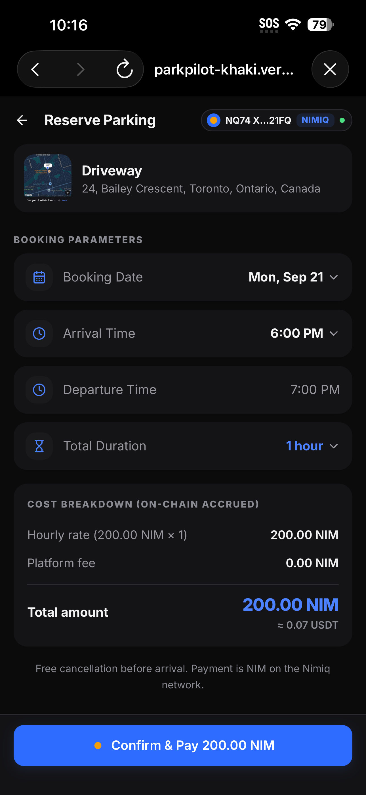
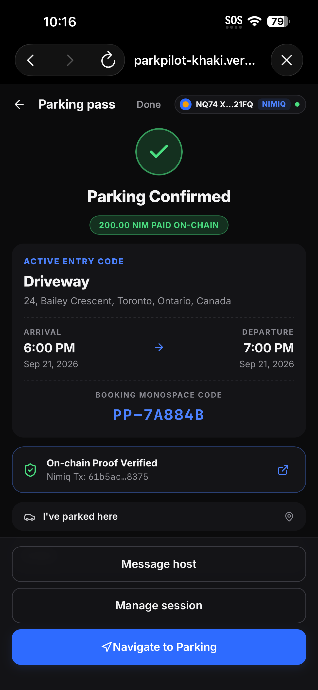

# parkpilot

> Find parking. Host Parking. Pay in NIM.

| Field | Value |
| --- | --- |
| Category | Marketplaces |
| Pricing | Free |
| Team name | parkpilot team |
| Team members | abdulafeez arogundade, Hellen Dolapo |
| X account | _Not provided — optional_ |
| Heard about it via | Nimiq Community |
| Contact email | demmypayne22@gmail.com |
| GitHub login | @revoart |
| Submitted at | 2026-09-17T19:30:21.700Z |

## Links

| Link | URL |
| --- | --- |
| Repo | [https://github.com/revoart/parkpilot-nimiq-pay](<https://github.com/revoart/parkpilot-nimiq-pay>) |
| Demo | [https://parkpilot-khaki.vercel.app](<https://parkpilot-khaki.vercel.app>) |
| Video | [https://youtu.be/lIUaWw5CCJc?feature=shared](<https://youtu.be/lIUaWw5CCJc?feature=shared>) |
| Skool post | [https://www.skool.com/miniappscompetition/parkpilot-find-parking-pay-with-usdt-no-meter-no-card-no-account?p=88bd63b8](<https://www.skool.com/miniappscompetition/parkpilot-find-parking-pay-with-usdt-no-meter-no-card-no-account?p=88bd63b8>) |
| Social post | [https://www.facebook.com/share/p/193WVwJck3/?mibextid=wwXIfr](<https://www.facebook.com/share/p/193WVwJck3/?mibextid=wwXIfr>) |

## Description

ParkPilot is a peer-to-peer parking marketplace inside Nimiq Pay. Drivers find and book nearby driveways and parking spaces and pay in NIM straight from their wallet — no cards, no accounts. Hosts list their own space and are paid automatically, keeping 90% of every booking.

## Builder story

Parking is a solved problem in theory and a miserable one in practice. You circle a block, you find nothing, you pay a machine that eats your card, and the space you eventually take belongs to someone who'd happily rent it to you.

ParkPilot closes that loop. It runs inside Nimiq Pay, so there is no signup, no card, and no custodian — a driver pays a host directly from their own wallet, in NIM, in one approval. Hosts list a driveway in minutes and get paid automatically.

Building it meant solving a real one: proving a wallet is yours without a signature scheme. Nimiq Pay's sign() returns a signature that neither Nimiq's own verifier nor standard Ed25519 can validate, so we authenticate with a 1 Luna transfer instead — the sender of a transaction is on-chain proof of ownership, and nobody can forge it.

## Thumbnail

## Screenshots

---

_Generated from the submission form. `submission.yaml` in this folder is the machine-readable source of truth._
