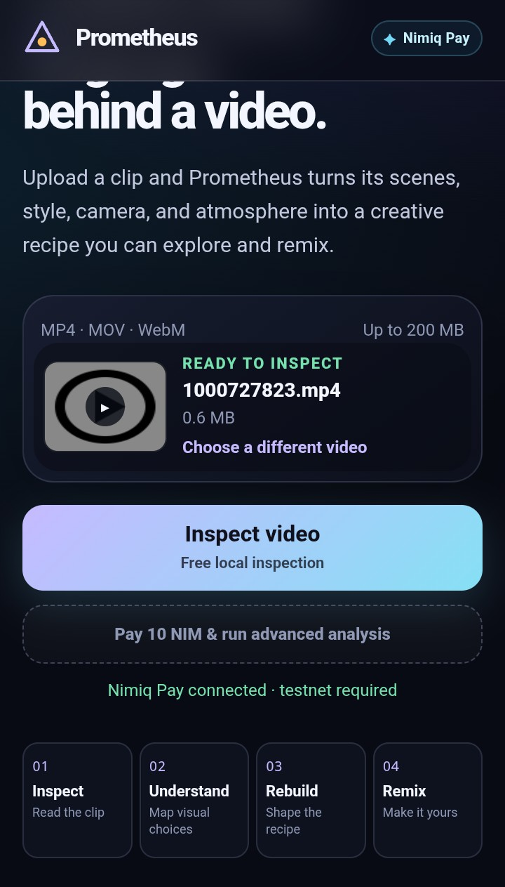
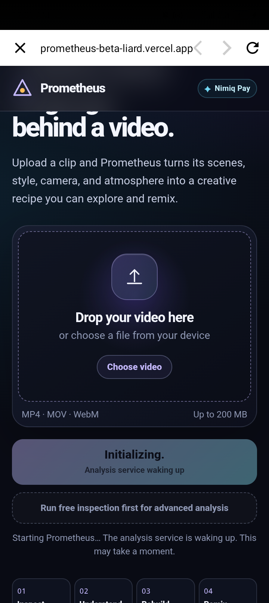
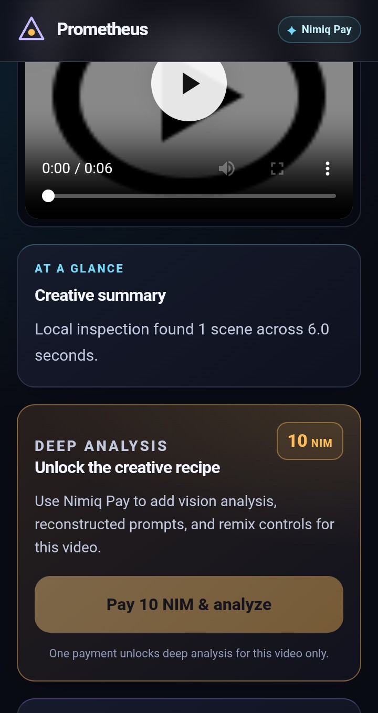

# Prometheus

> Decode. Rebuild. Remix

| Field | Value |
| --- | --- |
| Category | Creator tools |
| Pricing | Freemium |
| Team name | _Not provided — optional_ |
| Team members | _Not provided — optional_ |
| X account | obsidian98_ |
| Heard about it via | _Not provided — optional_ |
| Contact email | idowusamuel344@gmail.com |
| GitHub login | @samuelid22 |
| Submitted at | 2026-09-18T23:54:14.431Z |

## Links

| Link | URL |
| --- | --- |
| Repo | [https://github.com/samuelid22/PROMETHEUS.git](<https://github.com/samuelid22/PROMETHEUS.git>) |
| Demo | [https://prometheus-beta-liard.vercel.app/](<https://prometheus-beta-liard.vercel.app/>) |
| Video | [https://x.com/obsidian98_/status/2101097130102239674](<https://x.com/obsidian98_/status/2101097130102239674>) |
| Skool post | _Not provided — optional_ |
| Social post | _Not provided — optional_ |

## Description

Prometheus analyzes videos and deconstructs them and reconstrcuts the creative recipe behind them.

For creators who want to understand, recreate or remix compelling visual style through Nimiq ecosystem (currently available on testnet for beta).

## Builder story

It all started with me wondering how high detailed and beautiful videos were made and wanting to replicate them.
This tool helps me analyze a whole video scene by scene and the knowledge to replicate them.

## Thumbnail

## Screenshots

---

_Generated from the submission form. `submission.yaml` in this folder is the machine-readable source of truth._
