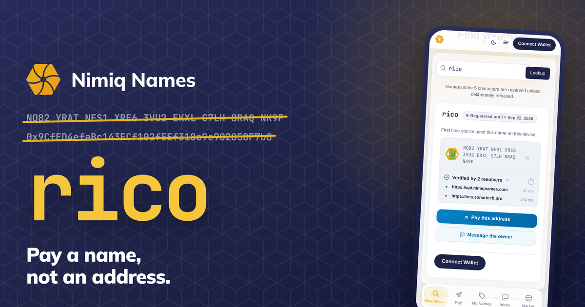
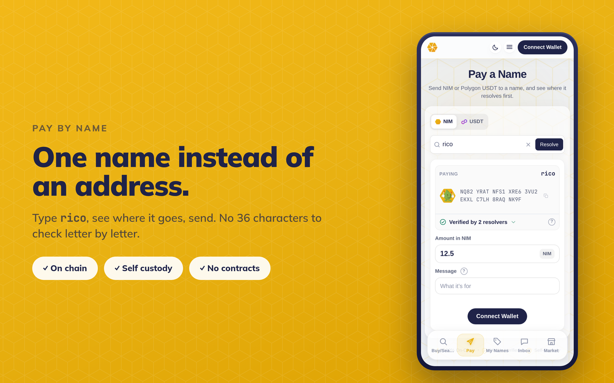
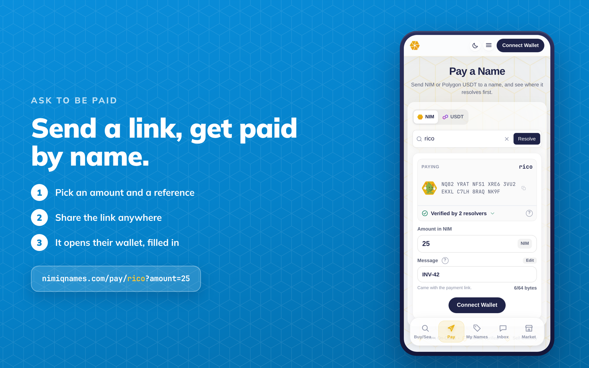
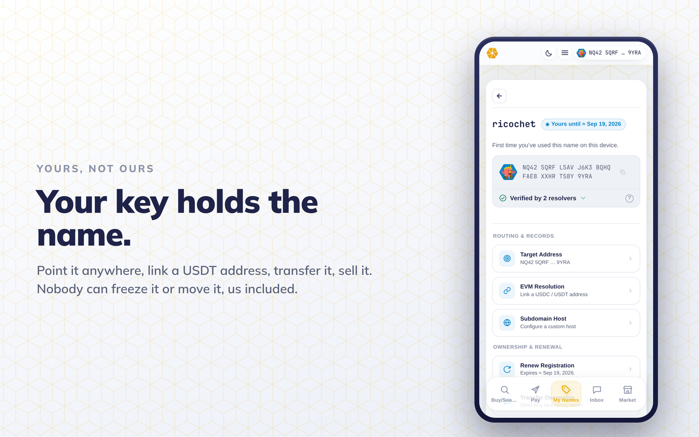

# Nimiq Names

> One name to pay them all on Nimiq

| Field | Value |
| --- | --- |
| Category | On-chain services |
| Pricing | Paid |
| Team name | _Not provided — optional_ |
| Team members | @RicoMaverick |
| X account | https://x.com/nimiqnames |
| Heard about it via | _Not provided — optional_ |
| Contact email | enrique.ferrater@selfcrypto.io |
| GitHub login | @selfcrypto |
| Submitted at | 2026-09-17T01:47:37.625Z |

## Links

| Link | URL |
| --- | --- |
| Repo | [https://github.com/selfcrypto/nns](<https://github.com/selfcrypto/nns>) |
| Demo | [https://nimiqnames.com](<https://nimiqnames.com>) |
| Video | [https://youtu.be/lVhPkgVjzYc](<https://youtu.be/lVhPkgVjzYc>) |
| Skool post | [https://www.skool.com/miniappscompetition/nimiqnamescom-one-name-to-pay-them-all-on-nimiq?p=e7b4531b](<https://www.skool.com/miniappscompetition/nimiqnamescom-one-name-to-pay-them-all-on-nimiq?p=e7b4531b>) |
| Social post | [https://x.com/nimiqnames/status/2100400633215889869](<https://x.com/nimiqnames/status/2100400633215889869>) |

## Description

Register a human-readable name on Nimiq and get paid at "rico" instead of a 36-character address. On-chain, held by your key, with no smart contract, no custodian with every lookup attaching a proof.

## Builder story

_Not provided — optional_

## Thumbnail

## Screenshots

---

_Generated from the submission form. `submission.yaml` in this folder is the machine-readable source of truth._
