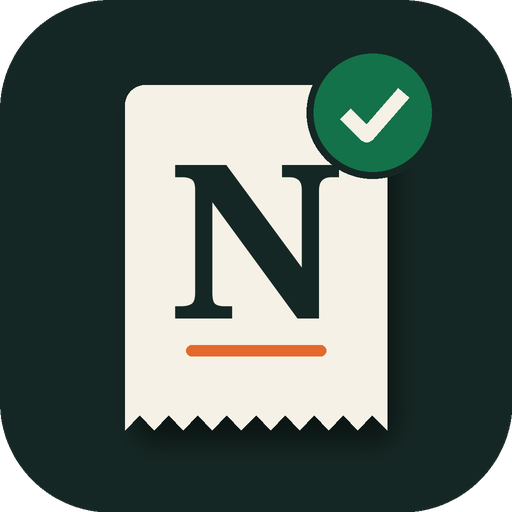
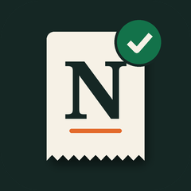
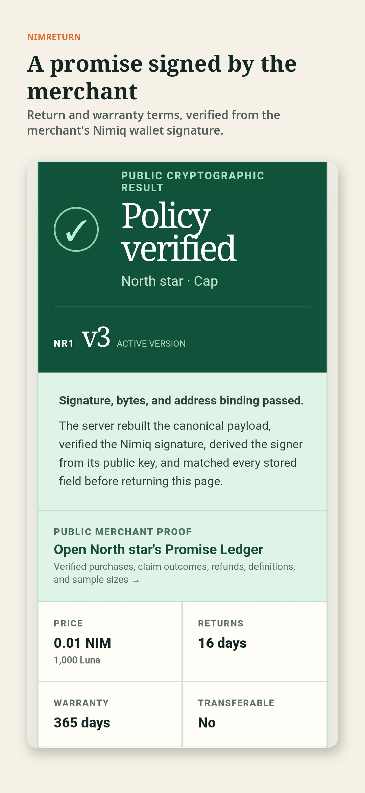
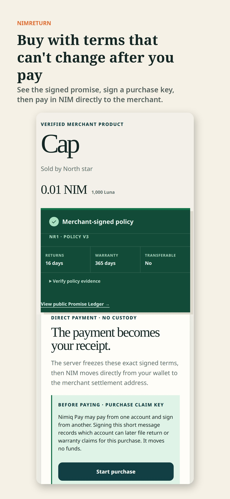
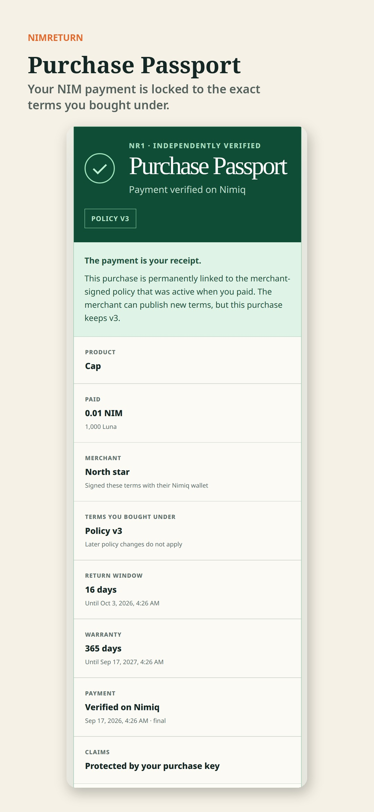
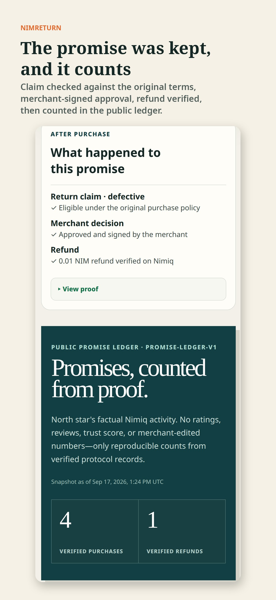
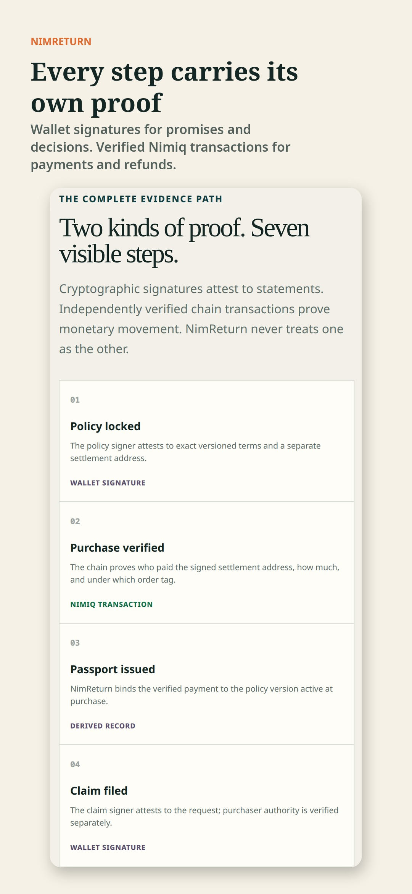

# NimReturn

> The payment is your receipt. The merchant's signature is your policy.

| Field | Value |
| --- | --- |
| Category | Shopping & deals |
| Pricing | Free |
| Team name | _Not provided — optional_ |
| Team members | _Not provided — optional_ |
| X account | shreyyyshth |
| Heard about it via | _Not provided — optional_ |
| Contact email | shreshthmishra333@gmail.com |
| GitHub login | @shreshth006 |
| Submitted at | 2026-09-17T20:29:53.960Z |

## Links

| Link | URL |
| --- | --- |
| Repo | [https://github.com/shreshth006/NimReturn](<https://github.com/shreshth006/NimReturn>) |
| Demo | [https://nimreturn-staging-cycle2.onrender.com/](<https://nimreturn-staging-cycle2.onrender.com/>) |
| Video | [https://youtube.com/shorts/K1LNfFr0hDM](<https://youtube.com/shorts/K1LNfFr0hDM>) |
| Skool post | [https://www.skool.com/miniappscompetition/can-you-tell-what-my-mini-app-does-before-i-explain-it?p=3f787857](<https://www.skool.com/miniappscompetition/can-you-tell-what-my-mini-app-does-before-i-explain-it?p=3f787857>) |
| Social post | [https://x.com/shreyyyshth/status/2100678165014458638](<https://x.com/shreyyyshth/status/2100678165014458638>) |

## Description

NimReturn keeps a merchant's signed return and warranty terms attached to your NIM payment, then verifies each claim, signed decision, and refund on Nimiq. No custody, no reviews: just signed promises and verified payments.

## Builder story

Crypto proves that you paid. It does not prove what the merchant promised when you paid. NimReturn is a consumer protection layer for Nimiq Pay that keeps that promise attached to the payment.

A merchant signs return and warranty terms with their Nimiq wallet. Before paying, the buyer sees those verified terms and signs a short purchase key. The buyer pays in NIM directly to the merchant, and NimReturn independently verifies the transaction through Albatross finality. The result is a Purchase Passport that permanently binds the purchase to the exact policy version that existed at checkout, even if the merchant later changes their terms.

If something goes wrong, the buyer files a signed return or warranty claim. NimReturn checks it deterministically against the original policy window. The merchant signs a decision, refunds NIM through Nimiq Pay, and NimReturn verifies the refund on chain. Every verified event feeds a public Promise Ledger: purchases, eligible claims, decisions, and refunds, calculated only from signatures and chain evidence. No reviews, no star ratings, no editable trust score.

NimReturn never holds funds or keys. Nimiq Pay handles every signature and payment; the chain proves money moved, and signatures prove what was promised and decided.

Building it on a real Android phone taught us how Nimiq Pay actually works: it pays from a timelock contract account and signs with its owner account. Instead of assuming those are the same, NimReturn binds a purchase key before payment, refunds that key, and records the actual sender as evidence.

It currently runs on Nimiq Testnet (TestAlbatross). Judges can open a completed example without a wallet, or switch Nimiq Pay to Testnet to make a protected purchase.

## Thumbnail

## Screenshots

---

_Generated from the submission form. `submission.yaml` in this folder is the machine-readable source of truth._
