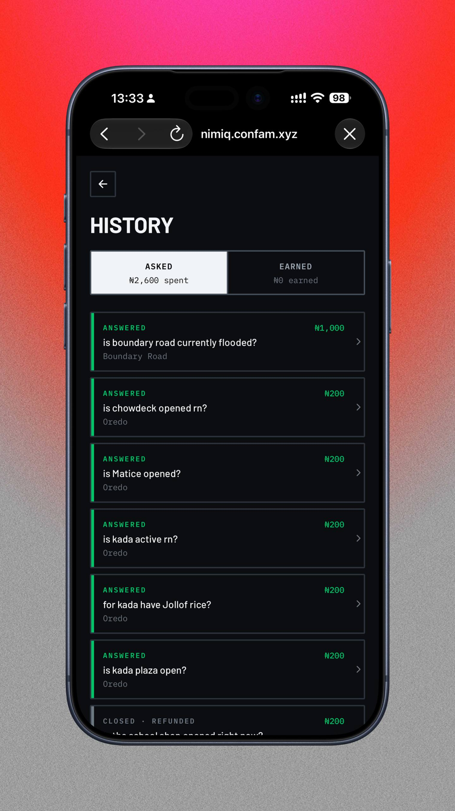
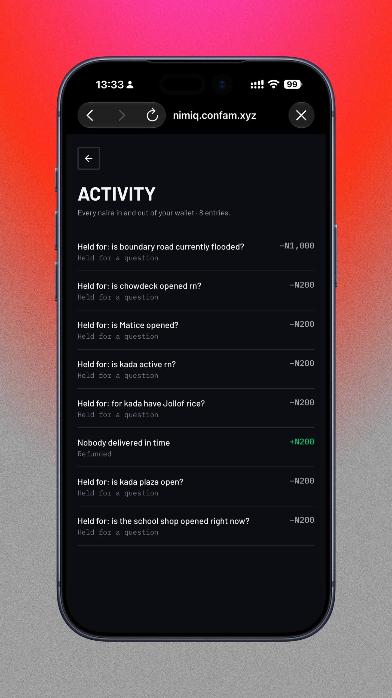
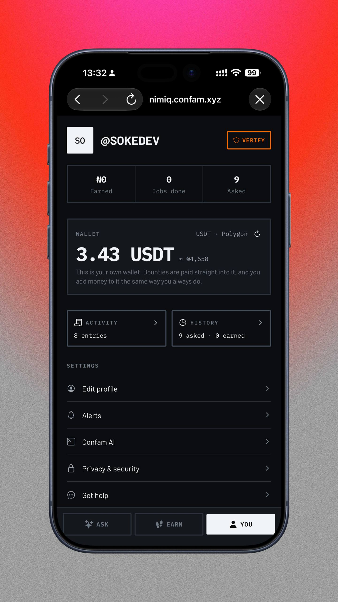
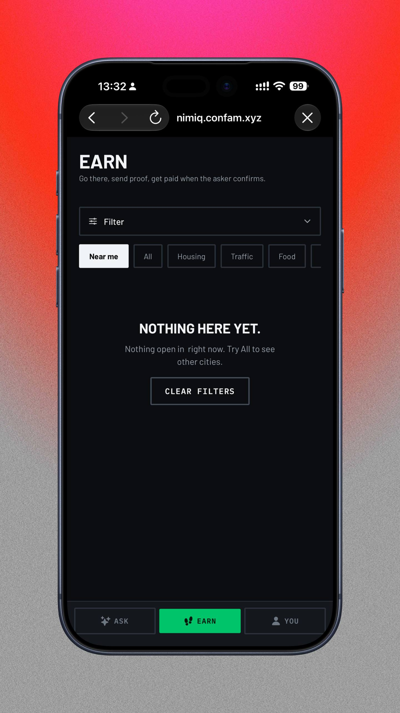
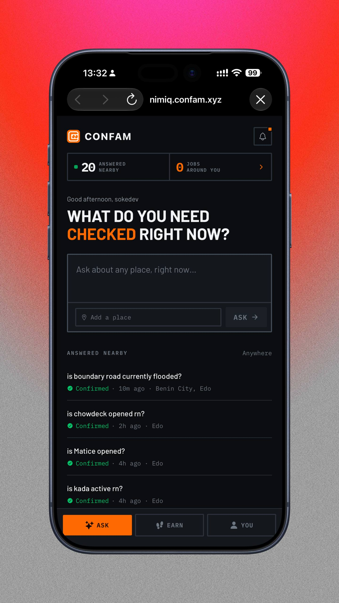

# Confam

> The physical world, on demand.

| Field | Value |
| --- | --- |
| Category | Earning |
| Pricing | Free |
| Team name | Sotechy Labs |
| Team members | Desh |
| X account | soke_decentra |
| Heard about it via | Twitter(X) |
| Contact email | coolexcollins@gmail.com |
| GitHub login | @soke-dev |
| Submitted at | 2026-09-18T14:19:57.660Z |

## Links

| Link | URL |
| --- | --- |
| Repo | [https://github.com/soke-dev/confam-mini-app](<https://github.com/soke-dev/confam-mini-app>) |
| Demo | [https://nimiq.confam.xyz/](<https://nimiq.confam.xyz/>) |
| Video | [https://youtu.be/IxRe_YhgVHI?si=9V3_hrKuw39pWsF1](<https://youtu.be/IxRe_YhgVHI?si=9V3_hrKuw39pWsF1>) |
| Skool post | _Not provided — optional_ |
| Social post | [https://x.com/confamai/status/2100950851749642538?s=20](<https://x.com/confamai/status/2100950851749642538?s=20>) |

## Description

Know what's happening at a place before you go. Confam sends somebody who's already nearby to check it and photograph it, and pays them when you accept the answer.

## Builder story

Google Maps can't tell me whether the filling station on Awolowo Road has fuel today, or whether Boundary Road is flooded this morning. That information isn't written down anywhere  and by the time it is, it's wrong.

But somebody walked past that filling station ten minutes ago. The knowledge already exists; it just has no way of reaching the person who needs it, and no reason to travel.

Confam gives it both. You ask about a place, put a small bounty on it, and somebody nearby walks over and photographs it. In a city where a wasted trip across town costs you an afternoon and the fuel to get there, knowing before you go is worth far more than the bounty.

I built it inside Nimiq Pay because the escrow was never the hard part. Asking somebody to install an app, make an account and fund a wallet before they could earn for a two-minute walk that was. In a mini app, the wallet is already in their hand.

## Thumbnail

## Screenshots

---

_Generated from the submission form. `submission.yaml` in this folder is the machine-readable source of truth._
