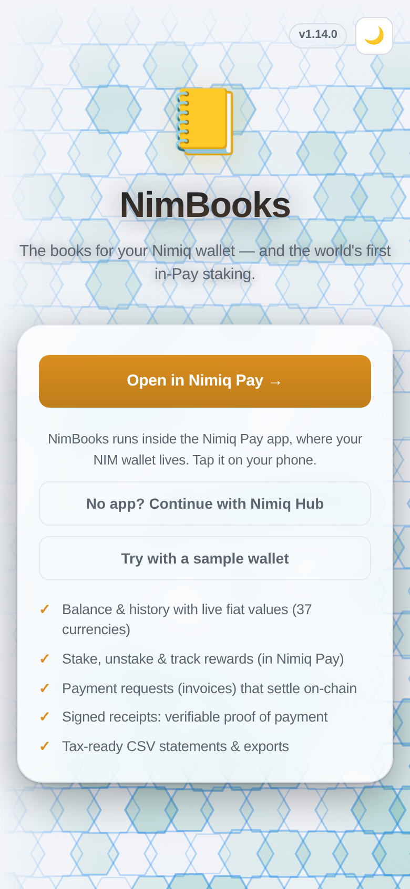
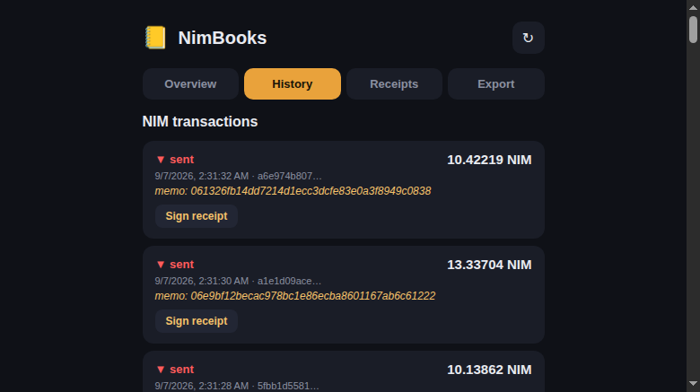
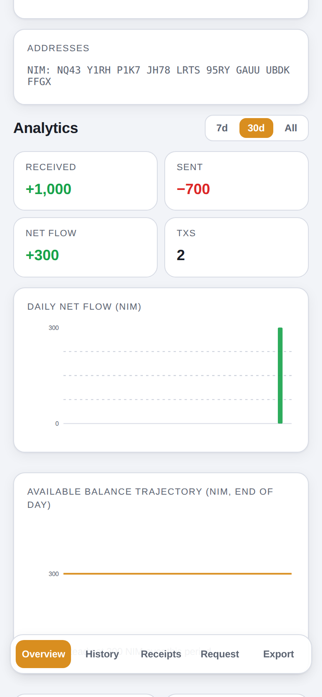
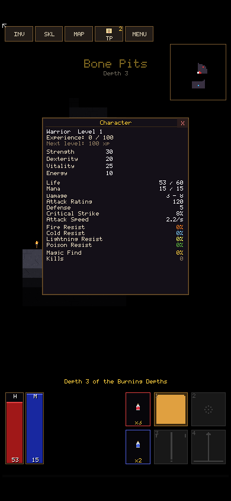
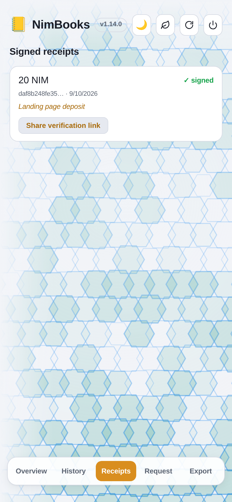

# NimBooks

> The books for your Nimiq wallet.

| Field | Value |
| --- | --- |
| Category | Productivity |
| Pricing | Free |
| Team name | _Not provided — optional_ |
| Team members | _Not provided — optional_ |
| X account | subimpact |
| Heard about it via | nimiq official website |
| Contact email | me@subimpact.net |
| GitHub login | @subimpact |
| Submitted at | 2026-09-06T21:09:37.867Z |

## Links

| Link | URL |
| --- | --- |
| Repo | [https://github.com/subimpact/nimbooks](<https://github.com/subimpact/nimbooks>) |
| Demo | [https://nimbooks.subimpact.net](<https://nimbooks.subimpact.net>) |
| Video | [https://youtube.com/shorts/7UG5FxW46a0](<https://youtube.com/shorts/7UG5FxW46a0>) |
| Skool post | [https://www.skool.com/miniappscompetition/nimbooks-the-books-for-your-nimiq-wallet](<https://www.skool.com/miniappscompetition/nimbooks-the-books-for-your-nimiq-wallet>) |
| Social post | [https://x.com/subimpact/status/2096703159674814882](<https://x.com/subimpact/status/2096703159674814882>) |

## Description

NimBooks is the accounting layer for Nimiq Pay — track NIM balances and history with fiat values, export accountant-ready CSV statements, and issue signed proof-of-payment receipts anyone can verify publicly, no backend required.

## Builder story

_Not provided — optional_

## Thumbnail

## Screenshots

---

_Generated from the submission form. `submission.yaml` in this folder is the machine-readable source of truth._
