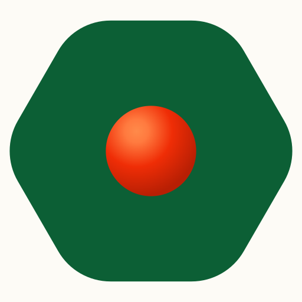
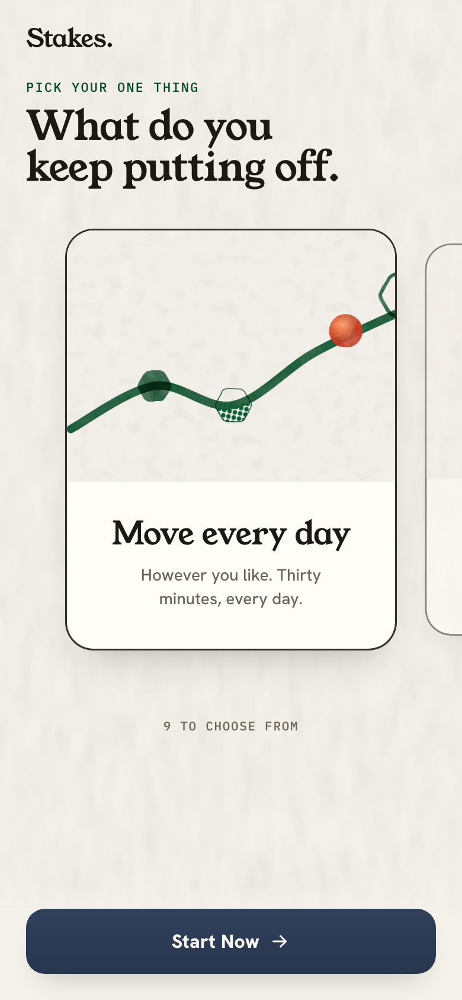
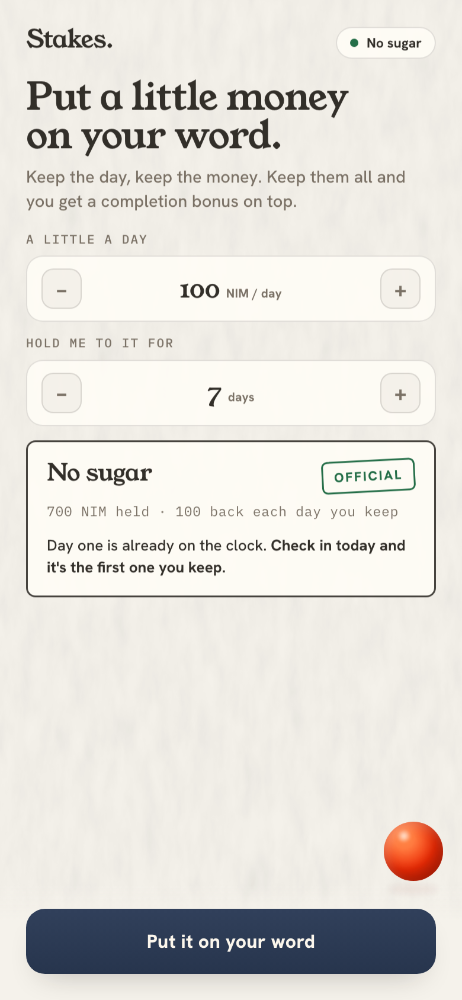
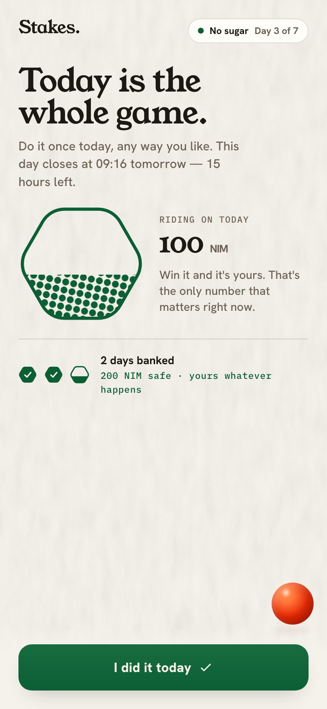
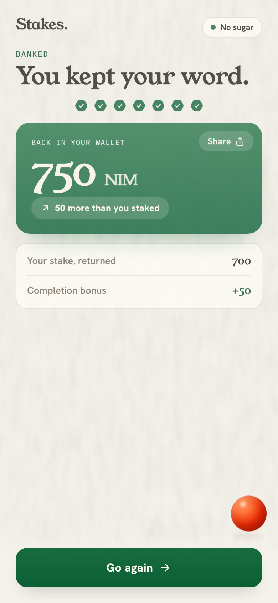

# Stakes

> Win your moment. Bank the day.

| Field | Value |
| --- | --- |
| Category | Lifestyle |
| Pricing | Free |
| Team name | surfstyk |
| Team members | _Not provided — optional_ |
| X account | surfstyk |
| Heard about it via | Nimiq X post |
| Contact email | hendrik@surfstyk.com |
| GitHub login | @surfstyk |
| Submitted at | 2026-09-09T18:10:20.688Z |

## Links

| Link | URL |
| --- | --- |
| Repo | [https://github.com/surfstyk/stakes](<https://github.com/surfstyk/stakes>) |
| Demo | [https://stakes.day](<https://stakes.day>) |
| Video | [https://youtu.be/IhR93SCj6rg](<https://youtu.be/IhR93SCj6rg>) |
| Skool post | [https://www.skool.com/miniappscompetition/keep-one-day-thats-my-whole-ask-stakesday](<https://www.skool.com/miniappscompetition/keep-one-day-thats-my-whole-ask-stakesday>) |
| Social post | [https://x.com/surfstyk/status/2097743725023613037](<https://x.com/surfstyk/status/2097743725023613037>) |

## Description

Stakes is a daily commitment app in Nimiq Pay: put a little of your own NIM on a goal, keep the day, and get it back with a bonus when you follow through. The dot shows up for the weak moment and keeps no score.

## Builder story

Stakes came from one observation: you don't lose a goal across a year, you lose it in a single weak moment, the ten seconds where the easy thing wins. So I built for that moment. You put a little of your own money on your word, keep the day, and get it back with a bonus. The dot shows up for the weak moment and keeps no score. It runs in Nimiq Pay, and every check-in is signed from your own wallet, on the chain for anyone to read.

## Thumbnail

## Screenshots

---

_Generated from the submission form. `submission.yaml` in this folder is the machine-readable source of truth._
