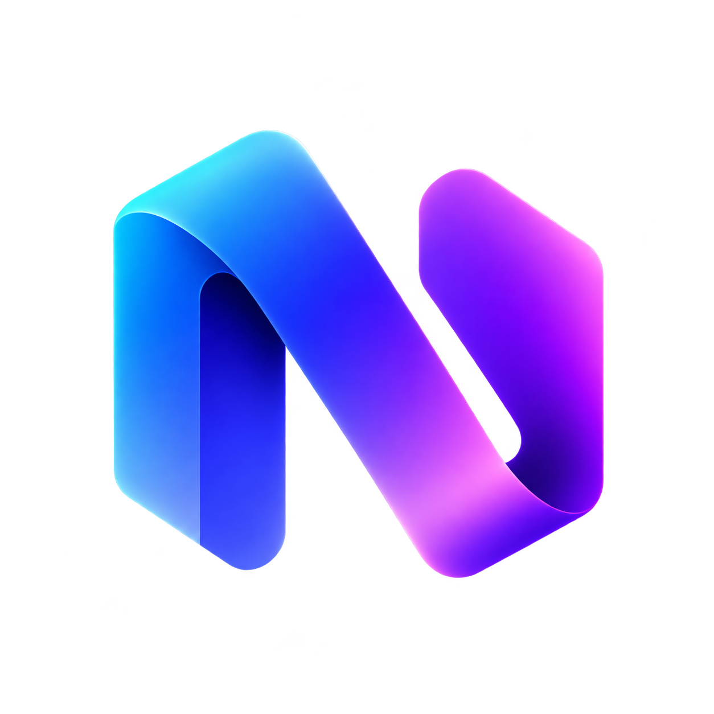
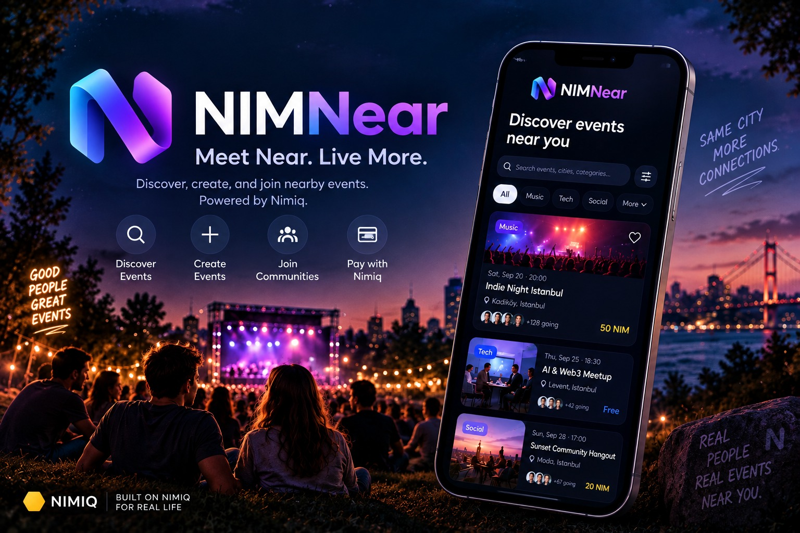
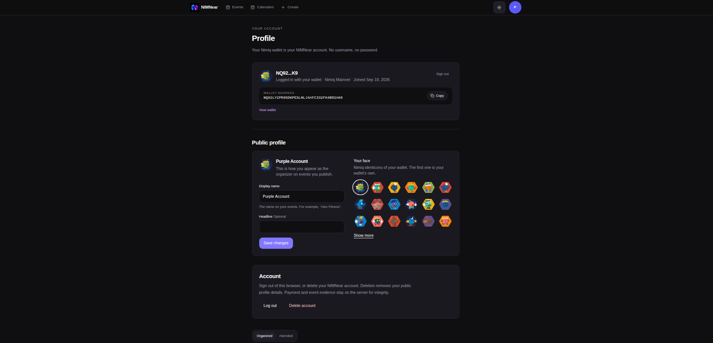
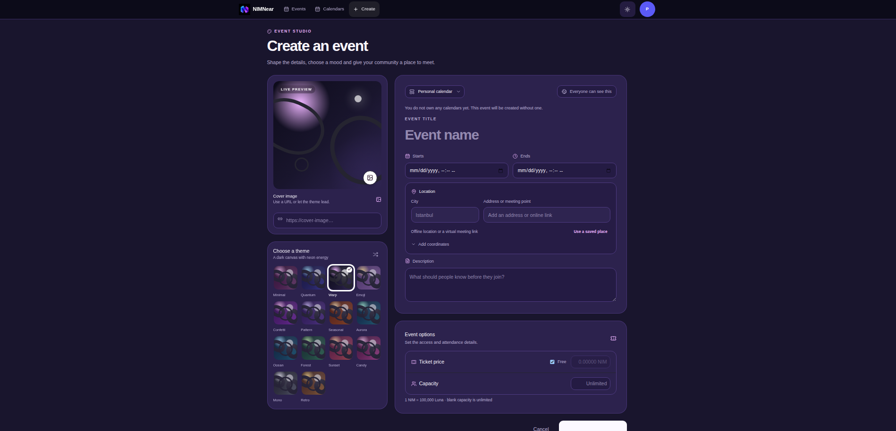
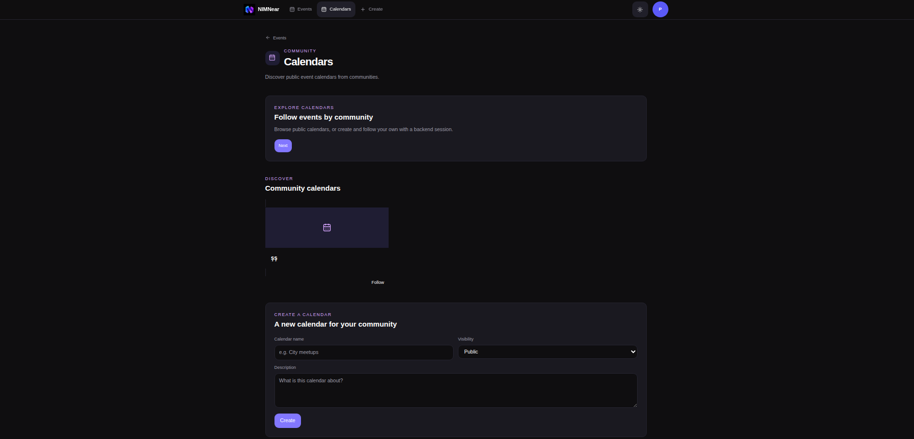
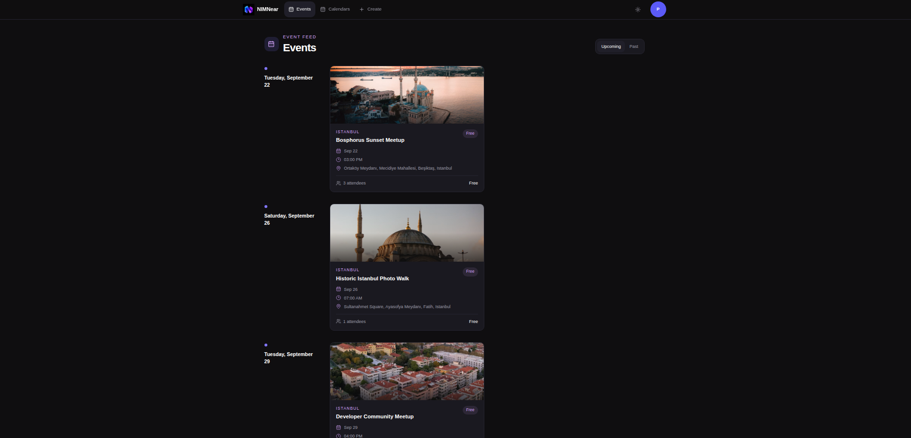

# NIMNear

> Meet Near. Fun More.

| Field | Value |
| --- | --- |
| Category | Social |
| Pricing | Free |
| Team name | _Not provided — optional_ |
| Team members | _Not provided — optional_ |
| X account | https://x.com/TalhaKpersonal |
| Heard about it via | Nimiq Community |
| Contact email | tlhkabasakal@gmail.com |
| GitHub login | @talhakabasakal |
| Submitted at | 2026-09-18T23:49:49.996Z |

## Links

| Link | URL |
| --- | --- |
| Repo | [https://github.com/talhakabasakal/NimNear.git](<https://github.com/talhakabasakal/NimNear.git>) |
| Demo | [https://nim-near.vercel.app/](<https://nim-near.vercel.app/>) |
| Video | [https://youtu.be/KT8uiKCnv6c](<https://youtu.be/KT8uiKCnv6c>) |
| Skool post | [https://www.skool.com/miniappscompetition/i-just-submitted-nimnear-to-the-nimiq-mini-apps-competition?p=db6056c1](<https://www.skool.com/miniappscompetition/i-just-submitted-nimnear-to-the-nimiq-mini-apps-competition?p=db6056c1>) |
| Social post | [https://youtu.be/KT8uiKCnv6c](<https://youtu.be/KT8uiKCnv6c>) |

## Description

NIMNear helps people discover, create, and join nearby events, with seamless Nimiq-powered payments for paid experiences.

## Builder story

I built NIMNear because I wanted to make it easier for people to discover real experiences happening around them and connect with their local communities.

I noticed that finding nearby events, joining them, and handling payments often happen across different platforms. With NIMNear, I wanted to bring these experiences together in one simple application where users can discover nearby events, create their own gatherings, join communities, and pay for experiences using NIM.

Nimiq inspired me to explore how crypto could work naturally in a real-world social application. Instead of making blockchain the main focus, I use it as infrastructure behind the experience. NIMNear uses Nimiq wallet authentication and supports NIM payments for paid events, with transactions verified on-chain before participation is confirmed.

While building NIMNear, I worked through challenges such as wallet-based authentication, Mainnet transaction verification, browser and Nimiq Pay flows, and creating an experience that remains simple for users who may not be familiar with crypto.

My goal with NIMNear is simple: use Nimiq to help turn nearby opportunities into real connections.

## Thumbnail

## Screenshots

---

_Generated from the submission form. `submission.yaml` in this folder is the machine-readable source of truth._
