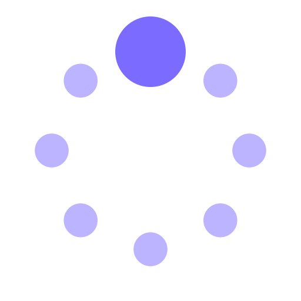
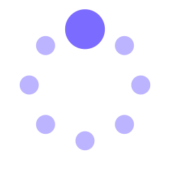
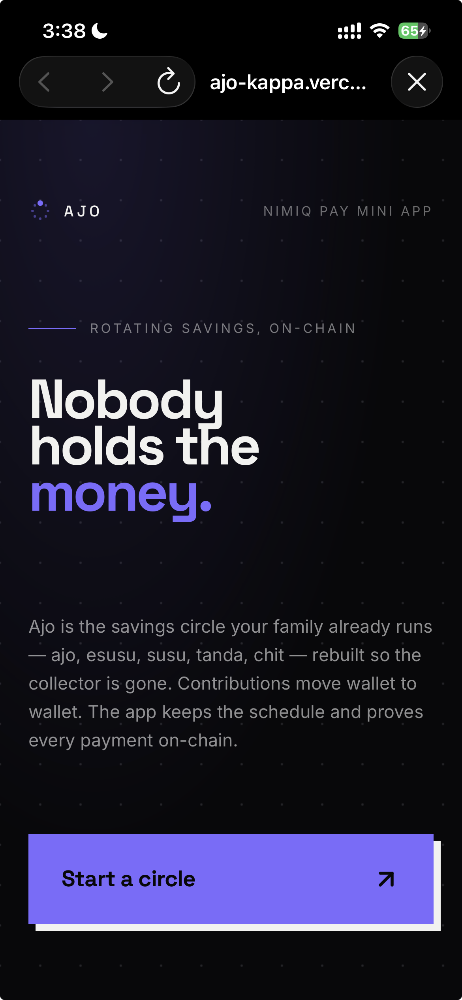
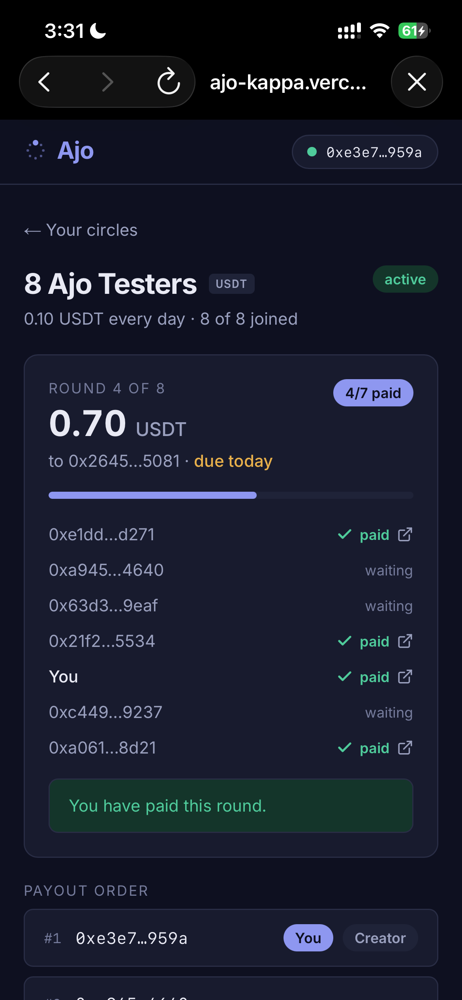
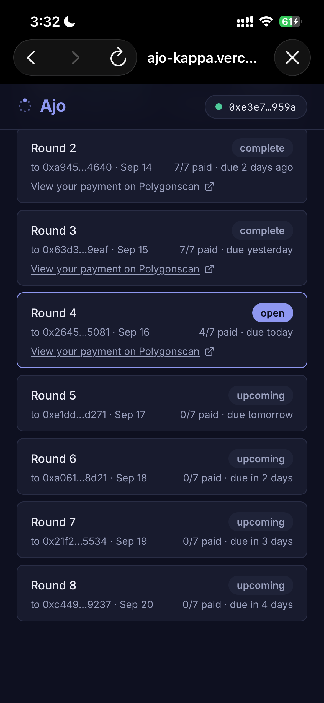

# Ajo

> Nobody holds the money.

| Field | Value |
| --- | --- |
| Category | On-chain services |
| Pricing | Free |
| Team name | _Not provided — optional_ |
| Team members | _Not provided — optional_ |
| X account | etudaye_fn |
| Heard about it via | X |
| Contact email | musaawwaletudaye@gmail.com |
| GitHub login | @techbone |
| Submitted at | 2026-09-17T14:42:34.962Z |

## Links

| Link | URL |
| --- | --- |
| Repo | [https://github.com/techbone/ajo](<https://github.com/techbone/ajo>) |
| Demo | [https://ajo-kappa.vercel.app](<https://ajo-kappa.vercel.app>) |
| Video | [https://youtu.be/y_bBsziTm5o](<https://youtu.be/y_bBsziTm5o>) |
| Skool post | [https://www.skool.com/miniappscompetition/ajo-a-savings-circle-where-nobody-holds-the-money?p=4790c03b](<https://www.skool.com/miniappscompetition/ajo-a-savings-circle-where-nobody-holds-the-money?p=4790c03b>) |
| Social post | [https://x.com/ajo_onchain/status/2095207109260382226](<https://x.com/ajo_onchain/status/2095207109260382226>) |

## Description

A rotating savings circle, ajo, esusu, tanda, on USDT and NIM. Members contribute a fixed amount each round and one person is paid out, rotating until everyone's had a turn, with no one holding the pot.

## Builder story

My grandmother ran an ajo for twenty years. Ten women, a fixed contribution every week, one person takes the pot, then it rotates until everyone's had a turn. It always worked, the people, the trust, the rhythm, right up until it didn't, because it all rested on whoever was holding the money that month. One bad month and everyone's savings were just gone.

I've watched that same story play out in every version of this,  ajo, esusu, susu, tanda, chit, whatever your family calls it. Hundreds of millions of people run these circles because they work. And they all carry the same single point of failure: a person.

Ajo keeps everything that makes the original work, the rotation, the trust between people who already know each other, the discipline of a fixed contribution and removes the one part that breaks it. Nobody collects the money. Members pay each other directly, and the app's only job is to track who's paid and prove it on-chain.

I built and tested this with real people putting in real money, not just test wallets, my brother was the first person to pay into a circle from his own phone while I watched my screen update with nothing in my hands. Someone in the Nimiq community caught a real flaw in the rotation logic during testing, and it shipped a fix within a day. That's the whole point: build something people can actually trust with their savings, not just a demo.

## Thumbnail

## Screenshots

---

_Generated from the submission form. `submission.yaml` in this folder is the machine-readable source of truth._
