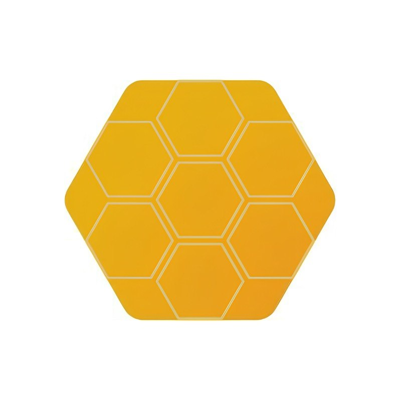
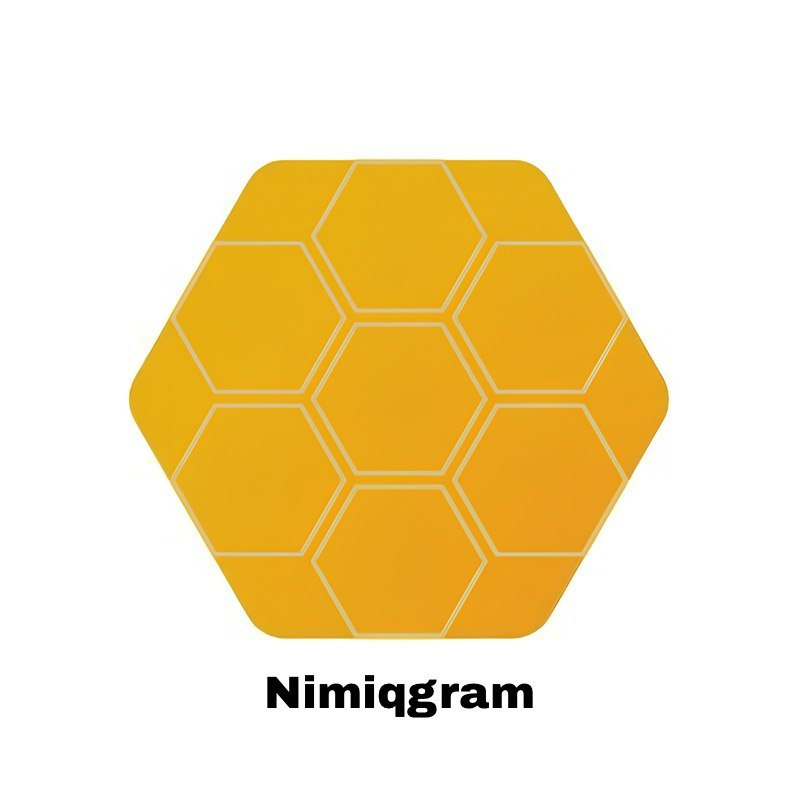
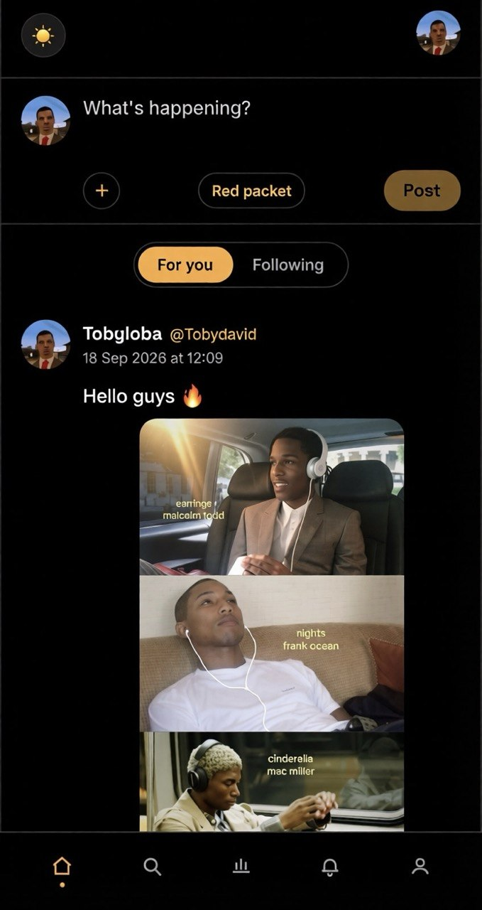
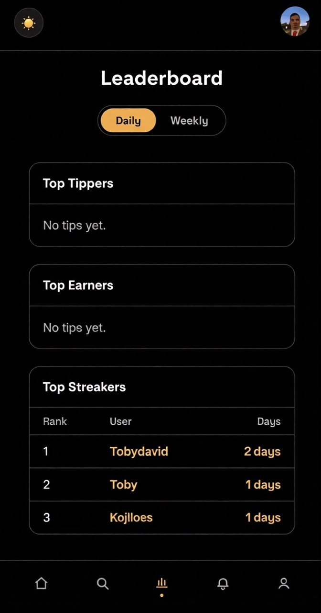
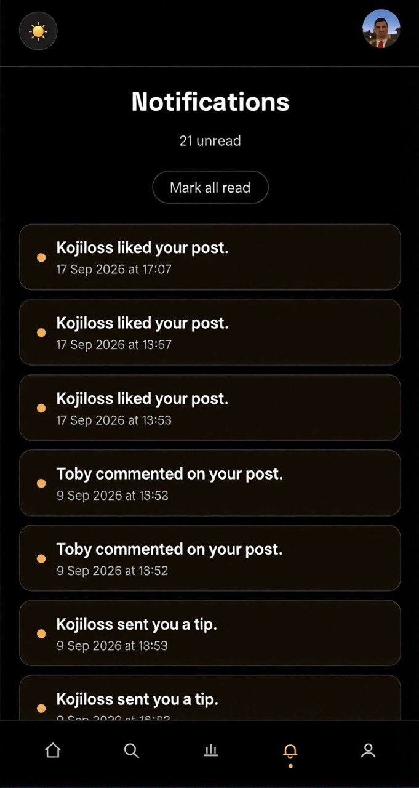
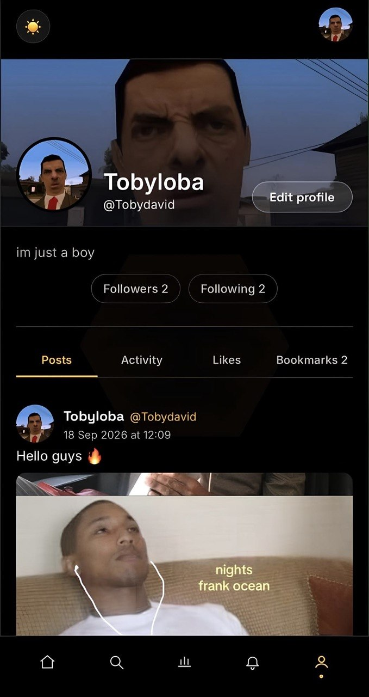

# Nimiqgram

> A social feed where every tip is checked against the blockchain before it counts.Likes are free Tips are real.

| Field | Value |
| --- | --- |
| Category | Social |
| Pricing | Free |
| Team name | Bob the Builder |
| Team members | Charliegonebrown |
| X account | winsoonbob |
| Heard about it via | X |
| Contact email | awedavid2007@gmail.com |
| GitHub login | @thereal-awetoby |
| Submitted at | 2026-09-18T21:10:06.285Z |

## Links

| Link | URL |
| --- | --- |
| Repo | [https://github.com/thereal-awetoby/nimiqgram](<https://github.com/thereal-awetoby/nimiqgram>) |
| Demo | [https://nimiqgram.vercel.app](<https://nimiqgram.vercel.app>) |
| Video | [https://youtube.com/shorts/WbaNXO0aaeA?si=2dbzwDFInBAV2c4m](<https://youtube.com/shorts/WbaNXO0aaeA?si=2dbzwDFInBAV2c4m>) |
| Skool post | [https://www.skool.com/miniappscompetition/nimiqgram-is-live?p=493b24dc](<https://www.skool.com/miniappscompetition/nimiqgram-is-live?p=493b24dc>) |
| Social post | [https://x.com/winsoonbob/status/2101005136956908023?s=46](<https://x.com/winsoonbob/status/2101005136956908023?s=46>) |

## Description

Nimiqgram is a social mini-app that runs on a Nimiq wallet instead of a username and password.You post, follow, like, comment — like any social app.
But tips are real NIM transactions,

## Builder story

_Not provided — optional_

## Thumbnail

## Screenshots

---

_Generated from the submission form. `submission.yaml` in this folder is the machine-readable source of truth._
