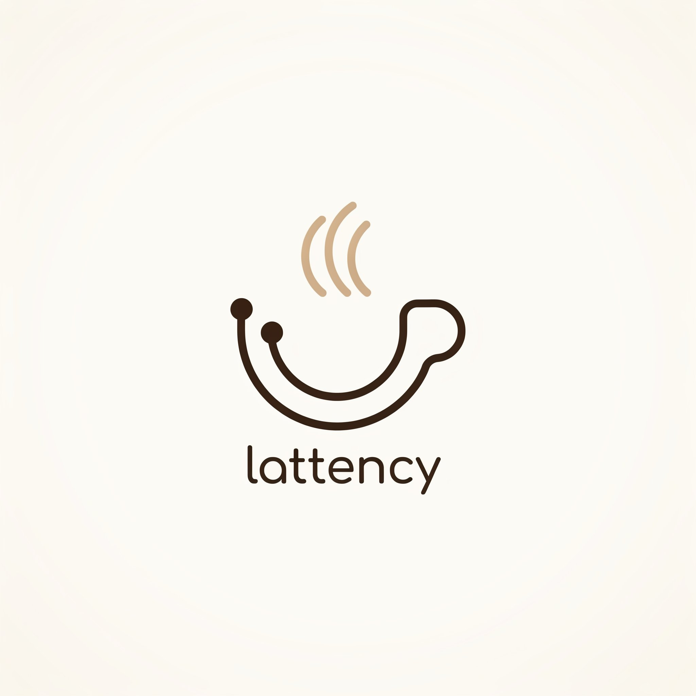
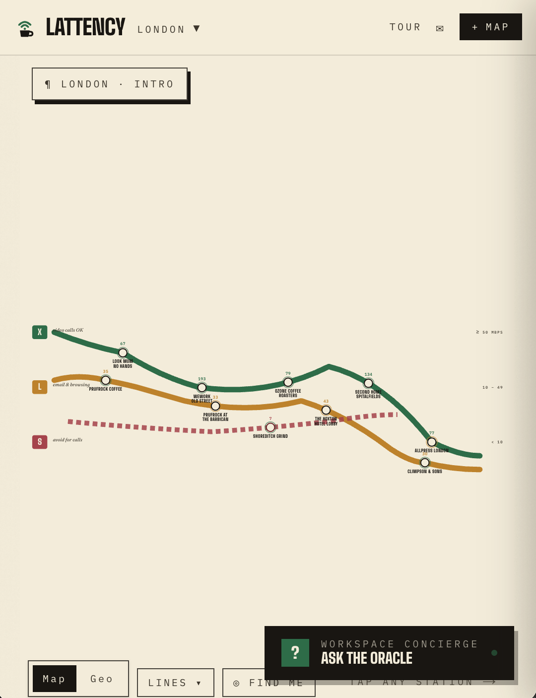
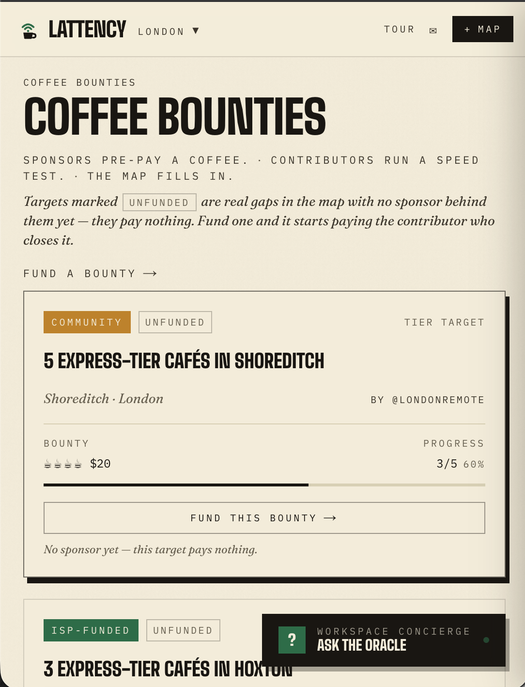
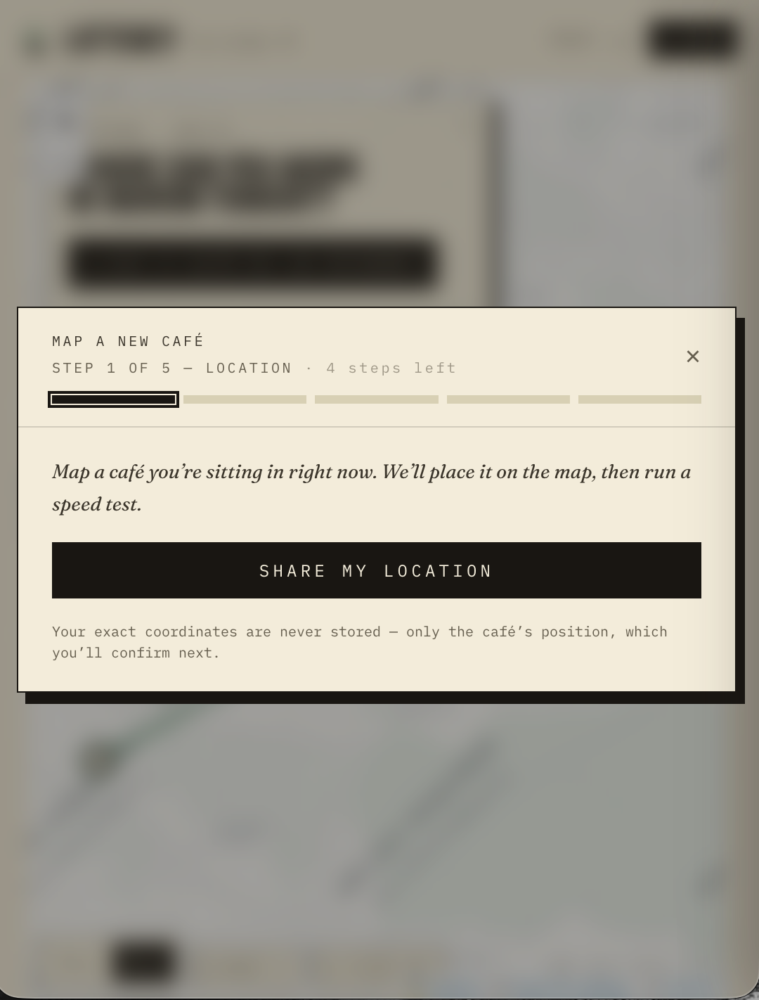

# lattency

> crowdsourced metro map of workable coffee spots

| Field | Value |
| --- | --- |
| Category | Earning |
| Pricing | Free |
| Team name | _Not provided — optional_ |
| Team members | _Not provided — optional_ |
| X account | papajimjams |
| Heard about it via | X |
| Contact email | papaandthejimjams@gmail.com |
| GitHub login | @thisyearnofear |
| Submitted at | 2026-09-18T22:20:25.544Z |

## Links

| Link | URL |
| --- | --- |
| Repo | [https://github.com/thisyearnofear/lattency](<https://github.com/thisyearnofear/lattency>) |
| Demo | [https://lattency.vercel.app/](<https://lattency.vercel.app/>) |
| Video | [https://youtu.be/h9GY2Ba38gs](<https://youtu.be/h9GY2Ba38gs>) |
| Skool post | [https://www.skool.com/miniappscompetition/lattency?p=9fdafa35](<https://www.skool.com/miniappscompetition/lattency?p=9fdafa35>) |
| Social post | [https://x.com/papajimjams/status/2101073829716238359](<https://x.com/papajimjams/status/2101073829716238359>) |

## Description

Lattency is a physical-world oracle - the best data about a workspace comes from someone who is physically there. Lattency turns that private experience into a public good: wifi speed tests, bounties and coffee availability.

## Builder story

it feels like a lottery everytime i go into a coffee shop and/or workspace - will there be oat milk, how decent will the wifi be, does it turn into a bar/club just as i am getting into flow state

## Thumbnail

## Screenshots

---

_Generated from the submission form. `submission.yaml` in this folder is the machine-readable source of truth._
