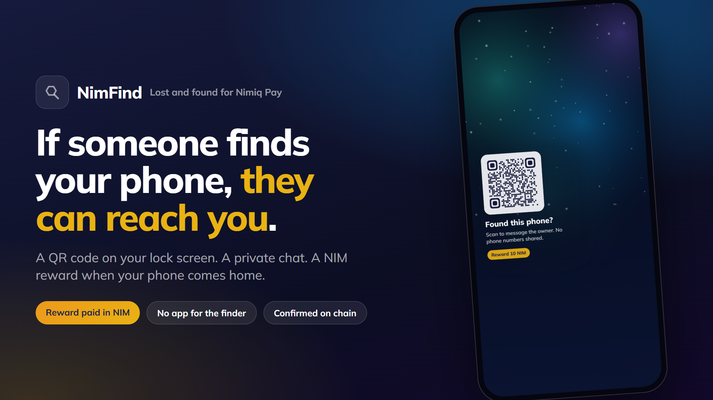
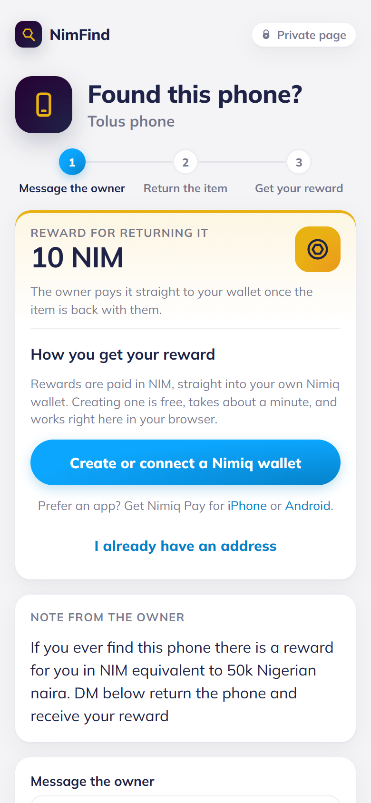
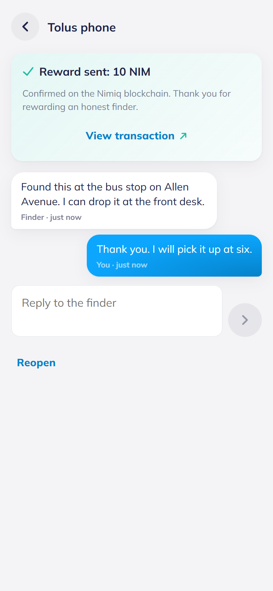
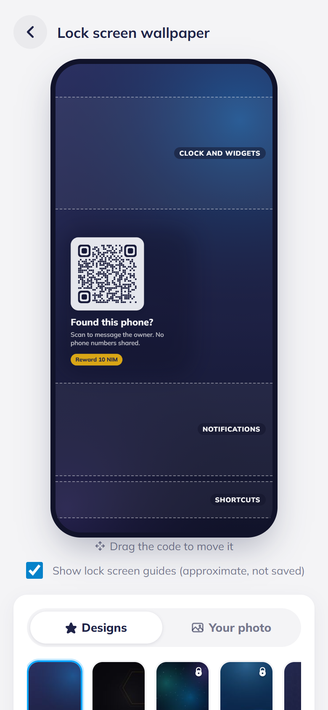
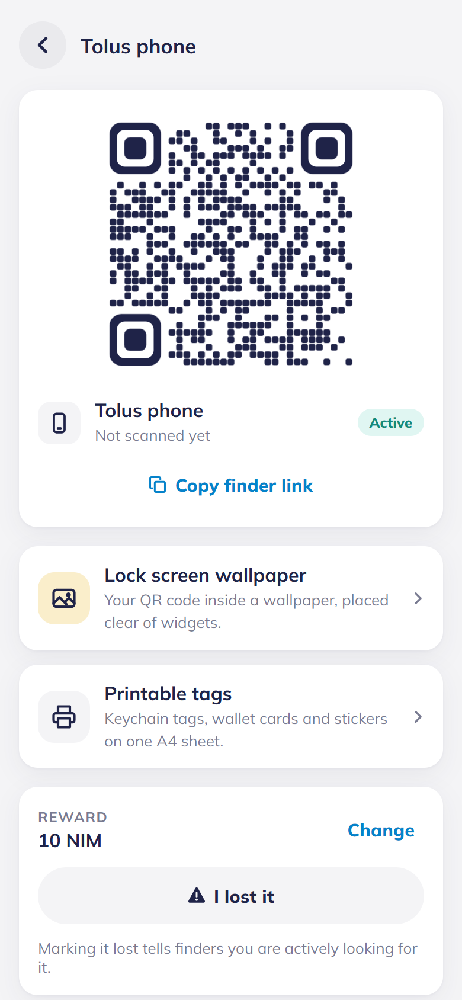

# NimFind

> Lost and found for Nimiq Pay

| Field | Value |
| --- | --- |
| Category | Lifestyle |
| Pricing | Freemium |
| Team name | Tolu's Team |
| Team members | _Not provided — optional_ |
| X account | Toluinweb3 |
| Heard about it via | x |
| Contact email | toleexxzy@gmail.com |
| GitHub login | @tomcode1000 |
| Submitted at | 2026-09-18T13:47:47.533Z |

## Links

| Link | URL |
| --- | --- |
| Repo | [https://github.com/tomcode1000/NimFind](<https://github.com/tomcode1000/NimFind>) |
| Demo | [https://nim-find.vercel.app/](<https://nim-find.vercel.app/>) |
| Video | [https://youtu.be/swLMKowNyVs](<https://youtu.be/swLMKowNyVs>) |
| Skool post | _Not provided — optional_ |
| Social post | [https://x.com/Toluinweb3/status/2100877393103655252?s=20](<https://x.com/Toluinweb3/status/2100877393103655252?s=20>) |

## Description

NimFind gives anyone who carries a phone, keys or a bag a QR code for their lock screen and stickers, so whoever finds a lost item can message the owner privately and get paid a NIM reward when it is returned. It is for everyday Nimiq Pay users who want a way back for their thing

## Builder story

_Not provided — optional_

## Thumbnail

## Screenshots

---

_Generated from the submission form. `submission.yaml` in this folder is the machine-readable source of truth._
