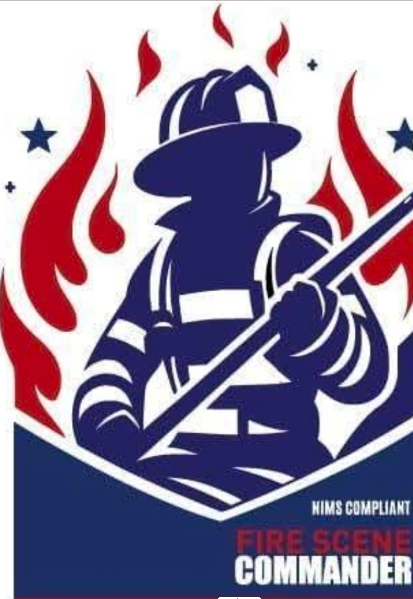
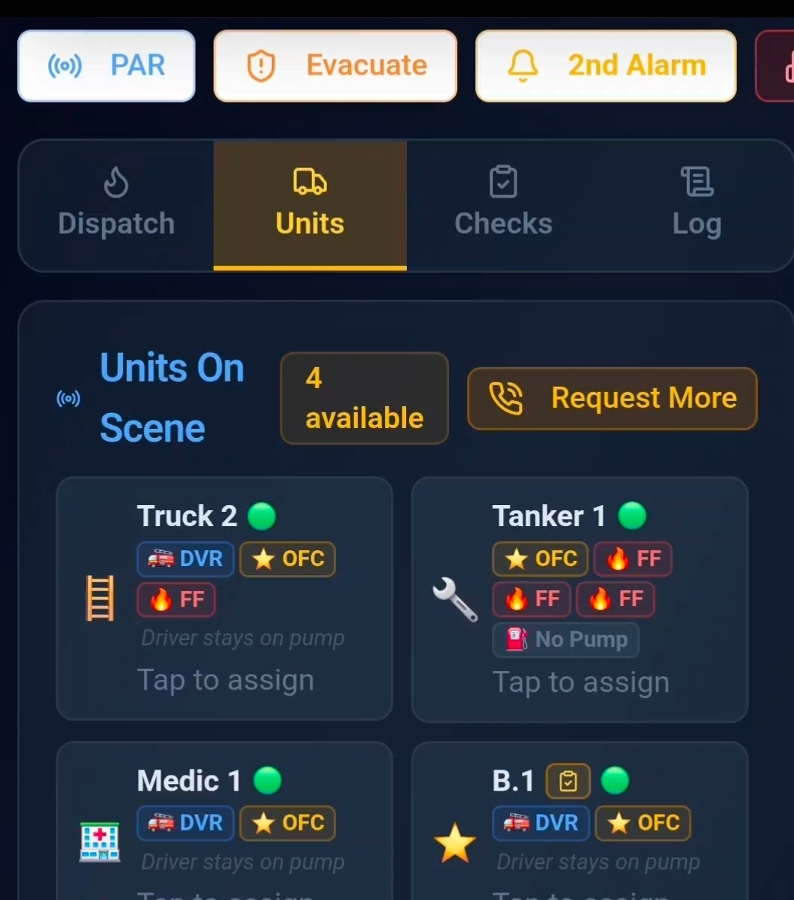
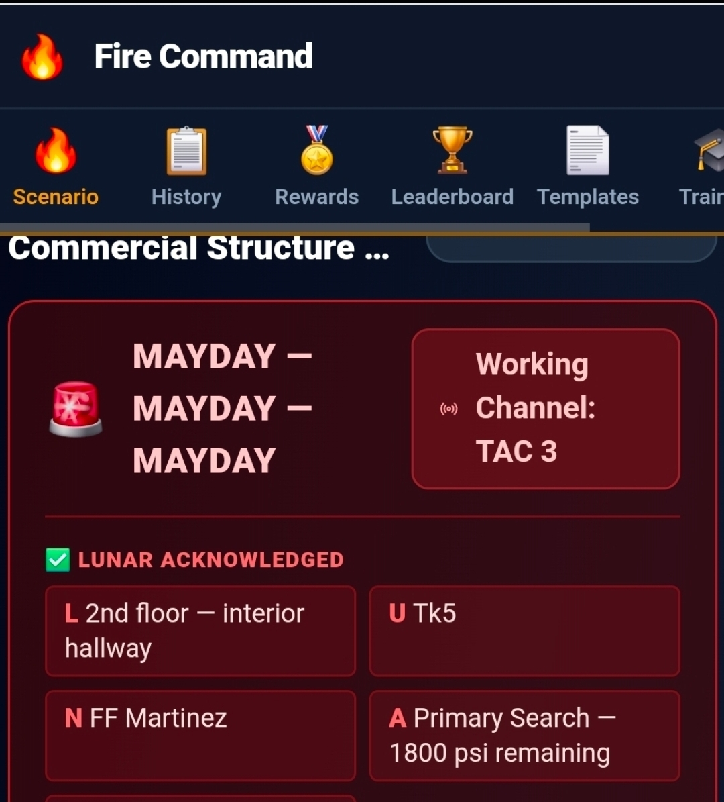
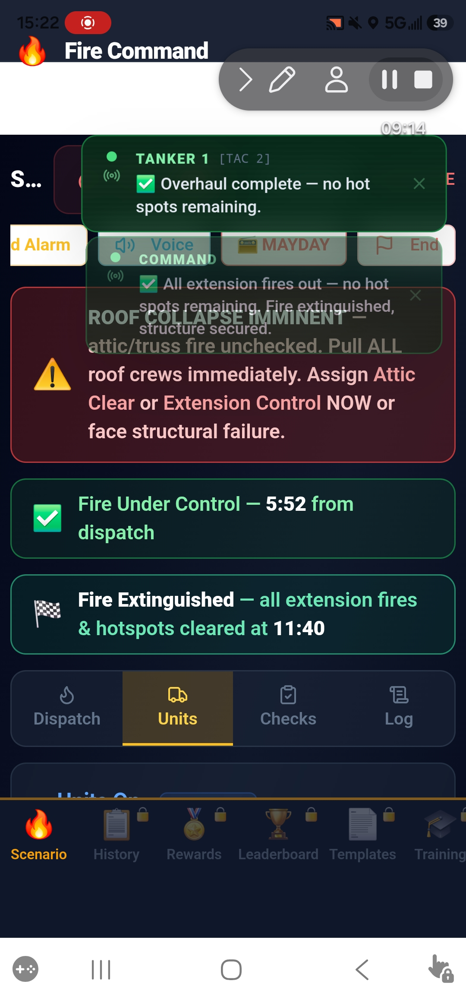
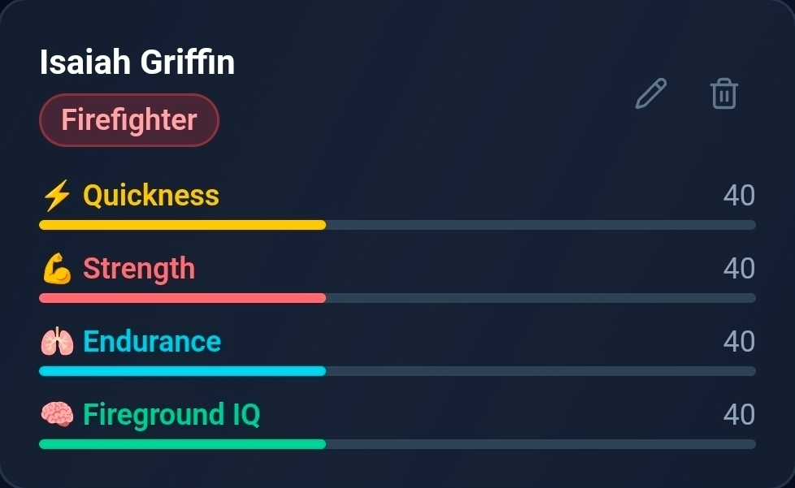
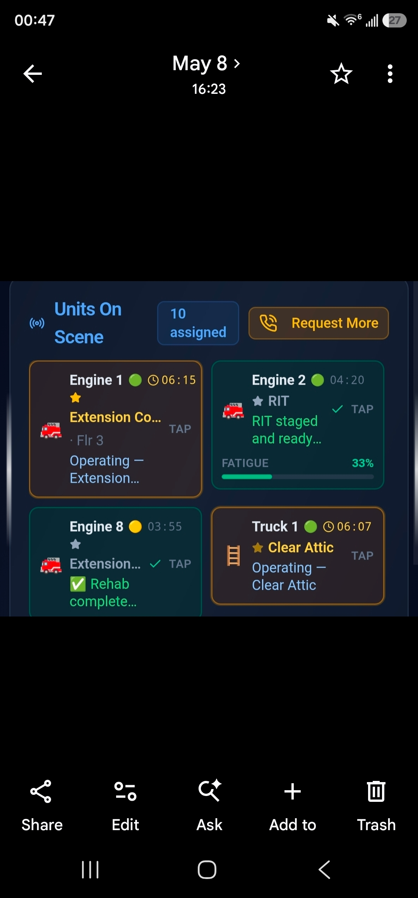

# Fire Scene Commander

> Fire Scene Commander — Command the chaos. Save the scene.

| Field | Value |
| --- | --- |
| Category | Games |
| Pricing | Paid |
| Team name | LDH Dynamics |
| Team members | Alexander Griffin |
| X account | _Not provided — optional_ |
| Heard about it via | _Not provided — optional_ |
| Contact email | Triplegriffin@gmail.com |
| GitHub login | @triplegriffin-eng |
| Submitted at | 2026-09-18T15:51:13.840Z |

## Links

| Link | URL |
| --- | --- |
| Repo | [https://firescenecommander.base44.app](<https://firescenecommander.base44.app>) |
| Demo | [https://firescenecommander.base44.app](<https://firescenecommander.base44.app>) |
| Video | [https://youtu.be/UNr02EwW5QU?is=jP3AP8FMcGXNRCh8](<https://youtu.be/UNr02EwW5QU?is=jP3AP8FMcGXNRCh8>) |
| Skool post | _Not provided — optional_ |
| Social post | _Not provided — optional_ |

## Description

Fire Scene Commander puts you in command of a dynamic emergency scene where every decision matters. Deploy crews, manage resources, battle evolving fire conditions, and bring the incident under control in a deep, realistic firefighting command simulation.

## Builder story

After years as a firefighter, I wanted to turn my real-world experience and love of incident command into something others could experience. Fire Scene Commander was built to put you in the command seat—where conditions change, resources matter, and every decision can change the outcome.

## Thumbnail

## Screenshots

---

_Generated from the submission form. `submission.yaml` in this folder is the machine-readable source of truth._
