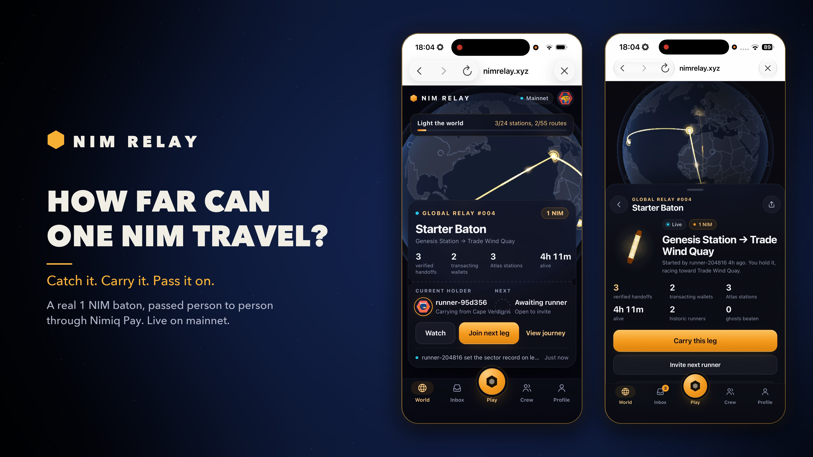
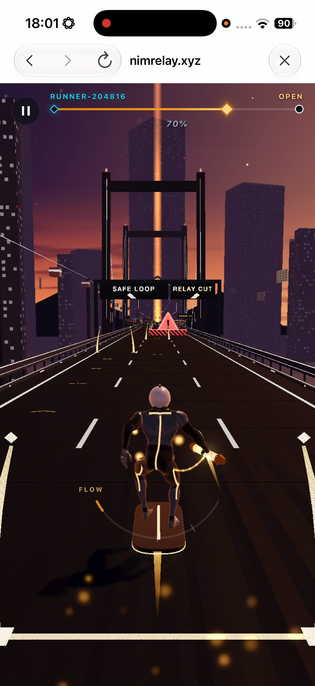
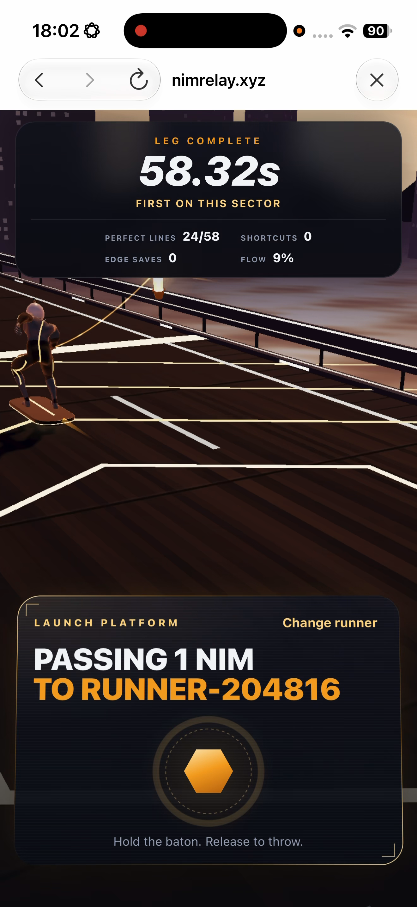
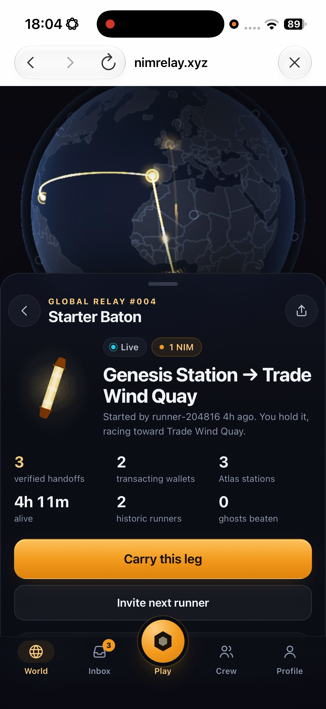
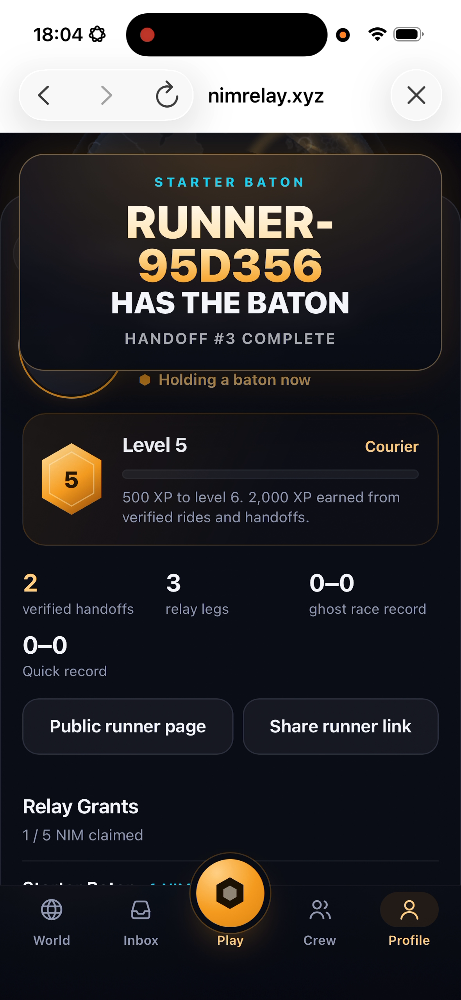

# NIM Relay

> One NIM. One relay. One journey.

| Field | Value |
| --- | --- |
| Category | Games |
| Pricing | Free |
| Team name | NimRelay |
| Team members | @IamOloba_, @winsznx |
| X account | NimRelay |
| Heard about it via | x |
| Contact email | xidoncapitals@gmail.com |
| GitHub login | @winsznx |
| Submitted at | 2026-09-18T20:47:34.153Z |

## Links

| Link | URL |
| --- | --- |
| Repo | [https://github.com/winsznx/nim-relay](<https://github.com/winsznx/nim-relay>) |
| Demo | [https://nimrelay.xyz](<https://nimrelay.xyz>) |
| Video | [https://youtu.be/6orRlOB75ww](<https://youtu.be/6orRlOB75ww>) |
| Skool post | [https://www.skool.com/miniappscompetition/quick-update-on-nim-relay?p=b90cdf1b](<https://www.skool.com/miniappscompetition/quick-update-on-nim-relay?p=b90cdf1b>) |
| Social post | [https://x.com/iamoloba_/status/2100558359996903930?s=46](<https://x.com/iamoloba_/status/2100558359996903930?s=46>) |

## Description

NIM Relay is a social arcade game where a real 1 NIM baton moves from player to player. Race the previous runner’s verified ghost, complete your leg, and pass the baton through Nimiq Pay to extend a living journey across the Relay Atlas.

## Builder story

NIM Relay started with one question: what if the transaction itself was the game mechanic?

Instead of adding crypto rewards to a normal game, we made a real NIM transfer the baton. Each runner receives it, races the previous runner’s verified ghost, completes their leg, and passes it to the next person through Nimiq Pay.

As the baton moves, it builds a visible journey across the Relay Atlas. Every verified handoff adds another runner, route and piece of history.

We built the rest of the product around that idea: social challenges, verified ghosts, relay history, progression and a world that changes as people keep the baton moving.

The goal is simple: make using NIM feel like play rather than payment infrastructure.

## Thumbnail

## Screenshots

---

_Generated from the submission form. `submission.yaml` in this folder is the machine-readable source of truth._
