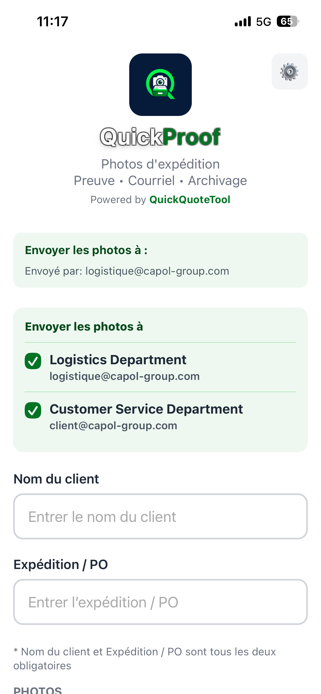
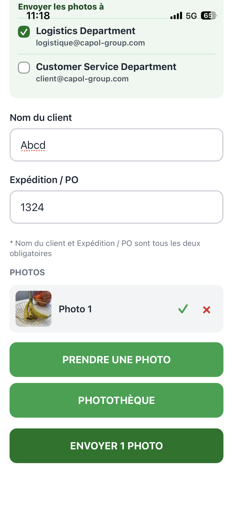
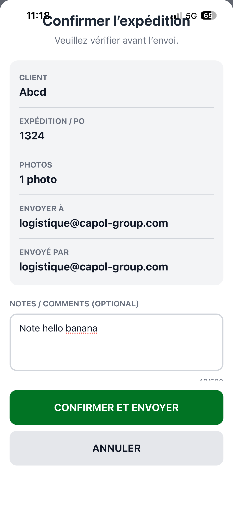
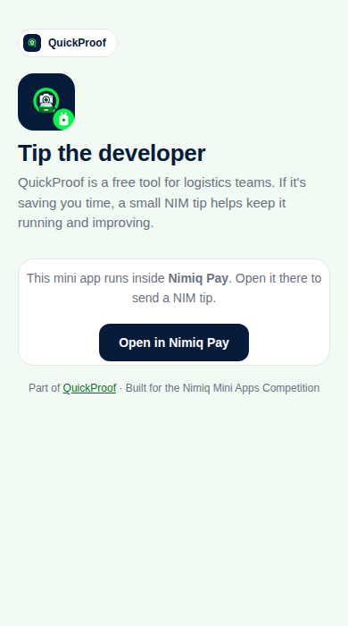
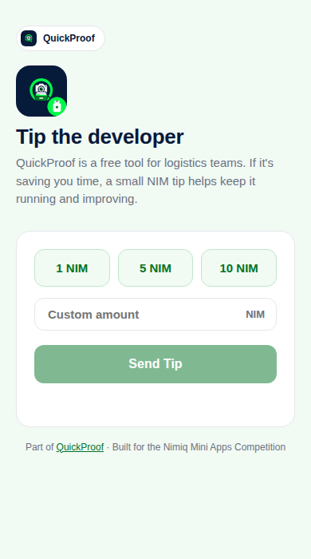

# Quick proof nim tip jar

> Tip the tools you use every day — one tap, one NIM.

| Field | Value |
| --- | --- |
| Category | Productivity |
| Pricing | Free |
| Team name | _Not provided — optional_ |
| Team members | _Not provided — optional_ |
| X account | _Not provided — optional_ |
| Contact email | f.bradette@outlook.com |
| GitHub login | @xcoder2088 |
| Submitted at | 2026-08-24T18:34:56.160Z |

## Links

| Link | URL |
| --- | --- |
| Repo | [https://github.com/xcoder2088/nimiq-quick-proof-tips-jar](<https://github.com/xcoder2088/nimiq-quick-proof-tips-jar>) |
| Demo | [https://shipping.quickquotetool.ca/](<https://shipping.quickquotetool.ca/>) |
| Video | [https://youtube.com/shorts/S_-yqUt2PhM?si=sT_SjDs40Wtr_Zzt](<https://youtube.com/shorts/S_-yqUt2PhM?si=sT_SjDs40Wtr_Zzt>) |

## Description

NIM Tip Jar lets users of QuickProof — a free shipment-photo tool for logistics teams — send a small NIM tip to support the developer, right from the app they already use daily.

## Builder story

I run QuickQuoteTool.ca, a FedEx shipping rate tool, and kept running into the same problem: shipment disputes and "where's my package" questions that a simple photo at drop-off would have solved instantly. So I built QuickProof — a fast way for logistics teams to snap a photo and send it straight to email, no app clutter, no friction.

It's used daily by people with zero interest in crypto, which made adding NIM an interesting challenge: how do you bring it into a product without making it feel like a "crypto app" bolted on? The answer was to keep it quiet. The tip jar only shows up at meaningful moments — the first successful shipment, then every 10th one after that — and PayPal sits right next to NIM so the feature works whether someone's into Nimiq or not. Settings always has both options too, for anyone who wants to come back later.

Building the Mini App as its own open-source repo, separate from QuickProof's private codebase, meant thinking through a real integration: actual transactions, real UI, a real fallback for people opening it outside Nimiq Pay. It's been a good way to see what it actually takes to bring Nimiq into a product that already has daily users, not a demo built from scratch.

## Thumbnail

## Screenshots

---

_Generated from the submission form. `submission.yaml` in this folder is the machine-readable source of truth._
