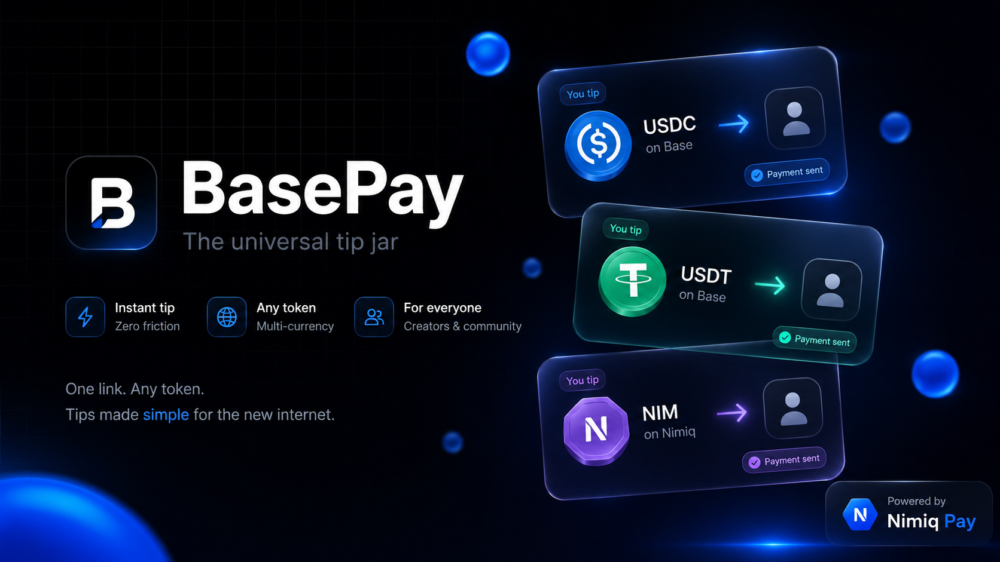
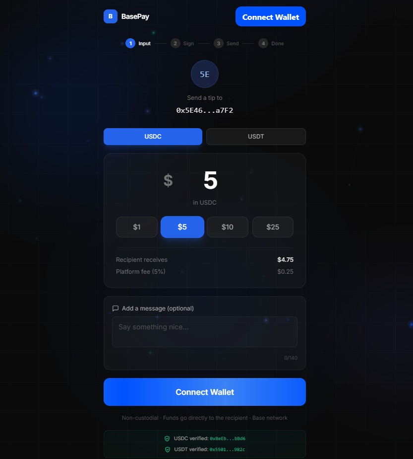
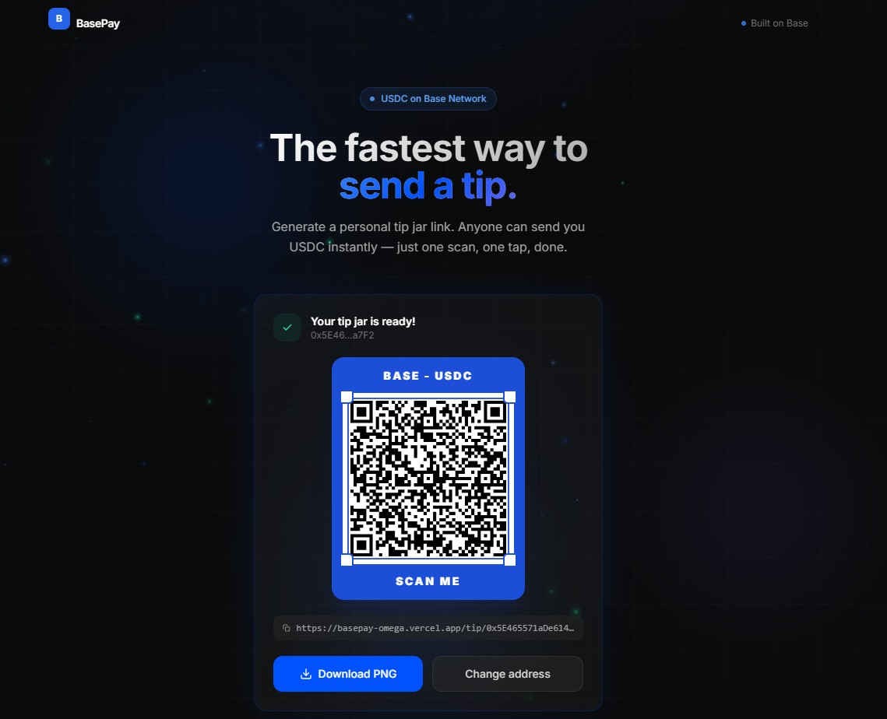
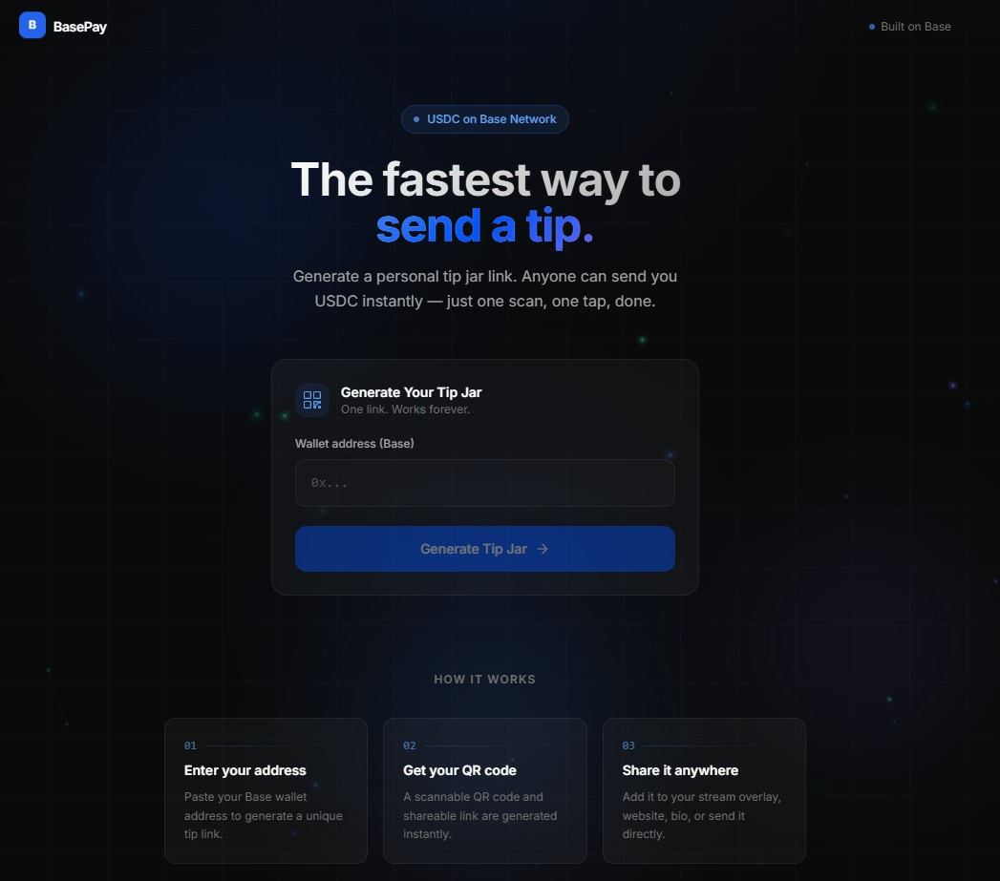

# BasePay

> The universal tip jar

| Field | Value |
| --- | --- |
| Category | Creator tools |
| Pricing | Free |
| Team name | _Not provided — optional_ |
| Team members | _Not provided — optional_ |
| X account | landlordrice |
| Contact email | xxcode66@gmail.com |
| GitHub login | @xxcode66-source |
| Submitted at | 2026-08-30T18:49:26.853Z |

## Links

| Link | URL |
| --- | --- |
| Repo | [https://github.com/xxcode66-source/basepay](<https://github.com/xxcode66-source/basepay>) |
| Demo | [https://basepay-omega.vercel.app/](<https://basepay-omega.vercel.app/>) |
| Video | [https://www.youtube.com/watch?v=33Egy4tGDKo](<https://www.youtube.com/watch?v=33Egy4tGDKo>) |

## Description

BasePay is a non-custodial, multi-currency tip jar that runs as a Nimiq Pay Mini App. Creators generate a personal tip link or QR code, share it on their stream, website, or bio — and receive tips instantly in USDC, USDT, or native NIM.

## Builder story

I'm a streamer's friend. Every time my buddy went live, he struggled to accept tips. Every platform took a cut — Twitch 50%, YouTube 30%, even "tip jar" services charged 5-10%. The money was his, but the middlemen disagreed.So I built BasePay. One link, one QR code, zero custody. Supporters pay directly from their wallet to his. No platform holds the funds, no approval process, no waiting period. The smart contract just routes the money — 95% to him, 5% to keep the lights on. That's it.But there was still a problem: wallet friction. Every supporter had to install a browser extension, find their wallet, connect it, switch to Base... half of them gave up before sending a single tip.That's why I brought BasePay to Nimiq Pay. The wallet is already there. The user is already authenticated. One tap and the tip is sent — whether it's USDC, USDT, or native NIM. No extensions, no popups, no friction.The problem I'm solving isn't technical. It's human. Tipping should feel as easy as handing someone cash. Not easier — because this is actually better. It's instant, it's global, it's non-custodial, and nobody can freeze your money.BasePay started as a favor for one streamer. Now it's a universal tip jar that works wherever Nimiq Pay goes. That's the dream: money that moves like a message.

## Thumbnail

## Screenshots

---

_Generated from the submission form. `submission.yaml` in this folder is the machine-readable source of truth._
