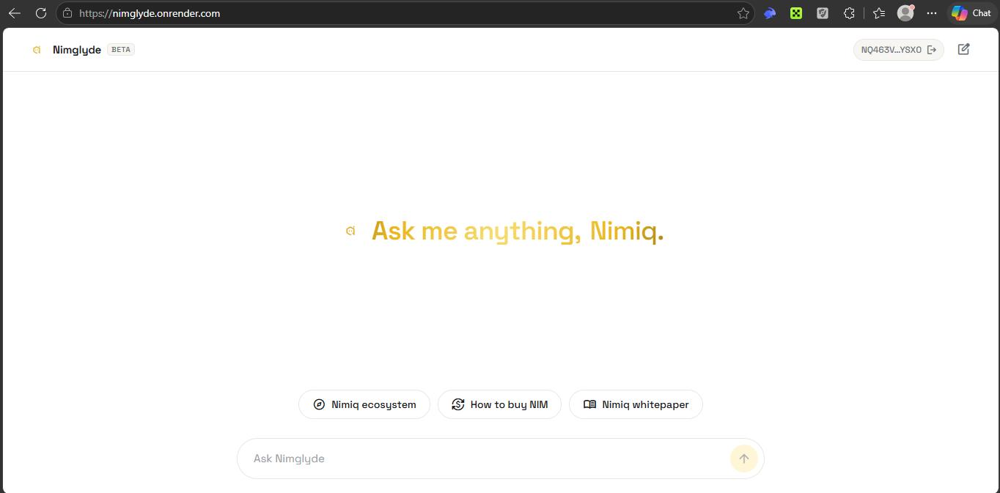
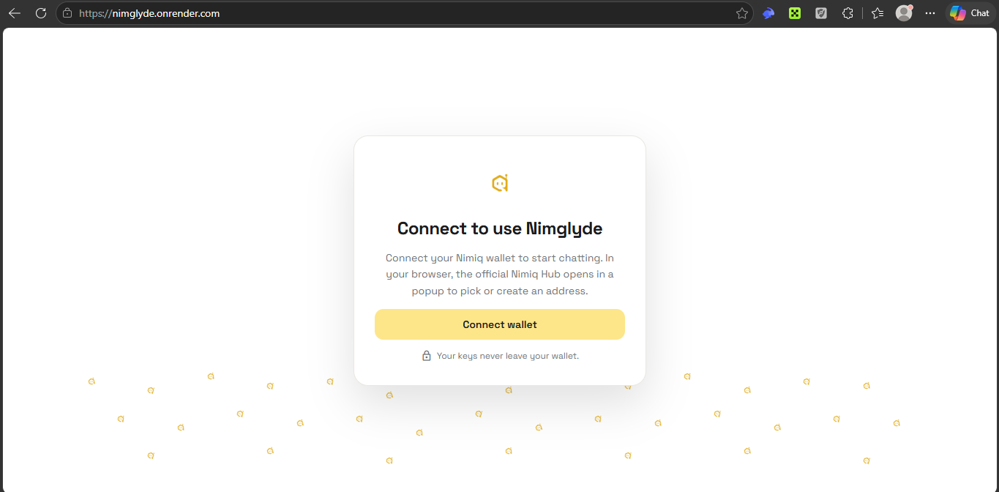
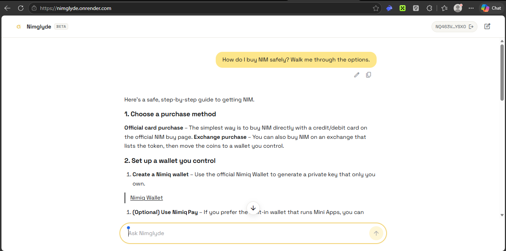
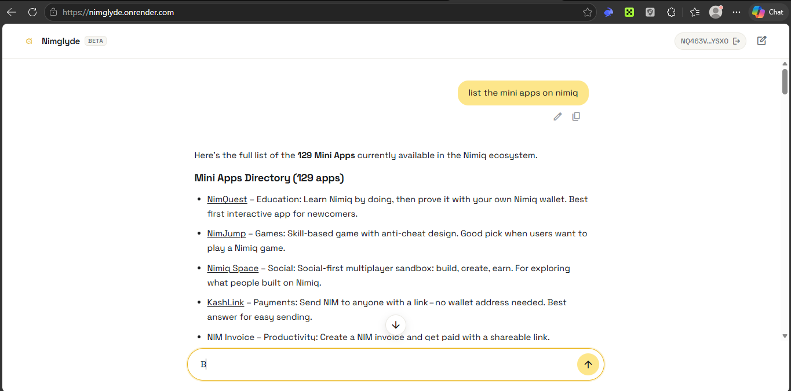
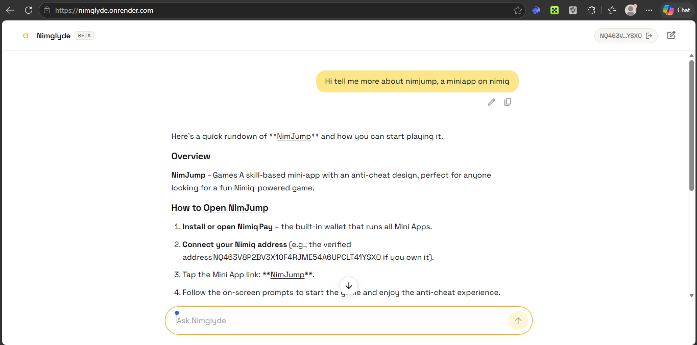

# Nimglyde

> Ask anything Nimiq - get a verified answer

| Field | Value |
| --- | --- |
| Category | Productivity |
| Pricing | Free |
| Team name | _Not provided — optional_ |
| Team members | _Not provided — optional_ |
| X account | x.com/0x_zachh |
| Heard about it via | X (formerly twitter) |
| Contact email | emmaolatunji760@gmail.com |
| GitHub login | @zachbuilds26 |
| Submitted at | 2026-09-17T17:47:53.429Z |

## Links

| Link | URL |
| --- | --- |
| Repo | [https://github.com/zachbuilds26/nimglyde](<https://github.com/zachbuilds26/nimglyde>) |
| Demo | [https://nimglyde.onrender.com](<https://nimglyde.onrender.com>) |
| Video | [https://youtu.be/Yn2BWz6VTdQ](<https://youtu.be/Yn2BWz6VTdQ>) |
| Skool post | [https://www.skool.com/miniappscompetition/nimglyde-launch?p=431bbeb1](<https://www.skool.com/miniappscompetition/nimglyde-launch?p=431bbeb1>) |
| Social post | [https://x.com/nimglyde/status/2100624416782614885](<https://x.com/nimglyde/status/2100624416782614885>) |

## Description

Nimglyde is an AI that answers any Nimiq question or questions related to the Nimiq ecosystem from verified docs + live chain data, links you straight to the Mini Apps, and shows the live $NIM price

## Builder story

Hey, im zach

I love Nimiq and I want more people to actually use it. Most newcomers get lost - they don’t know which of the Mini Apps to start with, they dont know how to simply build on nimiq, some find it hard to go through docs one by one to get answers about what they need to know about nimiq.

I built Nimglyde for anyone already using Nimiq and anyone curious to start. You connect your wallet and you can ask anything - how to buy NIM, how to send it, nimiq miniapps and how to use them - and it answers from verified docs and live chain data, links you straight to the mini app page, and also you can ask Nimglyde for $NIM price without having to start opening any exchange app.

It’s a small entrance that makes the whole ecosystem feel approachable. If it helps one more person stay and build on Nimiq, it’s worth it.

## Thumbnail

## Screenshots

---

_Generated from the submission form. `submission.yaml` in this folder is the machine-readable source of truth._
