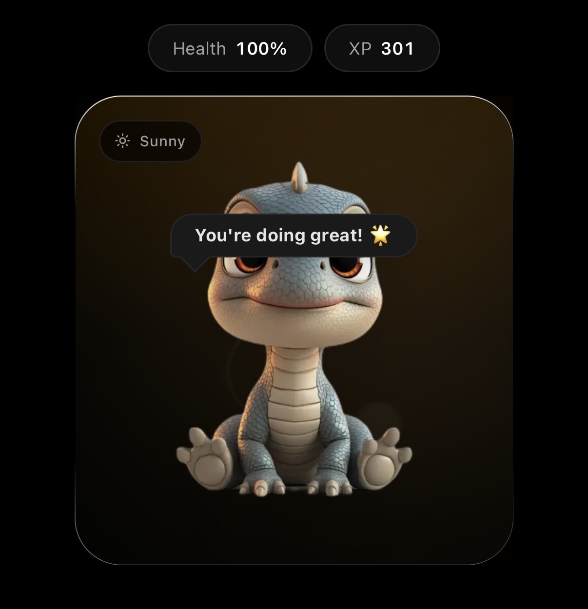
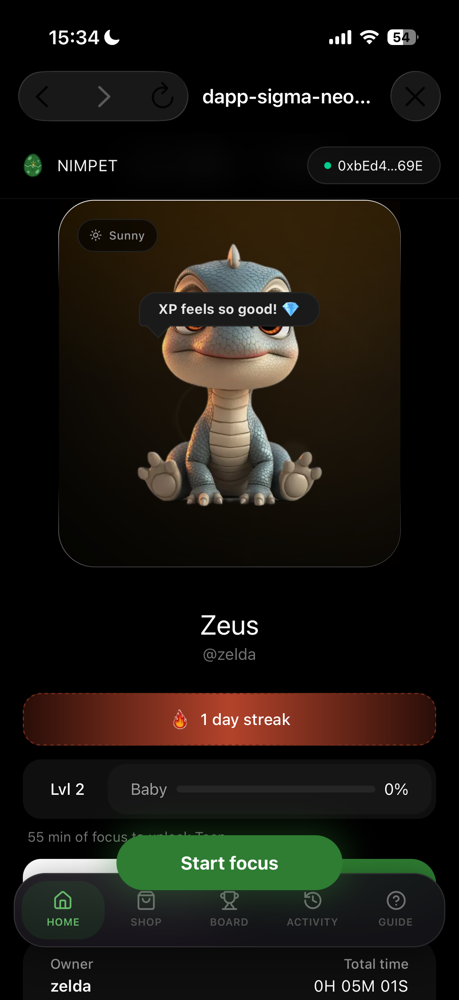
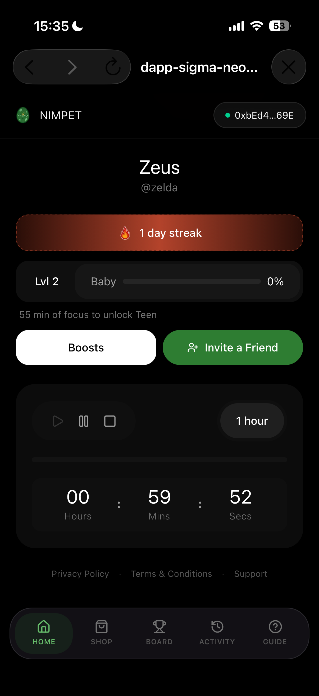
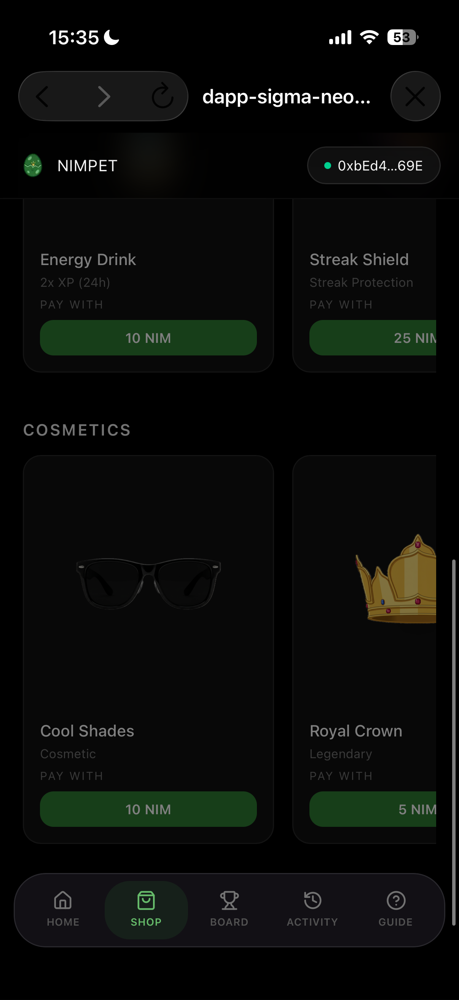
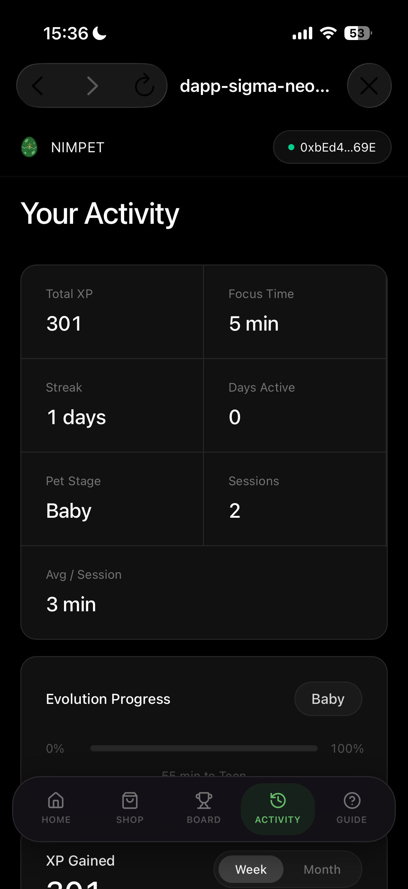
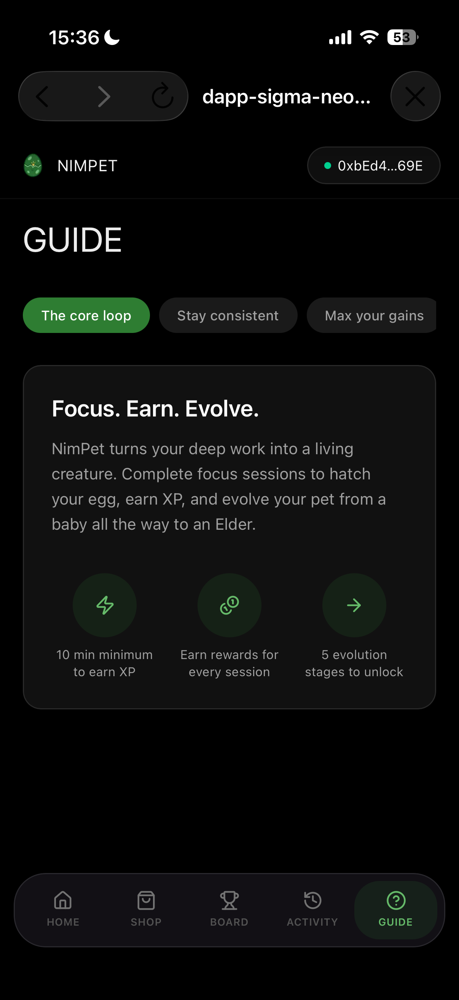

# NimPet

> Focus. Earn. Evolve

| Field | Value |
| --- | --- |
| Category | Productivity |
| Pricing | Free |
| Team name | _Not provided — optional_ |
| Team members | _Not provided — optional_ |
| X account | zintarh_dev |
| Heard about it via | X |
| Contact email | zintarh.jonathan@gmail.com |
| GitHub login | @zintarh |
| Submitted at | 2026-09-18T17:01:49.195Z |

## Links

| Link | URL |
| --- | --- |
| Repo | [https://github.com/zintarh/NimPet](<https://github.com/zintarh/NimPet>) |
| Demo | [https://nimpet.vercel.app/](<https://nimpet.vercel.app/>) |
| Video | [https://youtu.be/90Uju8fpYDY](<https://youtu.be/90Uju8fpYDY>) |
| Skool post | _Not provided — optional_ |
| Social post | _Not provided — optional_ |

## Description

NimPet turns your deep work into a living companion. Complete focus sessions to hatch your egg, earn XP, and evolve your creature from a baby into an Elder. Integrated seamlessly with Nimiq Pay, you can spend NIM (or USDC on Base) to feed your pet, customize it with cosmetics, or

## Builder story

I spent years wrestling with focus apps that worked for a week before losing their novelty. The issue was simple: skipping a session carried no real consequence.

NimPet turns focus into responsibility:

Evolve Through Deep Work: Complete sessions to hatch your egg and grow your pet from baby to Elder.

Real Accountability: Abandon your work for too long, and your pet dies. Reviving it requires a tangible cost.

True Ownership: Your milestones and companion stats are backed on-chain—never lost to device wipes or resets.

Native Payments: Spend NIM natively through Nimiq Pay with zero checkout friction or extra account setup.

Stop relying on willpower alone—build a companion that grows only when you do.

## Thumbnail

## Screenshots

---

_Generated from the submission form. `submission.yaml` in this folder is the machine-readable source of truth._
